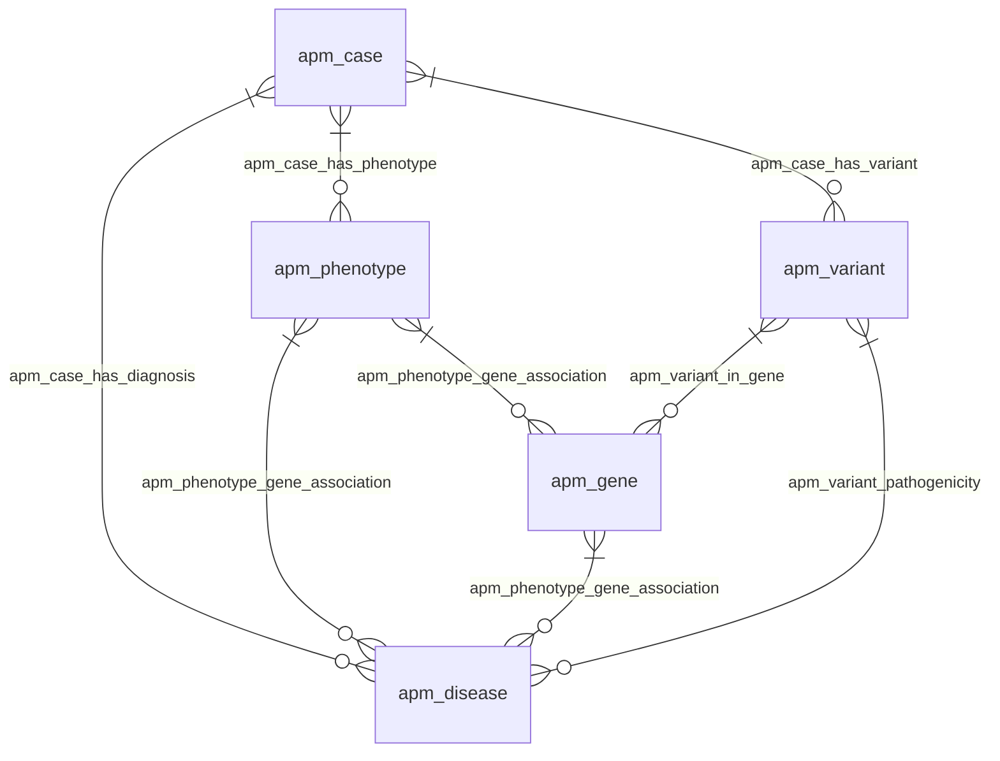
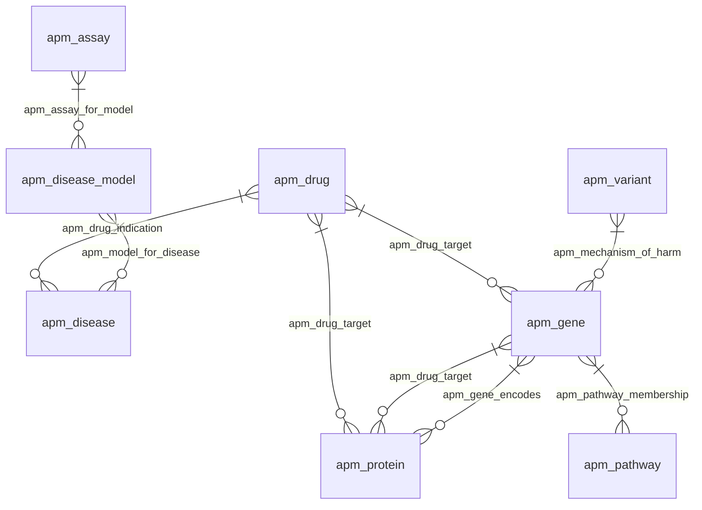

# Algorithm for Precision Medicine (apm)

> **Source:** `namespaces/apm.tql`

Rare disease investigation following Matt Might's APM: diagnostic phase (symptoms → molecular diagnosis) and therapeutic phase (mechanism → treatment).

**Summary:** 35 entities, 13 relations, 47 attributes

## Contents

- [Type Hierarchy](#type-hierarchy)
- [Relationships](#relationships)
- [Attributes](#attributes)
- [Entity Types](#entity-types)
- [Relation Types](#relation-types)
- [Query Examples](#query-examples)

## Type Hierarchy

```mermaid
classDiagram
    direction LR
    class apm_assay
    domain_thing <|-- apm_assay
    class apm_case {
        +apm-diagnostic-status
        +apm-therapeutic-status
        +apm-investigation-phase
    }
    domain_thing <|-- apm_case
    class apm_case_file {
        +apm-investigation-phase
    }
    collection <|-- apm_case_file
    class apm_clinvar_record {
        +apm-clinvar-id
    }
    artifact <|-- apm_clinvar_record
    class apm_conservation_data {
        +apm-conservation-score
        +apm-prediction-tool
        +apm-prediction-score
    }
    fragment <|-- apm_conservation_data
    class apm_cross_case_synthesis_note
    note_t <|-- apm_cross_case_synthesis_note
    class apm_diagnosis_hypothesis_note {
        +apm-diagnostic-status
        +apm-acmg-class
    }
    note_t <|-- apm_diagnosis_hypothesis_note
    class apm_disease {
        +apm-omim-id
        +apm-orpha-id
        +apm-mondo-id
        +apm-inheritance-pattern
        +apm-penetrance
    }
    domain_thing <|-- apm_disease
    class apm_disease_family
    collection <|-- apm_disease_family
    class apm_disease_model {
        +apm-model-type
        +apm-model-species
        +apm-phenotype-recapitulated
    }
    domain_thing <|-- apm_disease_model
    class apm_drug {
        +apm-drugbank-id
        +apm-chembl-id
        +apm-therapeutic-approach
        +apm-development-stage
    }
    domain_thing <|-- apm_drug
    class apm_drug_gene_interaction {
        +apm-gene-symbol
        +apm-therapeutic-approach
    }
    fragment <|-- apm_drug_gene_interaction
    class apm_drug_record {
        +apm-drugbank-id
        +apm-chembl-id
    }
    artifact <|-- apm_drug_record
    class apm_gene {
        +apm-gene-symbol
        +apm-ensembl-id
        +apm-entrez-id
        +apm-inheritance-pattern
    }
    domain_thing <|-- apm_gene
    class apm_gnomad_record {
        +apm-gnomad-af
    }
    artifact <|-- apm_gnomad_record
    class apm_mechanism_analysis_note {
        +apm-mechanism-type
        +apm-functional-impact
    }
    note_t <|-- apm_mechanism_analysis_note
    class apm_mechanism_claim {
        +apm-mechanism-type
        +apm-functional-impact
        +confidence
    }
    fragment <|-- apm_mechanism_claim
    class apm_omim_record {
        +apm-omim-id
    }
    artifact <|-- apm_omim_record
    class apm_pathogenicity_evidence {
        +apm-acmg-criteria
        +confidence
    }
    fragment <|-- apm_pathogenicity_evidence
    class apm_pathway
    domain_thing <|-- apm_pathway
    class apm_pathway_record
    artifact <|-- apm_pathway_record
    class apm_patient_cohort
    collection <|-- apm_patient_cohort
    class apm_phenotype {
        +apm-hpo-id
        +apm-hpo-label
        +apm-onset-category
        +apm-severity
    }
    domain_thing <|-- apm_phenotype
    class apm_phenotype_feature {
        +apm-hpo-id
        +apm-hpo-label
        +apm-onset-category
        +apm-severity
    }
    fragment <|-- apm_phenotype_feature
    class apm_phenotype_genotype_note
    note_t <|-- apm_phenotype_genotype_note
    class apm_prediction_record {
        +apm-prediction-tool
        +apm-prediction-score
        +apm-prediction-result
    }
    artifact <|-- apm_prediction_record
    class apm_protein {
        +apm-uniprot-id
        +apm-protein-domain
    }
    domain_thing <|-- apm_protein
    class apm_reanalysis_note {
        +apm-diagnostic-status
    }
    note_t <|-- apm_reanalysis_note
    class apm_screening_analysis_note
    note_t <|-- apm_screening_analysis_note
    class apm_screening_result
    artifact <|-- apm_screening_result
    class apm_sequencing_report
    artifact <|-- apm_sequencing_report
    class apm_therapeutic_strategy_note {
        +apm-therapeutic-approach
        +apm-functional-impact
    }
    note_t <|-- apm_therapeutic_strategy_note
    class apm_variant {
        +apm-chromosome
        +apm-position-start
        +apm-position-end
        +apm-reference-allele
        +apm-alternate-allele
    }
    domain_thing <|-- apm_variant
    class apm_variant_call {
        +apm-chromosome
        +apm-hgvs-c
        +apm-hgvs-p
        +apm-zygosity
        +apm-gene-symbol
    }
    fragment <|-- apm_variant_call
    class apm_variant_interpretation_note {
        +apm-acmg-class
        +apm-acmg-criteria
    }
    note_t <|-- apm_variant_interpretation_note
    class apm_assay_for_model
    class apm_case_has_diagnosis {
        +apm-diagnostic-status
        +confidence
        +provenance
    }
    class apm_case_has_phenotype {
        +apm-onset-category
        +apm-severity
        +provenance
    }
    class apm_case_has_variant {
        +apm-zygosity
        +provenance
    }
    class apm_drug_indication {
        +apm-development-stage
        +provenance
    }
    class apm_drug_target {
        +apm-therapeutic-approach
        +confidence
        +provenance
    }
    class apm_gene_encodes
    class apm_mechanism_of_harm {
        +apm-mechanism-type
        +apm-functional-impact
        +confidence
        +provenance
    }
    class apm_model_for_disease {
        +apm-phenotype-recapitulated
        +confidence
        +provenance
    }
    class apm_pathway_membership
    class apm_phenotype_gene_association {
        +confidence
        +provenance
    }
    class apm_variant_in_gene
    class apm_variant_pathogenicity {
        +apm-acmg-class
        +confidence
        +provenance
    }
    class fragment
    <<core>> fragment
    class domain_thing
    <<core>> domain_thing
    class artifact
    <<core>> artifact
    class collection
    <<core>> collection
    class note_t
    <<core>> note_t
```



## Relationships

### Diagnostic Phase



### Therapeutic Phase



## Attributes

| Attribute | Value Type | Description |
|-----------|-----------|-------------|
| `apm-acmg-class` | `string` |  |
| `apm-acmg-criteria` | `string` |  |
| `apm-allele-frequency` | `double` |  |
| `apm-alternate-allele` | `string` |  |
| `apm-chembl-id` | `string` |  |
| `apm-chromosome` | `string` |  |
| `apm-clinvar-id` | `string` |  |
| `apm-conservation-score` | `double` |  |
| `apm-development-stage` | `string` |  |
| `apm-diagnostic-status` | `string` |  |
| `apm-drugbank-id` | `string` |  |
| `apm-ensembl-id` | `string` |  |
| `apm-entrez-id` | `string` |  |
| `apm-functional-impact` | `string` |  |
| `apm-gene-symbol` | `string` |  |
| `apm-genome-build` | `string` |  |
| `apm-gnomad-af` | `double` |  |
| `apm-hgvs-c` | `string` |  |
| `apm-hgvs-g` | `string` |  |
| `apm-hgvs-p` | `string` |  |
| `apm-hpo-id` | `string` |  |
| `apm-hpo-label` | `string` |  |
| `apm-inheritance-pattern` | `string` |  |
| `apm-investigation-phase` | `string` |  |
| `apm-mechanism-type` | `string` |  |
| `apm-model-species` | `string` |  |
| `apm-model-type` | `string` |  |
| `apm-mondo-id` | `string` |  |
| `apm-omim-id` | `string` |  |
| `apm-onset-category` | `string` |  |
| `apm-orpha-id` | `string` |  |
| `apm-penetrance` | `string` |  |
| `apm-phenotype-recapitulated` | `boolean` |  |
| `apm-position-end` | `long` |  |
| `apm-position-start` | `long` |  |
| `apm-prediction-result` | `string` |  |
| `apm-prediction-score` | `double` |  |
| `apm-prediction-tool` | `string` |  |
| `apm-protein-domain` | `string` |  |
| `apm-reference-allele` | `string` |  |
| `apm-severity` | `string` |  |
| `apm-target-type` | `string` |  |
| `apm-therapeutic-approach` | `string` |  |
| `apm-therapeutic-status` | `string` |  |
| `apm-transcript-id` | `string` |  |
| `apm-uniprot-id` | `string` |  |
| `apm-zygosity` | `string` |  |

## Entity Types

### `apm-assay`

> APM-ASSAY - A functional test/experiment

- **Kind:** Entity
- **Parent:** `domain-thing`
- **Defined in:** `apm`

**Attributes (owns):**

| Attribute | Key? | Defined In |
|-----------|------|------------|
| `id` | @key | *identifiable-entity* (inherited) |
| `name` |  | *identifiable-entity* (inherited) |
| `description` |  | *identifiable-entity* (inherited) |
| `iri` |  | *identifiable-entity* (inherited) |
| `created-at` |  | *identifiable-entity* (inherited) |
| `updated-at` |  | *identifiable-entity* (inherited) |
| `provenance` |  | *identifiable-entity* (inherited) |
| `source-uri` |  | *identifiable-entity* (inherited) |
| `license` |  | *identifiable-entity* (inherited) |

**Roles (plays):**

| Relation | Role | Defined In |
|----------|------|------------|
| `apm-assay-for-model` | `assay` | apm |
| `representation` | `referent` | *domain-thing* (inherited) |
| `authorship` | `authored-work` | *domain-thing* (inherited) |
| `citation-reference` | `citing-item` | *domain-thing* (inherited) |
| `citation-reference` | `cited-item` | *domain-thing* (inherited) |
| `classification` | `classified-entity` | *identifiable-entity* (inherited) |
| `tagging` | `tagged-entity` | *identifiable-entity* (inherited) |
| `aboutness` | `subject` | *identifiable-entity* (inherited) |
| `collection-membership` | `member` | *identifiable-entity* (inherited) |
| `provenance-record` | `produced-entity` | *identifiable-entity* (inherited) |
| `provenance-record` | `source-entity` | *identifiable-entity* (inherited) |
| `property-assertion` | `subject-entity` | *identifiable-entity* (inherited) |
| `semantic-triple` | `triple-subject` | *identifiable-entity* (inherited) |
| `semantic-triple` | `triple-object` | *identifiable-entity* (inherited) |

### `apm-case`

> APM-CASE - The patient entity (distinct from the case file collection)

- **Kind:** Entity
- **Parent:** `domain-thing`
- **Defined in:** `apm`

**Attributes (owns):**

| Attribute | Key? | Defined In |
|-----------|------|------------|
| `apm-diagnostic-status` |  | apm |
| `apm-therapeutic-status` |  | apm |
| `apm-investigation-phase` |  | apm |
| `id` | @key | *identifiable-entity* (inherited) |
| `name` |  | *identifiable-entity* (inherited) |
| `description` |  | *identifiable-entity* (inherited) |
| `iri` |  | *identifiable-entity* (inherited) |
| `created-at` |  | *identifiable-entity* (inherited) |
| `updated-at` |  | *identifiable-entity* (inherited) |
| `provenance` |  | *identifiable-entity* (inherited) |
| `source-uri` |  | *identifiable-entity* (inherited) |
| `license` |  | *identifiable-entity* (inherited) |

**Roles (plays):**

| Relation | Role | Defined In |
|----------|------|------------|
| `apm-case-has-phenotype` | `case` | apm |
| `apm-case-has-variant` | `case` | apm |
| `apm-case-has-diagnosis` | `case` | apm |
| `representation` | `referent` | *domain-thing* (inherited) |
| `authorship` | `authored-work` | *domain-thing* (inherited) |
| `citation-reference` | `citing-item` | *domain-thing* (inherited) |
| `citation-reference` | `cited-item` | *domain-thing* (inherited) |
| `classification` | `classified-entity` | *identifiable-entity* (inherited) |
| `tagging` | `tagged-entity` | *identifiable-entity* (inherited) |
| `aboutness` | `subject` | *identifiable-entity* (inherited) |
| `collection-membership` | `member` | *identifiable-entity* (inherited) |
| `provenance-record` | `produced-entity` | *identifiable-entity* (inherited) |
| `provenance-record` | `source-entity` | *identifiable-entity* (inherited) |
| `property-assertion` | `subject-entity` | *identifiable-entity* (inherited) |
| `semantic-triple` | `triple-subject` | *identifiable-entity* (inherited) |
| `semantic-triple` | `triple-object` | *identifiable-entity* (inherited) |

### `apm-case-file`

> APM-CASE-FILE - The patient investigation case file (organizes all related things/ICEs)

- **Kind:** Entity
- **Parent:** `collection`
- **Defined in:** `apm`

**Attributes (owns):**

| Attribute | Key? | Defined In |
|-----------|------|------------|
| `apm-investigation-phase` |  | apm |
| `logical-query` |  | *collection* (inherited) |
| `is-extensional` |  | *collection* (inherited) |
| `id` | @key | *identifiable-entity* (inherited) |
| `name` |  | *identifiable-entity* (inherited) |
| `description` |  | *identifiable-entity* (inherited) |
| `iri` |  | *identifiable-entity* (inherited) |
| `created-at` |  | *identifiable-entity* (inherited) |
| `updated-at` |  | *identifiable-entity* (inherited) |
| `provenance` |  | *identifiable-entity* (inherited) |
| `source-uri` |  | *identifiable-entity* (inherited) |
| `license` |  | *identifiable-entity* (inherited) |

**Roles (plays):**

| Relation | Role | Defined In |
|----------|------|------------|
| `collection-membership` | `collection` | *collection* (inherited) |
| `collection-nesting` | `parent-collection` | *collection* (inherited) |
| `collection-nesting` | `child-collection` | *collection* (inherited) |
| `addresses-requirement` | `resource` | *collection* (inherited) |
| `classification` | `classified-entity` | *identifiable-entity* (inherited) |
| `tagging` | `tagged-entity` | *identifiable-entity* (inherited) |
| `aboutness` | `subject` | *identifiable-entity* (inherited) |
| `collection-membership` | `member` | *identifiable-entity* (inherited) |
| `provenance-record` | `produced-entity` | *identifiable-entity* (inherited) |
| `provenance-record` | `source-entity` | *identifiable-entity* (inherited) |
| `property-assertion` | `subject-entity` | *identifiable-entity* (inherited) |
| `semantic-triple` | `triple-subject` | *identifiable-entity* (inherited) |
| `semantic-triple` | `triple-object` | *identifiable-entity* (inherited) |

### `apm-clinvar-record`

> APM-CLINVAR-RECORD - Raw ClinVar entry for a variant

- **Kind:** Entity
- **Parent:** `artifact`
- **Defined in:** `apm`

**Attributes (owns):**

| Attribute | Key? | Defined In |
|-----------|------|------------|
| `apm-clinvar-id` |  | apm |
| `content` |  | *information-content-entity* (inherited) |
| `content-hash` |  | *information-content-entity* (inherited) |
| `format` |  | *information-content-entity* (inherited) |
| `token-count` |  | *information-content-entity* (inherited) |
| `cache-path` |  | *information-content-entity* (inherited) |
| `mime-type` |  | *information-content-entity* (inherited) |
| `file-size` |  | *information-content-entity* (inherited) |
| `id` | @key | *identifiable-entity* (inherited) |
| `name` |  | *identifiable-entity* (inherited) |
| `description` |  | *identifiable-entity* (inherited) |
| `iri` |  | *identifiable-entity* (inherited) |
| `created-at` |  | *identifiable-entity* (inherited) |
| `updated-at` |  | *identifiable-entity* (inherited) |
| `provenance` |  | *identifiable-entity* (inherited) |
| `source-uri` |  | *identifiable-entity* (inherited) |
| `license` |  | *identifiable-entity* (inherited) |

**Roles (plays):**

| Relation | Role | Defined In |
|----------|------|------------|
| `representation` | `artifact` | *artifact* (inherited) |
| `fragmentation` | `whole` | *artifact* (inherited) |
| `authorship` | `work` | *information-content-entity* (inherited) |
| `derivation` | `derived-from-source` | *information-content-entity* (inherited) |
| `derivation` | `derivative` | *information-content-entity* (inherited) |
| `classification` | `classified-entity` | *identifiable-entity* (inherited) |
| `tagging` | `tagged-entity` | *identifiable-entity* (inherited) |
| `aboutness` | `subject` | *identifiable-entity* (inherited) |
| `collection-membership` | `member` | *identifiable-entity* (inherited) |
| `provenance-record` | `produced-entity` | *identifiable-entity* (inherited) |
| `provenance-record` | `source-entity` | *identifiable-entity* (inherited) |
| `property-assertion` | `subject-entity` | *identifiable-entity* (inherited) |
| `semantic-triple` | `triple-subject` | *identifiable-entity* (inherited) |
| `semantic-triple` | `triple-object` | *identifiable-entity* (inherited) |

### `apm-conservation-data`

> APM-CONSERVATION-DATA - Conservation/prediction data extracted from records

- **Kind:** Entity
- **Parent:** `fragment`
- **Defined in:** `apm`

**Attributes (owns):**

| Attribute | Key? | Defined In |
|-----------|------|------------|
| `apm-conservation-score` |  | apm |
| `apm-prediction-tool` |  | apm |
| `apm-prediction-score` |  | apm |
| `offset` |  | *fragment* (inherited) |
| `length` |  | *fragment* (inherited) |
| `content` |  | *information-content-entity* (inherited) |
| `content-hash` |  | *information-content-entity* (inherited) |
| `format` |  | *information-content-entity* (inherited) |
| `token-count` |  | *information-content-entity* (inherited) |
| `cache-path` |  | *information-content-entity* (inherited) |
| `mime-type` |  | *information-content-entity* (inherited) |
| `file-size` |  | *information-content-entity* (inherited) |
| `id` | @key | *identifiable-entity* (inherited) |
| `name` |  | *identifiable-entity* (inherited) |
| `description` |  | *identifiable-entity* (inherited) |
| `iri` |  | *identifiable-entity* (inherited) |
| `created-at` |  | *identifiable-entity* (inherited) |
| `updated-at` |  | *identifiable-entity* (inherited) |
| `provenance` |  | *identifiable-entity* (inherited) |
| `source-uri` |  | *identifiable-entity* (inherited) |
| `license` |  | *identifiable-entity* (inherited) |

**Roles (plays):**

| Relation | Role | Defined In |
|----------|------|------------|
| `fragmentation` | `part` | *fragment* (inherited) |
| `quotation` | `quoted-fragment` | *fragment* (inherited) |
| `quotation` | `quoting-fragment` | *fragment* (inherited) |
| `authorship` | `work` | *information-content-entity* (inherited) |
| `derivation` | `derived-from-source` | *information-content-entity* (inherited) |
| `derivation` | `derivative` | *information-content-entity* (inherited) |
| `classification` | `classified-entity` | *identifiable-entity* (inherited) |
| `tagging` | `tagged-entity` | *identifiable-entity* (inherited) |
| `aboutness` | `subject` | *identifiable-entity* (inherited) |
| `collection-membership` | `member` | *identifiable-entity* (inherited) |
| `provenance-record` | `produced-entity` | *identifiable-entity* (inherited) |
| `provenance-record` | `source-entity` | *identifiable-entity* (inherited) |
| `property-assertion` | `subject-entity` | *identifiable-entity* (inherited) |
| `semantic-triple` | `triple-subject` | *identifiable-entity* (inherited) |
| `semantic-triple` | `triple-object` | *identifiable-entity* (inherited) |

### `apm-cross-case-synthesis-note`

> APM-CROSS-CASE-SYNTHESIS-NOTE - Findings across multiple cases

- **Kind:** Entity
- **Parent:** `note`
- **Defined in:** `apm`

**Attributes (owns):**

| Attribute | Key? | Defined In |
|-----------|------|------------|
| `confidence` |  | *note* (inherited) |
| `content` |  | *information-content-entity* (inherited) |
| `content-hash` |  | *information-content-entity* (inherited) |
| `format` |  | *information-content-entity* (inherited) |
| `token-count` |  | *information-content-entity* (inherited) |
| `cache-path` |  | *information-content-entity* (inherited) |
| `mime-type` |  | *information-content-entity* (inherited) |
| `file-size` |  | *information-content-entity* (inherited) |
| `id` | @key | *identifiable-entity* (inherited) |
| `name` |  | *identifiable-entity* (inherited) |
| `description` |  | *identifiable-entity* (inherited) |
| `iri` |  | *identifiable-entity* (inherited) |
| `created-at` |  | *identifiable-entity* (inherited) |
| `updated-at` |  | *identifiable-entity* (inherited) |
| `provenance` |  | *identifiable-entity* (inherited) |
| `source-uri` |  | *identifiable-entity* (inherited) |
| `license` |  | *identifiable-entity* (inherited) |

**Roles (plays):**

| Relation | Role | Defined In |
|----------|------|------------|
| `aboutness` | `note` | *note* (inherited) |
| `note-threading` | `parent-note` | *note* (inherited) |
| `note-threading` | `child-note` | *note* (inherited) |
| `evidence-chain` | `claim` | *note* (inherited) |
| `evidence-chain` | `evidence` | *note* (inherited) |
| `authorship` | `work` | *information-content-entity* (inherited) |
| `derivation` | `derived-from-source` | *information-content-entity* (inherited) |
| `derivation` | `derivative` | *information-content-entity* (inherited) |
| `classification` | `classified-entity` | *identifiable-entity* (inherited) |
| `tagging` | `tagged-entity` | *identifiable-entity* (inherited) |
| `aboutness` | `subject` | *identifiable-entity* (inherited) |
| `collection-membership` | `member` | *identifiable-entity* (inherited) |
| `provenance-record` | `produced-entity` | *identifiable-entity* (inherited) |
| `provenance-record` | `source-entity` | *identifiable-entity* (inherited) |
| `property-assertion` | `subject-entity` | *identifiable-entity* (inherited) |
| `semantic-triple` | `triple-subject` | *identifiable-entity* (inherited) |
| `semantic-triple` | `triple-object` | *identifiable-entity* (inherited) |

### `apm-diagnosis-hypothesis-note`

> APM-DIAGNOSIS-HYPOTHESIS-NOTE - Candidate diagnosis with reasoning

- **Kind:** Entity
- **Parent:** `note`
- **Defined in:** `apm`

**Attributes (owns):**

| Attribute | Key? | Defined In |
|-----------|------|------------|
| `apm-diagnostic-status` |  | apm |
| `apm-acmg-class` |  | apm |
| `confidence` |  | *note* (inherited) |
| `content` |  | *information-content-entity* (inherited) |
| `content-hash` |  | *information-content-entity* (inherited) |
| `format` |  | *information-content-entity* (inherited) |
| `token-count` |  | *information-content-entity* (inherited) |
| `cache-path` |  | *information-content-entity* (inherited) |
| `mime-type` |  | *information-content-entity* (inherited) |
| `file-size` |  | *information-content-entity* (inherited) |
| `id` | @key | *identifiable-entity* (inherited) |
| `name` |  | *identifiable-entity* (inherited) |
| `description` |  | *identifiable-entity* (inherited) |
| `iri` |  | *identifiable-entity* (inherited) |
| `created-at` |  | *identifiable-entity* (inherited) |
| `updated-at` |  | *identifiable-entity* (inherited) |
| `provenance` |  | *identifiable-entity* (inherited) |
| `source-uri` |  | *identifiable-entity* (inherited) |
| `license` |  | *identifiable-entity* (inherited) |

**Roles (plays):**

| Relation | Role | Defined In |
|----------|------|------------|
| `aboutness` | `note` | *note* (inherited) |
| `note-threading` | `parent-note` | *note* (inherited) |
| `note-threading` | `child-note` | *note* (inherited) |
| `evidence-chain` | `claim` | *note* (inherited) |
| `evidence-chain` | `evidence` | *note* (inherited) |
| `authorship` | `work` | *information-content-entity* (inherited) |
| `derivation` | `derived-from-source` | *information-content-entity* (inherited) |
| `derivation` | `derivative` | *information-content-entity* (inherited) |
| `classification` | `classified-entity` | *identifiable-entity* (inherited) |
| `tagging` | `tagged-entity` | *identifiable-entity* (inherited) |
| `aboutness` | `subject` | *identifiable-entity* (inherited) |
| `collection-membership` | `member` | *identifiable-entity* (inherited) |
| `provenance-record` | `produced-entity` | *identifiable-entity* (inherited) |
| `provenance-record` | `source-entity` | *identifiable-entity* (inherited) |
| `property-assertion` | `subject-entity` | *identifiable-entity* (inherited) |
| `semantic-triple` | `triple-subject` | *identifiable-entity* (inherited) |
| `semantic-triple` | `triple-object` | *identifiable-entity* (inherited) |

### `apm-disease`

> APM-DISEASE - A disease or condition

- **Kind:** Entity
- **Parent:** `domain-thing`
- **Defined in:** `apm`

**Attributes (owns):**

| Attribute | Key? | Defined In |
|-----------|------|------------|
| `apm-omim-id` |  | apm |
| `apm-orpha-id` |  | apm |
| `apm-mondo-id` |  | apm |
| `apm-inheritance-pattern` |  | apm |
| `apm-penetrance` |  | apm |
| `id` | @key | *identifiable-entity* (inherited) |
| `name` |  | *identifiable-entity* (inherited) |
| `description` |  | *identifiable-entity* (inherited) |
| `iri` |  | *identifiable-entity* (inherited) |
| `created-at` |  | *identifiable-entity* (inherited) |
| `updated-at` |  | *identifiable-entity* (inherited) |
| `provenance` |  | *identifiable-entity* (inherited) |
| `source-uri` |  | *identifiable-entity* (inherited) |
| `license` |  | *identifiable-entity* (inherited) |

**Roles (plays):**

| Relation | Role | Defined In |
|----------|------|------------|
| `apm-case-has-diagnosis` | `disease` | apm |
| `apm-variant-pathogenicity` | `disease` | apm |
| `apm-phenotype-gene-association` | `disease` | apm |
| `apm-drug-indication` | `indication` | apm |
| `apm-model-for-disease` | `disease` | apm |
| `representation` | `referent` | *domain-thing* (inherited) |
| `authorship` | `authored-work` | *domain-thing* (inherited) |
| `citation-reference` | `citing-item` | *domain-thing* (inherited) |
| `citation-reference` | `cited-item` | *domain-thing* (inherited) |
| `classification` | `classified-entity` | *identifiable-entity* (inherited) |
| `tagging` | `tagged-entity` | *identifiable-entity* (inherited) |
| `aboutness` | `subject` | *identifiable-entity* (inherited) |
| `collection-membership` | `member` | *identifiable-entity* (inherited) |
| `provenance-record` | `produced-entity` | *identifiable-entity* (inherited) |
| `provenance-record` | `source-entity` | *identifiable-entity* (inherited) |
| `property-assertion` | `subject-entity` | *identifiable-entity* (inherited) |
| `semantic-triple` | `triple-subject` | *identifiable-entity* (inherited) |
| `semantic-triple` | `triple-object` | *identifiable-entity* (inherited) |

### `apm-disease-family`

> APM-DISEASE-FAMILY - A family of related diseases (e.g., "lysosomal storage diseases") A disease family is NOT a disease — it's a set of diseases sharing a common mechanism

- **Kind:** Entity
- **Parent:** `collection`
- **Defined in:** `apm`

**Attributes (owns):**

| Attribute | Key? | Defined In |
|-----------|------|------------|
| `logical-query` |  | *collection* (inherited) |
| `is-extensional` |  | *collection* (inherited) |
| `id` | @key | *identifiable-entity* (inherited) |
| `name` |  | *identifiable-entity* (inherited) |
| `description` |  | *identifiable-entity* (inherited) |
| `iri` |  | *identifiable-entity* (inherited) |
| `created-at` |  | *identifiable-entity* (inherited) |
| `updated-at` |  | *identifiable-entity* (inherited) |
| `provenance` |  | *identifiable-entity* (inherited) |
| `source-uri` |  | *identifiable-entity* (inherited) |
| `license` |  | *identifiable-entity* (inherited) |

**Roles (plays):**

| Relation | Role | Defined In |
|----------|------|------------|
| `collection-membership` | `collection` | *collection* (inherited) |
| `collection-nesting` | `parent-collection` | *collection* (inherited) |
| `collection-nesting` | `child-collection` | *collection* (inherited) |
| `addresses-requirement` | `resource` | *collection* (inherited) |
| `classification` | `classified-entity` | *identifiable-entity* (inherited) |
| `tagging` | `tagged-entity` | *identifiable-entity* (inherited) |
| `aboutness` | `subject` | *identifiable-entity* (inherited) |
| `collection-membership` | `member` | *identifiable-entity* (inherited) |
| `provenance-record` | `produced-entity` | *identifiable-entity* (inherited) |
| `provenance-record` | `source-entity` | *identifiable-entity* (inherited) |
| `property-assertion` | `subject-entity` | *identifiable-entity* (inherited) |
| `semantic-triple` | `triple-subject` | *identifiable-entity* (inherited) |
| `semantic-triple` | `triple-object` | *identifiable-entity* (inherited) |

### `apm-disease-model`

> APM-DISEASE-MODEL - An experimental model system

- **Kind:** Entity
- **Parent:** `domain-thing`
- **Defined in:** `apm`

**Attributes (owns):**

| Attribute | Key? | Defined In |
|-----------|------|------------|
| `apm-model-type` |  | apm |
| `apm-model-species` |  | apm |
| `apm-phenotype-recapitulated` |  | apm |
| `id` | @key | *identifiable-entity* (inherited) |
| `name` |  | *identifiable-entity* (inherited) |
| `description` |  | *identifiable-entity* (inherited) |
| `iri` |  | *identifiable-entity* (inherited) |
| `created-at` |  | *identifiable-entity* (inherited) |
| `updated-at` |  | *identifiable-entity* (inherited) |
| `provenance` |  | *identifiable-entity* (inherited) |
| `source-uri` |  | *identifiable-entity* (inherited) |
| `license` |  | *identifiable-entity* (inherited) |

**Roles (plays):**

| Relation | Role | Defined In |
|----------|------|------------|
| `apm-model-for-disease` | `model` | apm |
| `apm-assay-for-model` | `model` | apm |
| `representation` | `referent` | *domain-thing* (inherited) |
| `authorship` | `authored-work` | *domain-thing* (inherited) |
| `citation-reference` | `citing-item` | *domain-thing* (inherited) |
| `citation-reference` | `cited-item` | *domain-thing* (inherited) |
| `classification` | `classified-entity` | *identifiable-entity* (inherited) |
| `tagging` | `tagged-entity` | *identifiable-entity* (inherited) |
| `aboutness` | `subject` | *identifiable-entity* (inherited) |
| `collection-membership` | `member` | *identifiable-entity* (inherited) |
| `provenance-record` | `produced-entity` | *identifiable-entity* (inherited) |
| `provenance-record` | `source-entity` | *identifiable-entity* (inherited) |
| `property-assertion` | `subject-entity` | *identifiable-entity* (inherited) |
| `semantic-triple` | `triple-subject` | *identifiable-entity* (inherited) |
| `semantic-triple` | `triple-object` | *identifiable-entity* (inherited) |

### `apm-drug`

> APM-DRUG - A therapeutic compound

- **Kind:** Entity
- **Parent:** `domain-thing`
- **Defined in:** `apm`

**Attributes (owns):**

| Attribute | Key? | Defined In |
|-----------|------|------------|
| `apm-drugbank-id` |  | apm |
| `apm-chembl-id` |  | apm |
| `apm-therapeutic-approach` |  | apm |
| `apm-development-stage` |  | apm |
| `id` | @key | *identifiable-entity* (inherited) |
| `name` |  | *identifiable-entity* (inherited) |
| `description` |  | *identifiable-entity* (inherited) |
| `iri` |  | *identifiable-entity* (inherited) |
| `created-at` |  | *identifiable-entity* (inherited) |
| `updated-at` |  | *identifiable-entity* (inherited) |
| `provenance` |  | *identifiable-entity* (inherited) |
| `source-uri` |  | *identifiable-entity* (inherited) |
| `license` |  | *identifiable-entity* (inherited) |

**Roles (plays):**

| Relation | Role | Defined In |
|----------|------|------------|
| `apm-drug-target` | `drug` | apm |
| `apm-drug-indication` | `drug` | apm |
| `representation` | `referent` | *domain-thing* (inherited) |
| `authorship` | `authored-work` | *domain-thing* (inherited) |
| `citation-reference` | `citing-item` | *domain-thing* (inherited) |
| `citation-reference` | `cited-item` | *domain-thing* (inherited) |
| `classification` | `classified-entity` | *identifiable-entity* (inherited) |
| `tagging` | `tagged-entity` | *identifiable-entity* (inherited) |
| `aboutness` | `subject` | *identifiable-entity* (inherited) |
| `collection-membership` | `member` | *identifiable-entity* (inherited) |
| `provenance-record` | `produced-entity` | *identifiable-entity* (inherited) |
| `provenance-record` | `source-entity` | *identifiable-entity* (inherited) |
| `property-assertion` | `subject-entity` | *identifiable-entity* (inherited) |
| `semantic-triple` | `triple-subject` | *identifiable-entity* (inherited) |
| `semantic-triple` | `triple-object` | *identifiable-entity* (inherited) |

### `apm-drug-gene-interaction`

> APM-DRUG-GENE-INTERACTION - Drug-gene interaction from databases

- **Kind:** Entity
- **Parent:** `fragment`
- **Defined in:** `apm`

**Attributes (owns):**

| Attribute | Key? | Defined In |
|-----------|------|------------|
| `apm-gene-symbol` |  | apm |
| `apm-therapeutic-approach` |  | apm |
| `offset` |  | *fragment* (inherited) |
| `length` |  | *fragment* (inherited) |
| `content` |  | *information-content-entity* (inherited) |
| `content-hash` |  | *information-content-entity* (inherited) |
| `format` |  | *information-content-entity* (inherited) |
| `token-count` |  | *information-content-entity* (inherited) |
| `cache-path` |  | *information-content-entity* (inherited) |
| `mime-type` |  | *information-content-entity* (inherited) |
| `file-size` |  | *information-content-entity* (inherited) |
| `id` | @key | *identifiable-entity* (inherited) |
| `name` |  | *identifiable-entity* (inherited) |
| `description` |  | *identifiable-entity* (inherited) |
| `iri` |  | *identifiable-entity* (inherited) |
| `created-at` |  | *identifiable-entity* (inherited) |
| `updated-at` |  | *identifiable-entity* (inherited) |
| `provenance` |  | *identifiable-entity* (inherited) |
| `source-uri` |  | *identifiable-entity* (inherited) |
| `license` |  | *identifiable-entity* (inherited) |

**Roles (plays):**

| Relation | Role | Defined In |
|----------|------|------------|
| `fragmentation` | `part` | *fragment* (inherited) |
| `quotation` | `quoted-fragment` | *fragment* (inherited) |
| `quotation` | `quoting-fragment` | *fragment* (inherited) |
| `authorship` | `work` | *information-content-entity* (inherited) |
| `derivation` | `derived-from-source` | *information-content-entity* (inherited) |
| `derivation` | `derivative` | *information-content-entity* (inherited) |
| `classification` | `classified-entity` | *identifiable-entity* (inherited) |
| `tagging` | `tagged-entity` | *identifiable-entity* (inherited) |
| `aboutness` | `subject` | *identifiable-entity* (inherited) |
| `collection-membership` | `member` | *identifiable-entity* (inherited) |
| `provenance-record` | `produced-entity` | *identifiable-entity* (inherited) |
| `provenance-record` | `source-entity` | *identifiable-entity* (inherited) |
| `property-assertion` | `subject-entity` | *identifiable-entity* (inherited) |
| `semantic-triple` | `triple-subject` | *identifiable-entity* (inherited) |
| `semantic-triple` | `triple-object` | *identifiable-entity* (inherited) |

### `apm-drug-record`

> APM-DRUG-RECORD - DrugBank/ChEMBL entry

- **Kind:** Entity
- **Parent:** `artifact`
- **Defined in:** `apm`

**Attributes (owns):**

| Attribute | Key? | Defined In |
|-----------|------|------------|
| `apm-drugbank-id` |  | apm |
| `apm-chembl-id` |  | apm |
| `content` |  | *information-content-entity* (inherited) |
| `content-hash` |  | *information-content-entity* (inherited) |
| `format` |  | *information-content-entity* (inherited) |
| `token-count` |  | *information-content-entity* (inherited) |
| `cache-path` |  | *information-content-entity* (inherited) |
| `mime-type` |  | *information-content-entity* (inherited) |
| `file-size` |  | *information-content-entity* (inherited) |
| `id` | @key | *identifiable-entity* (inherited) |
| `name` |  | *identifiable-entity* (inherited) |
| `description` |  | *identifiable-entity* (inherited) |
| `iri` |  | *identifiable-entity* (inherited) |
| `created-at` |  | *identifiable-entity* (inherited) |
| `updated-at` |  | *identifiable-entity* (inherited) |
| `provenance` |  | *identifiable-entity* (inherited) |
| `source-uri` |  | *identifiable-entity* (inherited) |
| `license` |  | *identifiable-entity* (inherited) |

**Roles (plays):**

| Relation | Role | Defined In |
|----------|------|------------|
| `representation` | `artifact` | *artifact* (inherited) |
| `fragmentation` | `whole` | *artifact* (inherited) |
| `authorship` | `work` | *information-content-entity* (inherited) |
| `derivation` | `derived-from-source` | *information-content-entity* (inherited) |
| `derivation` | `derivative` | *information-content-entity* (inherited) |
| `classification` | `classified-entity` | *identifiable-entity* (inherited) |
| `tagging` | `tagged-entity` | *identifiable-entity* (inherited) |
| `aboutness` | `subject` | *identifiable-entity* (inherited) |
| `collection-membership` | `member` | *identifiable-entity* (inherited) |
| `provenance-record` | `produced-entity` | *identifiable-entity* (inherited) |
| `provenance-record` | `source-entity` | *identifiable-entity* (inherited) |
| `property-assertion` | `subject-entity` | *identifiable-entity* (inherited) |
| `semantic-triple` | `triple-subject` | *identifiable-entity* (inherited) |
| `semantic-triple` | `triple-object` | *identifiable-entity* (inherited) |

### `apm-gene`

> APM-GENE - A gene implicated in the investigation

- **Kind:** Entity
- **Parent:** `domain-thing`
- **Defined in:** `apm`

**Attributes (owns):**

| Attribute | Key? | Defined In |
|-----------|------|------------|
| `apm-gene-symbol` |  | apm |
| `apm-ensembl-id` |  | apm |
| `apm-entrez-id` |  | apm |
| `apm-inheritance-pattern` |  | apm |
| `id` | @key | *identifiable-entity* (inherited) |
| `name` |  | *identifiable-entity* (inherited) |
| `description` |  | *identifiable-entity* (inherited) |
| `iri` |  | *identifiable-entity* (inherited) |
| `created-at` |  | *identifiable-entity* (inherited) |
| `updated-at` |  | *identifiable-entity* (inherited) |
| `provenance` |  | *identifiable-entity* (inherited) |
| `source-uri` |  | *identifiable-entity* (inherited) |
| `license` |  | *identifiable-entity* (inherited) |

**Roles (plays):**

| Relation | Role | Defined In |
|----------|------|------------|
| `apm-variant-in-gene` | `gene` | apm |
| `apm-phenotype-gene-association` | `gene` | apm |
| `apm-mechanism-of-harm` | `gene` | apm |
| `apm-gene-encodes` | `gene` | apm |
| `apm-drug-target` | `target-gene` | apm |
| `apm-pathway-membership` | `member-gene` | apm |
| `representation` | `referent` | *domain-thing* (inherited) |
| `authorship` | `authored-work` | *domain-thing* (inherited) |
| `citation-reference` | `citing-item` | *domain-thing* (inherited) |
| `citation-reference` | `cited-item` | *domain-thing* (inherited) |
| `classification` | `classified-entity` | *identifiable-entity* (inherited) |
| `tagging` | `tagged-entity` | *identifiable-entity* (inherited) |
| `aboutness` | `subject` | *identifiable-entity* (inherited) |
| `collection-membership` | `member` | *identifiable-entity* (inherited) |
| `provenance-record` | `produced-entity` | *identifiable-entity* (inherited) |
| `provenance-record` | `source-entity` | *identifiable-entity* (inherited) |
| `property-assertion` | `subject-entity` | *identifiable-entity* (inherited) |
| `semantic-triple` | `triple-subject` | *identifiable-entity* (inherited) |
| `semantic-triple` | `triple-object` | *identifiable-entity* (inherited) |

### `apm-gnomad-record`

> APM-GNOMAD-RECORD - Population frequency data

- **Kind:** Entity
- **Parent:** `artifact`
- **Defined in:** `apm`

**Attributes (owns):**

| Attribute | Key? | Defined In |
|-----------|------|------------|
| `apm-gnomad-af` |  | apm |
| `content` |  | *information-content-entity* (inherited) |
| `content-hash` |  | *information-content-entity* (inherited) |
| `format` |  | *information-content-entity* (inherited) |
| `token-count` |  | *information-content-entity* (inherited) |
| `cache-path` |  | *information-content-entity* (inherited) |
| `mime-type` |  | *information-content-entity* (inherited) |
| `file-size` |  | *information-content-entity* (inherited) |
| `id` | @key | *identifiable-entity* (inherited) |
| `name` |  | *identifiable-entity* (inherited) |
| `description` |  | *identifiable-entity* (inherited) |
| `iri` |  | *identifiable-entity* (inherited) |
| `created-at` |  | *identifiable-entity* (inherited) |
| `updated-at` |  | *identifiable-entity* (inherited) |
| `provenance` |  | *identifiable-entity* (inherited) |
| `source-uri` |  | *identifiable-entity* (inherited) |
| `license` |  | *identifiable-entity* (inherited) |

**Roles (plays):**

| Relation | Role | Defined In |
|----------|------|------------|
| `representation` | `artifact` | *artifact* (inherited) |
| `fragmentation` | `whole` | *artifact* (inherited) |
| `authorship` | `work` | *information-content-entity* (inherited) |
| `derivation` | `derived-from-source` | *information-content-entity* (inherited) |
| `derivation` | `derivative` | *information-content-entity* (inherited) |
| `classification` | `classified-entity` | *identifiable-entity* (inherited) |
| `tagging` | `tagged-entity` | *identifiable-entity* (inherited) |
| `aboutness` | `subject` | *identifiable-entity* (inherited) |
| `collection-membership` | `member` | *identifiable-entity* (inherited) |
| `provenance-record` | `produced-entity` | *identifiable-entity* (inherited) |
| `provenance-record` | `source-entity` | *identifiable-entity* (inherited) |
| `property-assertion` | `subject-entity` | *identifiable-entity* (inherited) |
| `semantic-triple` | `triple-subject` | *identifiable-entity* (inherited) |
| `semantic-triple` | `triple-object` | *identifiable-entity* (inherited) |

### `apm-mechanism-analysis-note`

> APM-MECHANISM-ANALYSIS-NOTE - How the variant causes disease (bridges Phase 1->2)

- **Kind:** Entity
- **Parent:** `note`
- **Defined in:** `apm`

**Attributes (owns):**

| Attribute | Key? | Defined In |
|-----------|------|------------|
| `apm-mechanism-type` |  | apm |
| `apm-functional-impact` |  | apm |
| `confidence` |  | *note* (inherited) |
| `content` |  | *information-content-entity* (inherited) |
| `content-hash` |  | *information-content-entity* (inherited) |
| `format` |  | *information-content-entity* (inherited) |
| `token-count` |  | *information-content-entity* (inherited) |
| `cache-path` |  | *information-content-entity* (inherited) |
| `mime-type` |  | *information-content-entity* (inherited) |
| `file-size` |  | *information-content-entity* (inherited) |
| `id` | @key | *identifiable-entity* (inherited) |
| `name` |  | *identifiable-entity* (inherited) |
| `description` |  | *identifiable-entity* (inherited) |
| `iri` |  | *identifiable-entity* (inherited) |
| `created-at` |  | *identifiable-entity* (inherited) |
| `updated-at` |  | *identifiable-entity* (inherited) |
| `provenance` |  | *identifiable-entity* (inherited) |
| `source-uri` |  | *identifiable-entity* (inherited) |
| `license` |  | *identifiable-entity* (inherited) |

**Roles (plays):**

| Relation | Role | Defined In |
|----------|------|------------|
| `aboutness` | `note` | *note* (inherited) |
| `note-threading` | `parent-note` | *note* (inherited) |
| `note-threading` | `child-note` | *note* (inherited) |
| `evidence-chain` | `claim` | *note* (inherited) |
| `evidence-chain` | `evidence` | *note* (inherited) |
| `authorship` | `work` | *information-content-entity* (inherited) |
| `derivation` | `derived-from-source` | *information-content-entity* (inherited) |
| `derivation` | `derivative` | *information-content-entity* (inherited) |
| `classification` | `classified-entity` | *identifiable-entity* (inherited) |
| `tagging` | `tagged-entity` | *identifiable-entity* (inherited) |
| `aboutness` | `subject` | *identifiable-entity* (inherited) |
| `collection-membership` | `member` | *identifiable-entity* (inherited) |
| `provenance-record` | `produced-entity` | *identifiable-entity* (inherited) |
| `provenance-record` | `source-entity` | *identifiable-entity* (inherited) |
| `property-assertion` | `subject-entity` | *identifiable-entity* (inherited) |
| `semantic-triple` | `triple-subject` | *identifiable-entity* (inherited) |
| `semantic-triple` | `triple-object` | *identifiable-entity* (inherited) |

### `apm-mechanism-claim`

> APM-MECHANISM-CLAIM - Mechanism claim from literature/studies

- **Kind:** Entity
- **Parent:** `fragment`
- **Defined in:** `apm`

**Attributes (owns):**

| Attribute | Key? | Defined In |
|-----------|------|------------|
| `apm-mechanism-type` |  | apm |
| `apm-functional-impact` |  | apm |
| `confidence` |  | apm |
| `offset` |  | *fragment* (inherited) |
| `length` |  | *fragment* (inherited) |
| `content` |  | *information-content-entity* (inherited) |
| `content-hash` |  | *information-content-entity* (inherited) |
| `format` |  | *information-content-entity* (inherited) |
| `token-count` |  | *information-content-entity* (inherited) |
| `cache-path` |  | *information-content-entity* (inherited) |
| `mime-type` |  | *information-content-entity* (inherited) |
| `file-size` |  | *information-content-entity* (inherited) |
| `id` | @key | *identifiable-entity* (inherited) |
| `name` |  | *identifiable-entity* (inherited) |
| `description` |  | *identifiable-entity* (inherited) |
| `iri` |  | *identifiable-entity* (inherited) |
| `created-at` |  | *identifiable-entity* (inherited) |
| `updated-at` |  | *identifiable-entity* (inherited) |
| `provenance` |  | *identifiable-entity* (inherited) |
| `source-uri` |  | *identifiable-entity* (inherited) |
| `license` |  | *identifiable-entity* (inherited) |

**Roles (plays):**

| Relation | Role | Defined In |
|----------|------|------------|
| `fragmentation` | `part` | *fragment* (inherited) |
| `quotation` | `quoted-fragment` | *fragment* (inherited) |
| `quotation` | `quoting-fragment` | *fragment* (inherited) |
| `authorship` | `work` | *information-content-entity* (inherited) |
| `derivation` | `derived-from-source` | *information-content-entity* (inherited) |
| `derivation` | `derivative` | *information-content-entity* (inherited) |
| `classification` | `classified-entity` | *identifiable-entity* (inherited) |
| `tagging` | `tagged-entity` | *identifiable-entity* (inherited) |
| `aboutness` | `subject` | *identifiable-entity* (inherited) |
| `collection-membership` | `member` | *identifiable-entity* (inherited) |
| `provenance-record` | `produced-entity` | *identifiable-entity* (inherited) |
| `provenance-record` | `source-entity` | *identifiable-entity* (inherited) |
| `property-assertion` | `subject-entity` | *identifiable-entity* (inherited) |
| `semantic-triple` | `triple-subject` | *identifiable-entity* (inherited) |
| `semantic-triple` | `triple-object` | *identifiable-entity* (inherited) |

### `apm-omim-record`

> APM-OMIM-RECORD - OMIM gene/disease entry

- **Kind:** Entity
- **Parent:** `artifact`
- **Defined in:** `apm`

**Attributes (owns):**

| Attribute | Key? | Defined In |
|-----------|------|------------|
| `apm-omim-id` |  | apm |
| `content` |  | *information-content-entity* (inherited) |
| `content-hash` |  | *information-content-entity* (inherited) |
| `format` |  | *information-content-entity* (inherited) |
| `token-count` |  | *information-content-entity* (inherited) |
| `cache-path` |  | *information-content-entity* (inherited) |
| `mime-type` |  | *information-content-entity* (inherited) |
| `file-size` |  | *information-content-entity* (inherited) |
| `id` | @key | *identifiable-entity* (inherited) |
| `name` |  | *identifiable-entity* (inherited) |
| `description` |  | *identifiable-entity* (inherited) |
| `iri` |  | *identifiable-entity* (inherited) |
| `created-at` |  | *identifiable-entity* (inherited) |
| `updated-at` |  | *identifiable-entity* (inherited) |
| `provenance` |  | *identifiable-entity* (inherited) |
| `source-uri` |  | *identifiable-entity* (inherited) |
| `license` |  | *identifiable-entity* (inherited) |

**Roles (plays):**

| Relation | Role | Defined In |
|----------|------|------------|
| `representation` | `artifact` | *artifact* (inherited) |
| `fragmentation` | `whole` | *artifact* (inherited) |
| `authorship` | `work` | *information-content-entity* (inherited) |
| `derivation` | `derived-from-source` | *information-content-entity* (inherited) |
| `derivation` | `derivative` | *information-content-entity* (inherited) |
| `classification` | `classified-entity` | *identifiable-entity* (inherited) |
| `tagging` | `tagged-entity` | *identifiable-entity* (inherited) |
| `aboutness` | `subject` | *identifiable-entity* (inherited) |
| `collection-membership` | `member` | *identifiable-entity* (inherited) |
| `provenance-record` | `produced-entity` | *identifiable-entity* (inherited) |
| `provenance-record` | `source-entity` | *identifiable-entity* (inherited) |
| `property-assertion` | `subject-entity` | *identifiable-entity* (inherited) |
| `semantic-triple` | `triple-subject` | *identifiable-entity* (inherited) |
| `semantic-triple` | `triple-object` | *identifiable-entity* (inherited) |

### `apm-pathogenicity-evidence`

> APM-PATHOGENICITY-EVIDENCE - Individual ACMG evidence item

- **Kind:** Entity
- **Parent:** `fragment`
- **Defined in:** `apm`

**Attributes (owns):**

| Attribute | Key? | Defined In |
|-----------|------|------------|
| `apm-acmg-criteria` |  | apm |
| `confidence` |  | apm |
| `offset` |  | *fragment* (inherited) |
| `length` |  | *fragment* (inherited) |
| `content` |  | *information-content-entity* (inherited) |
| `content-hash` |  | *information-content-entity* (inherited) |
| `format` |  | *information-content-entity* (inherited) |
| `token-count` |  | *information-content-entity* (inherited) |
| `cache-path` |  | *information-content-entity* (inherited) |
| `mime-type` |  | *information-content-entity* (inherited) |
| `file-size` |  | *information-content-entity* (inherited) |
| `id` | @key | *identifiable-entity* (inherited) |
| `name` |  | *identifiable-entity* (inherited) |
| `description` |  | *identifiable-entity* (inherited) |
| `iri` |  | *identifiable-entity* (inherited) |
| `created-at` |  | *identifiable-entity* (inherited) |
| `updated-at` |  | *identifiable-entity* (inherited) |
| `provenance` |  | *identifiable-entity* (inherited) |
| `source-uri` |  | *identifiable-entity* (inherited) |
| `license` |  | *identifiable-entity* (inherited) |

**Roles (plays):**

| Relation | Role | Defined In |
|----------|------|------------|
| `fragmentation` | `part` | *fragment* (inherited) |
| `quotation` | `quoted-fragment` | *fragment* (inherited) |
| `quotation` | `quoting-fragment` | *fragment* (inherited) |
| `authorship` | `work` | *information-content-entity* (inherited) |
| `derivation` | `derived-from-source` | *information-content-entity* (inherited) |
| `derivation` | `derivative` | *information-content-entity* (inherited) |
| `classification` | `classified-entity` | *identifiable-entity* (inherited) |
| `tagging` | `tagged-entity` | *identifiable-entity* (inherited) |
| `aboutness` | `subject` | *identifiable-entity* (inherited) |
| `collection-membership` | `member` | *identifiable-entity* (inherited) |
| `provenance-record` | `produced-entity` | *identifiable-entity* (inherited) |
| `provenance-record` | `source-entity` | *identifiable-entity* (inherited) |
| `property-assertion` | `subject-entity` | *identifiable-entity* (inherited) |
| `semantic-triple` | `triple-subject` | *identifiable-entity* (inherited) |
| `semantic-triple` | `triple-object` | *identifiable-entity* (inherited) |

### `apm-pathway`

> APM-PATHWAY - A biological pathway

- **Kind:** Entity
- **Parent:** `domain-thing`
- **Defined in:** `apm`

**Attributes (owns):**

| Attribute | Key? | Defined In |
|-----------|------|------------|
| `id` | @key | *identifiable-entity* (inherited) |
| `name` |  | *identifiable-entity* (inherited) |
| `description` |  | *identifiable-entity* (inherited) |
| `iri` |  | *identifiable-entity* (inherited) |
| `created-at` |  | *identifiable-entity* (inherited) |
| `updated-at` |  | *identifiable-entity* (inherited) |
| `provenance` |  | *identifiable-entity* (inherited) |
| `source-uri` |  | *identifiable-entity* (inherited) |
| `license` |  | *identifiable-entity* (inherited) |

**Roles (plays):**

| Relation | Role | Defined In |
|----------|------|------------|
| `apm-pathway-membership` | `pathway` | apm |
| `representation` | `referent` | *domain-thing* (inherited) |
| `authorship` | `authored-work` | *domain-thing* (inherited) |
| `citation-reference` | `citing-item` | *domain-thing* (inherited) |
| `citation-reference` | `cited-item` | *domain-thing* (inherited) |
| `classification` | `classified-entity` | *identifiable-entity* (inherited) |
| `tagging` | `tagged-entity` | *identifiable-entity* (inherited) |
| `aboutness` | `subject` | *identifiable-entity* (inherited) |
| `collection-membership` | `member` | *identifiable-entity* (inherited) |
| `provenance-record` | `produced-entity` | *identifiable-entity* (inherited) |
| `provenance-record` | `source-entity` | *identifiable-entity* (inherited) |
| `property-assertion` | `subject-entity` | *identifiable-entity* (inherited) |
| `semantic-triple` | `triple-subject` | *identifiable-entity* (inherited) |
| `semantic-triple` | `triple-object` | *identifiable-entity* (inherited) |

### `apm-pathway-record`

> APM-PATHWAY-RECORD - STRING/BioCyc/Genemania pathway data

- **Kind:** Entity
- **Parent:** `artifact`
- **Defined in:** `apm`

**Attributes (owns):**

| Attribute | Key? | Defined In |
|-----------|------|------------|
| `content` |  | *information-content-entity* (inherited) |
| `content-hash` |  | *information-content-entity* (inherited) |
| `format` |  | *information-content-entity* (inherited) |
| `token-count` |  | *information-content-entity* (inherited) |
| `cache-path` |  | *information-content-entity* (inherited) |
| `mime-type` |  | *information-content-entity* (inherited) |
| `file-size` |  | *information-content-entity* (inherited) |
| `id` | @key | *identifiable-entity* (inherited) |
| `name` |  | *identifiable-entity* (inherited) |
| `description` |  | *identifiable-entity* (inherited) |
| `iri` |  | *identifiable-entity* (inherited) |
| `created-at` |  | *identifiable-entity* (inherited) |
| `updated-at` |  | *identifiable-entity* (inherited) |
| `provenance` |  | *identifiable-entity* (inherited) |
| `source-uri` |  | *identifiable-entity* (inherited) |
| `license` |  | *identifiable-entity* (inherited) |

**Roles (plays):**

| Relation | Role | Defined In |
|----------|------|------------|
| `representation` | `artifact` | *artifact* (inherited) |
| `fragmentation` | `whole` | *artifact* (inherited) |
| `authorship` | `work` | *information-content-entity* (inherited) |
| `derivation` | `derived-from-source` | *information-content-entity* (inherited) |
| `derivation` | `derivative` | *information-content-entity* (inherited) |
| `classification` | `classified-entity` | *identifiable-entity* (inherited) |
| `tagging` | `tagged-entity` | *identifiable-entity* (inherited) |
| `aboutness` | `subject` | *identifiable-entity* (inherited) |
| `collection-membership` | `member` | *identifiable-entity* (inherited) |
| `provenance-record` | `produced-entity` | *identifiable-entity* (inherited) |
| `provenance-record` | `source-entity` | *identifiable-entity* (inherited) |
| `property-assertion` | `subject-entity` | *identifiable-entity* (inherited) |
| `semantic-triple` | `triple-subject` | *identifiable-entity* (inherited) |
| `semantic-triple` | `triple-object` | *identifiable-entity* (inherited) |

### `apm-patient-cohort`

> APM-PATIENT-COHORT - Patients sharing a phenotype, genotype, or clinical criteria

- **Kind:** Entity
- **Parent:** `collection`
- **Defined in:** `apm`

**Attributes (owns):**

| Attribute | Key? | Defined In |
|-----------|------|------------|
| `logical-query` |  | *collection* (inherited) |
| `is-extensional` |  | *collection* (inherited) |
| `id` | @key | *identifiable-entity* (inherited) |
| `name` |  | *identifiable-entity* (inherited) |
| `description` |  | *identifiable-entity* (inherited) |
| `iri` |  | *identifiable-entity* (inherited) |
| `created-at` |  | *identifiable-entity* (inherited) |
| `updated-at` |  | *identifiable-entity* (inherited) |
| `provenance` |  | *identifiable-entity* (inherited) |
| `source-uri` |  | *identifiable-entity* (inherited) |
| `license` |  | *identifiable-entity* (inherited) |

**Roles (plays):**

| Relation | Role | Defined In |
|----------|------|------------|
| `collection-membership` | `collection` | *collection* (inherited) |
| `collection-nesting` | `parent-collection` | *collection* (inherited) |
| `collection-nesting` | `child-collection` | *collection* (inherited) |
| `addresses-requirement` | `resource` | *collection* (inherited) |
| `classification` | `classified-entity` | *identifiable-entity* (inherited) |
| `tagging` | `tagged-entity` | *identifiable-entity* (inherited) |
| `aboutness` | `subject` | *identifiable-entity* (inherited) |
| `collection-membership` | `member` | *identifiable-entity* (inherited) |
| `provenance-record` | `produced-entity` | *identifiable-entity* (inherited) |
| `provenance-record` | `source-entity` | *identifiable-entity* (inherited) |
| `property-assertion` | `subject-entity` | *identifiable-entity* (inherited) |
| `semantic-triple` | `triple-subject` | *identifiable-entity* (inherited) |
| `semantic-triple` | `triple-object` | *identifiable-entity* (inherited) |

### `apm-phenotype`

> APM-PHENOTYPE - A clinical phenotype feature (canonical HPO concept)

- **Kind:** Entity
- **Parent:** `domain-thing`
- **Defined in:** `apm`

**Attributes (owns):**

| Attribute | Key? | Defined In |
|-----------|------|------------|
| `apm-hpo-id` |  | apm |
| `apm-hpo-label` |  | apm |
| `apm-onset-category` |  | apm |
| `apm-severity` |  | apm |
| `id` | @key | *identifiable-entity* (inherited) |
| `name` |  | *identifiable-entity* (inherited) |
| `description` |  | *identifiable-entity* (inherited) |
| `iri` |  | *identifiable-entity* (inherited) |
| `created-at` |  | *identifiable-entity* (inherited) |
| `updated-at` |  | *identifiable-entity* (inherited) |
| `provenance` |  | *identifiable-entity* (inherited) |
| `source-uri` |  | *identifiable-entity* (inherited) |
| `license` |  | *identifiable-entity* (inherited) |

**Roles (plays):**

| Relation | Role | Defined In |
|----------|------|------------|
| `apm-case-has-phenotype` | `phenotype` | apm |
| `apm-phenotype-gene-association` | `phenotype` | apm |
| `representation` | `referent` | *domain-thing* (inherited) |
| `authorship` | `authored-work` | *domain-thing* (inherited) |
| `citation-reference` | `citing-item` | *domain-thing* (inherited) |
| `citation-reference` | `cited-item` | *domain-thing* (inherited) |
| `classification` | `classified-entity` | *identifiable-entity* (inherited) |
| `tagging` | `tagged-entity` | *identifiable-entity* (inherited) |
| `aboutness` | `subject` | *identifiable-entity* (inherited) |
| `collection-membership` | `member` | *identifiable-entity* (inherited) |
| `provenance-record` | `produced-entity` | *identifiable-entity* (inherited) |
| `provenance-record` | `source-entity` | *identifiable-entity* (inherited) |
| `property-assertion` | `subject-entity` | *identifiable-entity* (inherited) |
| `semantic-triple` | `triple-subject` | *identifiable-entity* (inherited) |
| `semantic-triple` | `triple-object` | *identifiable-entity* (inherited) |

### `apm-phenotype-feature`

> APM-PHENOTYPE-FEATURE - Phenotype mention extracted from clinical notes/reports

- **Kind:** Entity
- **Parent:** `fragment`
- **Defined in:** `apm`

**Attributes (owns):**

| Attribute | Key? | Defined In |
|-----------|------|------------|
| `apm-hpo-id` |  | apm |
| `apm-hpo-label` |  | apm |
| `apm-onset-category` |  | apm |
| `apm-severity` |  | apm |
| `offset` |  | *fragment* (inherited) |
| `length` |  | *fragment* (inherited) |
| `content` |  | *information-content-entity* (inherited) |
| `content-hash` |  | *information-content-entity* (inherited) |
| `format` |  | *information-content-entity* (inherited) |
| `token-count` |  | *information-content-entity* (inherited) |
| `cache-path` |  | *information-content-entity* (inherited) |
| `mime-type` |  | *information-content-entity* (inherited) |
| `file-size` |  | *information-content-entity* (inherited) |
| `id` | @key | *identifiable-entity* (inherited) |
| `name` |  | *identifiable-entity* (inherited) |
| `description` |  | *identifiable-entity* (inherited) |
| `iri` |  | *identifiable-entity* (inherited) |
| `created-at` |  | *identifiable-entity* (inherited) |
| `updated-at` |  | *identifiable-entity* (inherited) |
| `provenance` |  | *identifiable-entity* (inherited) |
| `source-uri` |  | *identifiable-entity* (inherited) |
| `license` |  | *identifiable-entity* (inherited) |

**Roles (plays):**

| Relation | Role | Defined In |
|----------|------|------------|
| `fragmentation` | `part` | *fragment* (inherited) |
| `quotation` | `quoted-fragment` | *fragment* (inherited) |
| `quotation` | `quoting-fragment` | *fragment* (inherited) |
| `authorship` | `work` | *information-content-entity* (inherited) |
| `derivation` | `derived-from-source` | *information-content-entity* (inherited) |
| `derivation` | `derivative` | *information-content-entity* (inherited) |
| `classification` | `classified-entity` | *identifiable-entity* (inherited) |
| `tagging` | `tagged-entity` | *identifiable-entity* (inherited) |
| `aboutness` | `subject` | *identifiable-entity* (inherited) |
| `collection-membership` | `member` | *identifiable-entity* (inherited) |
| `provenance-record` | `produced-entity` | *identifiable-entity* (inherited) |
| `provenance-record` | `source-entity` | *identifiable-entity* (inherited) |
| `property-assertion` | `subject-entity` | *identifiable-entity* (inherited) |
| `semantic-triple` | `triple-subject` | *identifiable-entity* (inherited) |
| `semantic-triple` | `triple-object` | *identifiable-entity* (inherited) |

### `apm-phenotype-genotype-note`

> APM-PHENOTYPE-GENOTYPE-NOTE - Links symptoms to genetic findings

- **Kind:** Entity
- **Parent:** `note`
- **Defined in:** `apm`

**Attributes (owns):**

| Attribute | Key? | Defined In |
|-----------|------|------------|
| `confidence` |  | *note* (inherited) |
| `content` |  | *information-content-entity* (inherited) |
| `content-hash` |  | *information-content-entity* (inherited) |
| `format` |  | *information-content-entity* (inherited) |
| `token-count` |  | *information-content-entity* (inherited) |
| `cache-path` |  | *information-content-entity* (inherited) |
| `mime-type` |  | *information-content-entity* (inherited) |
| `file-size` |  | *information-content-entity* (inherited) |
| `id` | @key | *identifiable-entity* (inherited) |
| `name` |  | *identifiable-entity* (inherited) |
| `description` |  | *identifiable-entity* (inherited) |
| `iri` |  | *identifiable-entity* (inherited) |
| `created-at` |  | *identifiable-entity* (inherited) |
| `updated-at` |  | *identifiable-entity* (inherited) |
| `provenance` |  | *identifiable-entity* (inherited) |
| `source-uri` |  | *identifiable-entity* (inherited) |
| `license` |  | *identifiable-entity* (inherited) |

**Roles (plays):**

| Relation | Role | Defined In |
|----------|------|------------|
| `aboutness` | `note` | *note* (inherited) |
| `note-threading` | `parent-note` | *note* (inherited) |
| `note-threading` | `child-note` | *note* (inherited) |
| `evidence-chain` | `claim` | *note* (inherited) |
| `evidence-chain` | `evidence` | *note* (inherited) |
| `authorship` | `work` | *information-content-entity* (inherited) |
| `derivation` | `derived-from-source` | *information-content-entity* (inherited) |
| `derivation` | `derivative` | *information-content-entity* (inherited) |
| `classification` | `classified-entity` | *identifiable-entity* (inherited) |
| `tagging` | `tagged-entity` | *identifiable-entity* (inherited) |
| `aboutness` | `subject` | *identifiable-entity* (inherited) |
| `collection-membership` | `member` | *identifiable-entity* (inherited) |
| `provenance-record` | `produced-entity` | *identifiable-entity* (inherited) |
| `provenance-record` | `source-entity` | *identifiable-entity* (inherited) |
| `property-assertion` | `subject-entity` | *identifiable-entity* (inherited) |
| `semantic-triple` | `triple-subject` | *identifiable-entity* (inherited) |
| `semantic-triple` | `triple-object` | *identifiable-entity* (inherited) |

### `apm-prediction-record`

> APM-PREDICTION-RECORD - In silico prediction output

- **Kind:** Entity
- **Parent:** `artifact`
- **Defined in:** `apm`

**Attributes (owns):**

| Attribute | Key? | Defined In |
|-----------|------|------------|
| `apm-prediction-tool` |  | apm |
| `apm-prediction-score` |  | apm |
| `apm-prediction-result` |  | apm |
| `content` |  | *information-content-entity* (inherited) |
| `content-hash` |  | *information-content-entity* (inherited) |
| `format` |  | *information-content-entity* (inherited) |
| `token-count` |  | *information-content-entity* (inherited) |
| `cache-path` |  | *information-content-entity* (inherited) |
| `mime-type` |  | *information-content-entity* (inherited) |
| `file-size` |  | *information-content-entity* (inherited) |
| `id` | @key | *identifiable-entity* (inherited) |
| `name` |  | *identifiable-entity* (inherited) |
| `description` |  | *identifiable-entity* (inherited) |
| `iri` |  | *identifiable-entity* (inherited) |
| `created-at` |  | *identifiable-entity* (inherited) |
| `updated-at` |  | *identifiable-entity* (inherited) |
| `provenance` |  | *identifiable-entity* (inherited) |
| `source-uri` |  | *identifiable-entity* (inherited) |
| `license` |  | *identifiable-entity* (inherited) |

**Roles (plays):**

| Relation | Role | Defined In |
|----------|------|------------|
| `representation` | `artifact` | *artifact* (inherited) |
| `fragmentation` | `whole` | *artifact* (inherited) |
| `authorship` | `work` | *information-content-entity* (inherited) |
| `derivation` | `derived-from-source` | *information-content-entity* (inherited) |
| `derivation` | `derivative` | *information-content-entity* (inherited) |
| `classification` | `classified-entity` | *identifiable-entity* (inherited) |
| `tagging` | `tagged-entity` | *identifiable-entity* (inherited) |
| `aboutness` | `subject` | *identifiable-entity* (inherited) |
| `collection-membership` | `member` | *identifiable-entity* (inherited) |
| `provenance-record` | `produced-entity` | *identifiable-entity* (inherited) |
| `provenance-record` | `source-entity` | *identifiable-entity* (inherited) |
| `property-assertion` | `subject-entity` | *identifiable-entity* (inherited) |
| `semantic-triple` | `triple-subject` | *identifiable-entity* (inherited) |
| `semantic-triple` | `triple-object` | *identifiable-entity* (inherited) |

### `apm-protein`

> APM-PROTEIN - Protein product of a gene

- **Kind:** Entity
- **Parent:** `domain-thing`
- **Defined in:** `apm`

**Attributes (owns):**

| Attribute | Key? | Defined In |
|-----------|------|------------|
| `apm-uniprot-id` |  | apm |
| `apm-protein-domain` |  | apm |
| `id` | @key | *identifiable-entity* (inherited) |
| `name` |  | *identifiable-entity* (inherited) |
| `description` |  | *identifiable-entity* (inherited) |
| `iri` |  | *identifiable-entity* (inherited) |
| `created-at` |  | *identifiable-entity* (inherited) |
| `updated-at` |  | *identifiable-entity* (inherited) |
| `provenance` |  | *identifiable-entity* (inherited) |
| `source-uri` |  | *identifiable-entity* (inherited) |
| `license` |  | *identifiable-entity* (inherited) |

**Roles (plays):**

| Relation | Role | Defined In |
|----------|------|------------|
| `apm-gene-encodes` | `protein` | apm |
| `apm-drug-target` | `target-protein` | apm |
| `representation` | `referent` | *domain-thing* (inherited) |
| `authorship` | `authored-work` | *domain-thing* (inherited) |
| `citation-reference` | `citing-item` | *domain-thing* (inherited) |
| `citation-reference` | `cited-item` | *domain-thing* (inherited) |
| `classification` | `classified-entity` | *identifiable-entity* (inherited) |
| `tagging` | `tagged-entity` | *identifiable-entity* (inherited) |
| `aboutness` | `subject` | *identifiable-entity* (inherited) |
| `collection-membership` | `member` | *identifiable-entity* (inherited) |
| `provenance-record` | `produced-entity` | *identifiable-entity* (inherited) |
| `provenance-record` | `source-entity` | *identifiable-entity* (inherited) |
| `property-assertion` | `subject-entity` | *identifiable-entity* (inherited) |
| `semantic-triple` | `triple-subject` | *identifiable-entity* (inherited) |
| `semantic-triple` | `triple-object` | *identifiable-entity* (inherited) |

### `apm-reanalysis-note`

> APM-REANALYSIS-NOTE - Re-analysis when initial diagnosis fails

- **Kind:** Entity
- **Parent:** `note`
- **Defined in:** `apm`

**Attributes (owns):**

| Attribute | Key? | Defined In |
|-----------|------|------------|
| `apm-diagnostic-status` |  | apm |
| `confidence` |  | *note* (inherited) |
| `content` |  | *information-content-entity* (inherited) |
| `content-hash` |  | *information-content-entity* (inherited) |
| `format` |  | *information-content-entity* (inherited) |
| `token-count` |  | *information-content-entity* (inherited) |
| `cache-path` |  | *information-content-entity* (inherited) |
| `mime-type` |  | *information-content-entity* (inherited) |
| `file-size` |  | *information-content-entity* (inherited) |
| `id` | @key | *identifiable-entity* (inherited) |
| `name` |  | *identifiable-entity* (inherited) |
| `description` |  | *identifiable-entity* (inherited) |
| `iri` |  | *identifiable-entity* (inherited) |
| `created-at` |  | *identifiable-entity* (inherited) |
| `updated-at` |  | *identifiable-entity* (inherited) |
| `provenance` |  | *identifiable-entity* (inherited) |
| `source-uri` |  | *identifiable-entity* (inherited) |
| `license` |  | *identifiable-entity* (inherited) |

**Roles (plays):**

| Relation | Role | Defined In |
|----------|------|------------|
| `aboutness` | `note` | *note* (inherited) |
| `note-threading` | `parent-note` | *note* (inherited) |
| `note-threading` | `child-note` | *note* (inherited) |
| `evidence-chain` | `claim` | *note* (inherited) |
| `evidence-chain` | `evidence` | *note* (inherited) |
| `authorship` | `work` | *information-content-entity* (inherited) |
| `derivation` | `derived-from-source` | *information-content-entity* (inherited) |
| `derivation` | `derivative` | *information-content-entity* (inherited) |
| `classification` | `classified-entity` | *identifiable-entity* (inherited) |
| `tagging` | `tagged-entity` | *identifiable-entity* (inherited) |
| `aboutness` | `subject` | *identifiable-entity* (inherited) |
| `collection-membership` | `member` | *identifiable-entity* (inherited) |
| `provenance-record` | `produced-entity` | *identifiable-entity* (inherited) |
| `provenance-record` | `source-entity` | *identifiable-entity* (inherited) |
| `property-assertion` | `subject-entity` | *identifiable-entity* (inherited) |
| `semantic-triple` | `triple-subject` | *identifiable-entity* (inherited) |
| `semantic-triple` | `triple-object` | *identifiable-entity* (inherited) |

### `apm-screening-analysis-note`

> APM-SCREENING-ANALYSIS-NOTE - Drug screening hit analysis

- **Kind:** Entity
- **Parent:** `note`
- **Defined in:** `apm`

**Attributes (owns):**

| Attribute | Key? | Defined In |
|-----------|------|------------|
| `confidence` |  | *note* (inherited) |
| `content` |  | *information-content-entity* (inherited) |
| `content-hash` |  | *information-content-entity* (inherited) |
| `format` |  | *information-content-entity* (inherited) |
| `token-count` |  | *information-content-entity* (inherited) |
| `cache-path` |  | *information-content-entity* (inherited) |
| `mime-type` |  | *information-content-entity* (inherited) |
| `file-size` |  | *information-content-entity* (inherited) |
| `id` | @key | *identifiable-entity* (inherited) |
| `name` |  | *identifiable-entity* (inherited) |
| `description` |  | *identifiable-entity* (inherited) |
| `iri` |  | *identifiable-entity* (inherited) |
| `created-at` |  | *identifiable-entity* (inherited) |
| `updated-at` |  | *identifiable-entity* (inherited) |
| `provenance` |  | *identifiable-entity* (inherited) |
| `source-uri` |  | *identifiable-entity* (inherited) |
| `license` |  | *identifiable-entity* (inherited) |

**Roles (plays):**

| Relation | Role | Defined In |
|----------|------|------------|
| `aboutness` | `note` | *note* (inherited) |
| `note-threading` | `parent-note` | *note* (inherited) |
| `note-threading` | `child-note` | *note* (inherited) |
| `evidence-chain` | `claim` | *note* (inherited) |
| `evidence-chain` | `evidence` | *note* (inherited) |
| `authorship` | `work` | *information-content-entity* (inherited) |
| `derivation` | `derived-from-source` | *information-content-entity* (inherited) |
| `derivation` | `derivative` | *information-content-entity* (inherited) |
| `classification` | `classified-entity` | *identifiable-entity* (inherited) |
| `tagging` | `tagged-entity` | *identifiable-entity* (inherited) |
| `aboutness` | `subject` | *identifiable-entity* (inherited) |
| `collection-membership` | `member` | *identifiable-entity* (inherited) |
| `provenance-record` | `produced-entity` | *identifiable-entity* (inherited) |
| `provenance-record` | `source-entity` | *identifiable-entity* (inherited) |
| `property-assertion` | `subject-entity` | *identifiable-entity* (inherited) |
| `semantic-triple` | `triple-subject` | *identifiable-entity* (inherited) |
| `semantic-triple` | `triple-object` | *identifiable-entity* (inherited) |

### `apm-screening-result`

> APM-SCREENING-RESULT - Drug screening assay results

- **Kind:** Entity
- **Parent:** `artifact`
- **Defined in:** `apm`

**Attributes (owns):**

| Attribute | Key? | Defined In |
|-----------|------|------------|
| `content` |  | *information-content-entity* (inherited) |
| `content-hash` |  | *information-content-entity* (inherited) |
| `format` |  | *information-content-entity* (inherited) |
| `token-count` |  | *information-content-entity* (inherited) |
| `cache-path` |  | *information-content-entity* (inherited) |
| `mime-type` |  | *information-content-entity* (inherited) |
| `file-size` |  | *information-content-entity* (inherited) |
| `id` | @key | *identifiable-entity* (inherited) |
| `name` |  | *identifiable-entity* (inherited) |
| `description` |  | *identifiable-entity* (inherited) |
| `iri` |  | *identifiable-entity* (inherited) |
| `created-at` |  | *identifiable-entity* (inherited) |
| `updated-at` |  | *identifiable-entity* (inherited) |
| `provenance` |  | *identifiable-entity* (inherited) |
| `source-uri` |  | *identifiable-entity* (inherited) |
| `license` |  | *identifiable-entity* (inherited) |

**Roles (plays):**

| Relation | Role | Defined In |
|----------|------|------------|
| `representation` | `artifact` | *artifact* (inherited) |
| `fragmentation` | `whole` | *artifact* (inherited) |
| `authorship` | `work` | *information-content-entity* (inherited) |
| `derivation` | `derived-from-source` | *information-content-entity* (inherited) |
| `derivation` | `derivative` | *information-content-entity* (inherited) |
| `classification` | `classified-entity` | *identifiable-entity* (inherited) |
| `tagging` | `tagged-entity` | *identifiable-entity* (inherited) |
| `aboutness` | `subject` | *identifiable-entity* (inherited) |
| `collection-membership` | `member` | *identifiable-entity* (inherited) |
| `provenance-record` | `produced-entity` | *identifiable-entity* (inherited) |
| `provenance-record` | `source-entity` | *identifiable-entity* (inherited) |
| `property-assertion` | `subject-entity` | *identifiable-entity* (inherited) |
| `semantic-triple` | `triple-subject` | *identifiable-entity* (inherited) |
| `semantic-triple` | `triple-object` | *identifiable-entity* (inherited) |

### `apm-sequencing-report`

> APM-SEQUENCING-REPORT - Clinical WES/WGS report, VCF files

- **Kind:** Entity
- **Parent:** `artifact`
- **Defined in:** `apm`

**Attributes (owns):**

| Attribute | Key? | Defined In |
|-----------|------|------------|
| `content` |  | *information-content-entity* (inherited) |
| `content-hash` |  | *information-content-entity* (inherited) |
| `format` |  | *information-content-entity* (inherited) |
| `token-count` |  | *information-content-entity* (inherited) |
| `cache-path` |  | *information-content-entity* (inherited) |
| `mime-type` |  | *information-content-entity* (inherited) |
| `file-size` |  | *information-content-entity* (inherited) |
| `id` | @key | *identifiable-entity* (inherited) |
| `name` |  | *identifiable-entity* (inherited) |
| `description` |  | *identifiable-entity* (inherited) |
| `iri` |  | *identifiable-entity* (inherited) |
| `created-at` |  | *identifiable-entity* (inherited) |
| `updated-at` |  | *identifiable-entity* (inherited) |
| `provenance` |  | *identifiable-entity* (inherited) |
| `source-uri` |  | *identifiable-entity* (inherited) |
| `license` |  | *identifiable-entity* (inherited) |

**Roles (plays):**

| Relation | Role | Defined In |
|----------|------|------------|
| `representation` | `artifact` | *artifact* (inherited) |
| `fragmentation` | `whole` | *artifact* (inherited) |
| `authorship` | `work` | *information-content-entity* (inherited) |
| `derivation` | `derived-from-source` | *information-content-entity* (inherited) |
| `derivation` | `derivative` | *information-content-entity* (inherited) |
| `classification` | `classified-entity` | *identifiable-entity* (inherited) |
| `tagging` | `tagged-entity` | *identifiable-entity* (inherited) |
| `aboutness` | `subject` | *identifiable-entity* (inherited) |
| `collection-membership` | `member` | *identifiable-entity* (inherited) |
| `provenance-record` | `produced-entity` | *identifiable-entity* (inherited) |
| `provenance-record` | `source-entity` | *identifiable-entity* (inherited) |
| `property-assertion` | `subject-entity` | *identifiable-entity* (inherited) |
| `semantic-triple` | `triple-subject` | *identifiable-entity* (inherited) |
| `semantic-triple` | `triple-object` | *identifiable-entity* (inherited) |

### `apm-therapeutic-strategy-note`

> APM-THERAPEUTIC-STRATEGY-NOTE - Proposed treatment based on mechanism

- **Kind:** Entity
- **Parent:** `note`
- **Defined in:** `apm`

**Attributes (owns):**

| Attribute | Key? | Defined In |
|-----------|------|------------|
| `apm-therapeutic-approach` |  | apm |
| `apm-functional-impact` |  | apm |
| `confidence` |  | *note* (inherited) |
| `content` |  | *information-content-entity* (inherited) |
| `content-hash` |  | *information-content-entity* (inherited) |
| `format` |  | *information-content-entity* (inherited) |
| `token-count` |  | *information-content-entity* (inherited) |
| `cache-path` |  | *information-content-entity* (inherited) |
| `mime-type` |  | *information-content-entity* (inherited) |
| `file-size` |  | *information-content-entity* (inherited) |
| `id` | @key | *identifiable-entity* (inherited) |
| `name` |  | *identifiable-entity* (inherited) |
| `description` |  | *identifiable-entity* (inherited) |
| `iri` |  | *identifiable-entity* (inherited) |
| `created-at` |  | *identifiable-entity* (inherited) |
| `updated-at` |  | *identifiable-entity* (inherited) |
| `provenance` |  | *identifiable-entity* (inherited) |
| `source-uri` |  | *identifiable-entity* (inherited) |
| `license` |  | *identifiable-entity* (inherited) |

**Roles (plays):**

| Relation | Role | Defined In |
|----------|------|------------|
| `aboutness` | `note` | *note* (inherited) |
| `note-threading` | `parent-note` | *note* (inherited) |
| `note-threading` | `child-note` | *note* (inherited) |
| `evidence-chain` | `claim` | *note* (inherited) |
| `evidence-chain` | `evidence` | *note* (inherited) |
| `authorship` | `work` | *information-content-entity* (inherited) |
| `derivation` | `derived-from-source` | *information-content-entity* (inherited) |
| `derivation` | `derivative` | *information-content-entity* (inherited) |
| `classification` | `classified-entity` | *identifiable-entity* (inherited) |
| `tagging` | `tagged-entity` | *identifiable-entity* (inherited) |
| `aboutness` | `subject` | *identifiable-entity* (inherited) |
| `collection-membership` | `member` | *identifiable-entity* (inherited) |
| `provenance-record` | `produced-entity` | *identifiable-entity* (inherited) |
| `provenance-record` | `source-entity` | *identifiable-entity* (inherited) |
| `property-assertion` | `subject-entity` | *identifiable-entity* (inherited) |
| `semantic-triple` | `triple-subject` | *identifiable-entity* (inherited) |
| `semantic-triple` | `triple-object` | *identifiable-entity* (inherited) |

### `apm-variant`

> APM-VARIANT - A specific genomic variant

- **Kind:** Entity
- **Parent:** `domain-thing`
- **Defined in:** `apm`

**Attributes (owns):**

| Attribute | Key? | Defined In |
|-----------|------|------------|
| `apm-chromosome` |  | apm |
| `apm-position-start` |  | apm |
| `apm-position-end` |  | apm |
| `apm-reference-allele` |  | apm |
| `apm-alternate-allele` |  | apm |
| `apm-genome-build` |  | apm |
| `apm-transcript-id` |  | apm |
| `apm-hgvs-c` |  | apm |
| `apm-hgvs-p` |  | apm |
| `apm-hgvs-g` |  | apm |
| `apm-acmg-class` |  | apm |
| `apm-acmg-criteria` |  | apm |
| `apm-allele-frequency` |  | apm |
| `apm-gnomad-af` |  | apm |
| `apm-clinvar-id` |  | apm |
| `id` | @key | *identifiable-entity* (inherited) |
| `name` |  | *identifiable-entity* (inherited) |
| `description` |  | *identifiable-entity* (inherited) |
| `iri` |  | *identifiable-entity* (inherited) |
| `created-at` |  | *identifiable-entity* (inherited) |
| `updated-at` |  | *identifiable-entity* (inherited) |
| `provenance` |  | *identifiable-entity* (inherited) |
| `source-uri` |  | *identifiable-entity* (inherited) |
| `license` |  | *identifiable-entity* (inherited) |

**Roles (plays):**

| Relation | Role | Defined In |
|----------|------|------------|
| `apm-case-has-variant` | `variant` | apm |
| `apm-variant-in-gene` | `variant` | apm |
| `apm-variant-pathogenicity` | `variant` | apm |
| `apm-mechanism-of-harm` | `variant` | apm |
| `representation` | `referent` | *domain-thing* (inherited) |
| `authorship` | `authored-work` | *domain-thing* (inherited) |
| `citation-reference` | `citing-item` | *domain-thing* (inherited) |
| `citation-reference` | `cited-item` | *domain-thing* (inherited) |
| `classification` | `classified-entity` | *identifiable-entity* (inherited) |
| `tagging` | `tagged-entity` | *identifiable-entity* (inherited) |
| `aboutness` | `subject` | *identifiable-entity* (inherited) |
| `collection-membership` | `member` | *identifiable-entity* (inherited) |
| `provenance-record` | `produced-entity` | *identifiable-entity* (inherited) |
| `provenance-record` | `source-entity` | *identifiable-entity* (inherited) |
| `property-assertion` | `subject-entity` | *identifiable-entity* (inherited) |
| `semantic-triple` | `triple-subject` | *identifiable-entity* (inherited) |
| `semantic-triple` | `triple-object` | *identifiable-entity* (inherited) |

### `apm-variant-call`

> APM-VARIANT-CALL - Variant extracted from sequencing reports

- **Kind:** Entity
- **Parent:** `fragment`
- **Defined in:** `apm`

**Attributes (owns):**

| Attribute | Key? | Defined In |
|-----------|------|------------|
| `apm-chromosome` |  | apm |
| `apm-hgvs-c` |  | apm |
| `apm-hgvs-p` |  | apm |
| `apm-zygosity` |  | apm |
| `apm-gene-symbol` |  | apm |
| `apm-allele-frequency` |  | apm |
| `offset` |  | *fragment* (inherited) |
| `length` |  | *fragment* (inherited) |
| `content` |  | *information-content-entity* (inherited) |
| `content-hash` |  | *information-content-entity* (inherited) |
| `format` |  | *information-content-entity* (inherited) |
| `token-count` |  | *information-content-entity* (inherited) |
| `cache-path` |  | *information-content-entity* (inherited) |
| `mime-type` |  | *information-content-entity* (inherited) |
| `file-size` |  | *information-content-entity* (inherited) |
| `id` | @key | *identifiable-entity* (inherited) |
| `name` |  | *identifiable-entity* (inherited) |
| `description` |  | *identifiable-entity* (inherited) |
| `iri` |  | *identifiable-entity* (inherited) |
| `created-at` |  | *identifiable-entity* (inherited) |
| `updated-at` |  | *identifiable-entity* (inherited) |
| `provenance` |  | *identifiable-entity* (inherited) |
| `source-uri` |  | *identifiable-entity* (inherited) |
| `license` |  | *identifiable-entity* (inherited) |

**Roles (plays):**

| Relation | Role | Defined In |
|----------|------|------------|
| `fragmentation` | `part` | *fragment* (inherited) |
| `quotation` | `quoted-fragment` | *fragment* (inherited) |
| `quotation` | `quoting-fragment` | *fragment* (inherited) |
| `authorship` | `work` | *information-content-entity* (inherited) |
| `derivation` | `derived-from-source` | *information-content-entity* (inherited) |
| `derivation` | `derivative` | *information-content-entity* (inherited) |
| `classification` | `classified-entity` | *identifiable-entity* (inherited) |
| `tagging` | `tagged-entity` | *identifiable-entity* (inherited) |
| `aboutness` | `subject` | *identifiable-entity* (inherited) |
| `collection-membership` | `member` | *identifiable-entity* (inherited) |
| `provenance-record` | `produced-entity` | *identifiable-entity* (inherited) |
| `provenance-record` | `source-entity` | *identifiable-entity* (inherited) |
| `property-assertion` | `subject-entity` | *identifiable-entity* (inherited) |
| `semantic-triple` | `triple-subject` | *identifiable-entity* (inherited) |
| `semantic-triple` | `triple-object` | *identifiable-entity* (inherited) |

### `apm-variant-interpretation-note`

> APM-VARIANT-INTERPRETATION-NOTE - Full ACMG variant classification

- **Kind:** Entity
- **Parent:** `note`
- **Defined in:** `apm`

**Attributes (owns):**

| Attribute | Key? | Defined In |
|-----------|------|------------|
| `apm-acmg-class` |  | apm |
| `apm-acmg-criteria` |  | apm |
| `confidence` |  | *note* (inherited) |
| `content` |  | *information-content-entity* (inherited) |
| `content-hash` |  | *information-content-entity* (inherited) |
| `format` |  | *information-content-entity* (inherited) |
| `token-count` |  | *information-content-entity* (inherited) |
| `cache-path` |  | *information-content-entity* (inherited) |
| `mime-type` |  | *information-content-entity* (inherited) |
| `file-size` |  | *information-content-entity* (inherited) |
| `id` | @key | *identifiable-entity* (inherited) |
| `name` |  | *identifiable-entity* (inherited) |
| `description` |  | *identifiable-entity* (inherited) |
| `iri` |  | *identifiable-entity* (inherited) |
| `created-at` |  | *identifiable-entity* (inherited) |
| `updated-at` |  | *identifiable-entity* (inherited) |
| `provenance` |  | *identifiable-entity* (inherited) |
| `source-uri` |  | *identifiable-entity* (inherited) |
| `license` |  | *identifiable-entity* (inherited) |

**Roles (plays):**

| Relation | Role | Defined In |
|----------|------|------------|
| `aboutness` | `note` | *note* (inherited) |
| `note-threading` | `parent-note` | *note* (inherited) |
| `note-threading` | `child-note` | *note* (inherited) |
| `evidence-chain` | `claim` | *note* (inherited) |
| `evidence-chain` | `evidence` | *note* (inherited) |
| `authorship` | `work` | *information-content-entity* (inherited) |
| `derivation` | `derived-from-source` | *information-content-entity* (inherited) |
| `derivation` | `derivative` | *information-content-entity* (inherited) |
| `classification` | `classified-entity` | *identifiable-entity* (inherited) |
| `tagging` | `tagged-entity` | *identifiable-entity* (inherited) |
| `aboutness` | `subject` | *identifiable-entity* (inherited) |
| `collection-membership` | `member` | *identifiable-entity* (inherited) |
| `provenance-record` | `produced-entity` | *identifiable-entity* (inherited) |
| `provenance-record` | `source-entity` | *identifiable-entity* (inherited) |
| `property-assertion` | `subject-entity` | *identifiable-entity* (inherited) |
| `semantic-triple` | `triple-subject` | *identifiable-entity* (inherited) |
| `semantic-triple` | `triple-object` | *identifiable-entity* (inherited) |

## Relation Types

### `apm-assay-for-model`

> APM-ASSAY-FOR-MODEL - Assay measures model phenotype

- **Kind:** Relation
- **Parent:** relation
- **Defined in:** `apm`

**Roles (relates):**

| Role |
|------|
| `assay` |
| `model` |

### `apm-case-has-diagnosis`

> APM-CASE-HAS-DIAGNOSIS - Working or confirmed diagnosis

- **Kind:** Relation
- **Parent:** relation
- **Defined in:** `apm`

**Attributes (owns):**

| Attribute | Key? | Defined In |
|-----------|------|------------|
| `apm-diagnostic-status` |  | apm |
| `confidence` |  | apm |
| `provenance` |  | apm |

**Roles (relates):**

| Role |
|------|
| `case` |
| `disease` |

### `apm-case-has-phenotype`

> APM-CASE-HAS-PHENOTYPE - Patient presents with symptom

- **Kind:** Relation
- **Parent:** relation
- **Defined in:** `apm`

**Attributes (owns):**

| Attribute | Key? | Defined In |
|-----------|------|------------|
| `apm-onset-category` |  | apm |
| `apm-severity` |  | apm |
| `provenance` |  | apm |

**Roles (relates):**

| Role |
|------|
| `case` |
| `phenotype` |

### `apm-case-has-variant`

> APM-CASE-HAS-VARIANT - Patient carries variant

- **Kind:** Relation
- **Parent:** relation
- **Defined in:** `apm`

**Attributes (owns):**

| Attribute | Key? | Defined In |
|-----------|------|------------|
| `apm-zygosity` |  | apm |
| `provenance` |  | apm |

**Roles (relates):**

| Role |
|------|
| `case` |
| `variant` |

### `apm-drug-indication`

> APM-DRUG-INDICATION - Drug-disease relationship

- **Kind:** Relation
- **Parent:** relation
- **Defined in:** `apm`

**Attributes (owns):**

| Attribute | Key? | Defined In |
|-----------|------|------------|
| `apm-development-stage` |  | apm |
| `provenance` |  | apm |

**Roles (relates):**

| Role |
|------|
| `drug` |
| `indication` |

### `apm-drug-target`

> APM-DRUG-TARGET - Drug acts on target gene/protein

- **Kind:** Relation
- **Parent:** relation
- **Defined in:** `apm`

**Attributes (owns):**

| Attribute | Key? | Defined In |
|-----------|------|------------|
| `apm-therapeutic-approach` |  | apm |
| `confidence` |  | apm |
| `provenance` |  | apm |

**Roles (relates):**

| Role |
|------|
| `drug` |
| `target-gene` |
| `target-protein` |

### `apm-gene-encodes`

> APM-GENE-ENCODES - Gene produces protein

- **Kind:** Relation
- **Parent:** relation
- **Defined in:** `apm`

**Roles (relates):**

| Role |
|------|
| `gene` |
| `protein` |

### `apm-mechanism-of-harm`

> APM-MECHANISM-OF-HARM - How variant disrupts gene function

- **Kind:** Relation
- **Parent:** relation
- **Defined in:** `apm`

**Attributes (owns):**

| Attribute | Key? | Defined In |
|-----------|------|------------|
| `apm-mechanism-type` |  | apm |
| `apm-functional-impact` |  | apm |
| `confidence` |  | apm |
| `provenance` |  | apm |

**Roles (relates):**

| Role |
|------|
| `variant` |
| `gene` |

### `apm-model-for-disease`

> APM-MODEL-FOR-DISEASE - Model recapitulates disease

- **Kind:** Relation
- **Parent:** relation
- **Defined in:** `apm`

**Attributes (owns):**

| Attribute | Key? | Defined In |
|-----------|------|------------|
| `apm-phenotype-recapitulated` |  | apm |
| `confidence` |  | apm |
| `provenance` |  | apm |

**Roles (relates):**

| Role |
|------|
| `model` |
| `disease` |

### `apm-pathway-membership`

> APM-PATHWAY-MEMBERSHIP - Gene participates in pathway

- **Kind:** Relation
- **Parent:** relation
- **Defined in:** `apm`

**Roles (relates):**

| Role |
|------|
| `member-gene` |
| `pathway` |

### `apm-phenotype-gene-association`

> APM-PHENOTYPE-GENE-ASSOCIATION - Known phenotype-gene link

- **Kind:** Relation
- **Parent:** relation
- **Defined in:** `apm`

**Attributes (owns):**

| Attribute | Key? | Defined In |
|-----------|------|------------|
| `confidence` |  | apm |
| `provenance` |  | apm |

**Roles (relates):**

| Role |
|------|
| `phenotype` |
| `gene` |
| `disease` |

### `apm-variant-in-gene`

> APM-VARIANT-IN-GENE - Variant location in gene

- **Kind:** Relation
- **Parent:** relation
- **Defined in:** `apm`

**Roles (relates):**

| Role |
|------|
| `variant` |
| `gene` |

### `apm-variant-pathogenicity`

> APM-VARIANT-PATHOGENICITY - Central interpretive claim: variant causes disease

- **Kind:** Relation
- **Parent:** relation
- **Defined in:** `apm`

**Attributes (owns):**

| Attribute | Key? | Defined In |
|-----------|------|------------|
| `apm-acmg-class` |  | apm |
| `confidence` |  | apm |
| `provenance` |  | apm |

**Roles (relates):**

| Role |
|------|
| `variant` |
| `disease` |

## Query Examples

### Diagnostic Phase

Tracking patient phenotypes, variants, and diagnosis.

**Create a case with phenotypes**

```typeql
insert
    $case isa apm-case,
        has id "case-001",
        has name "Patient X Investigation",
        has apm-diagnostic-status "unsolved",
        has apm-investigation-phase "diagnostic",
        has created-at 2025-01-15T10:30:00;
    $pheno isa apm-phenotype,
        has id "pheno-seizures",
        has name "Seizures",
        has apm-hpo-id "HP:0001250",
        has apm-hpo-label "Seizures",
        has apm-onset-category "infantile";
    (case: $case, phenotype: $pheno)
        isa apm-case-has-phenotype,
        has apm-onset-category "infantile",
        has apm-severity "severe";
```

**Record variant finding**

```typeql
match
    $case isa apm-case, has id "case-001";
    $gene isa apm-gene, has apm-gene-symbol "NGLY1";
insert
    $v isa apm-variant,
        has id "var-ngly1-001",
        has name "NGLY1 c.1201A>T",
        has apm-hgvs-c "c.1201A>T",
        has apm-hgvs-p "p.Arg401Ter",
        has apm-chromosome "chr1",
        has apm-genome-build "GRCh38",
        has apm-acmg-class "pathogenic",
        has apm-acmg-criteria "PVS1,PM2,PP3";
    (case: $case, variant: $v)
        isa apm-case-has-variant,
        has apm-zygosity "homozygous";
    (variant: $v, gene: $gene)
        isa apm-variant-in-gene;
```

**Establish diagnosis**

```typeql
match
    $case isa apm-case, has id "case-001";
    $disease isa apm-disease, has id "disease-ngly1-def";
insert
    (case: $case, disease: $disease)
        isa apm-case-has-diagnosis,
        has apm-diagnostic-status "confirmed",
        has confidence 0.95;
```

### Therapeutic Phase

From mechanism of harm to treatment candidates.

**Record mechanism of harm**

```typeql
match
    $v isa apm-variant, has id "var-ngly1-001";
    $g isa apm-gene, has apm-gene-symbol "NGLY1";
insert
    (variant: $v, gene: $g)
        isa apm-mechanism-of-harm,
        has apm-mechanism-type "total-loss",
        has apm-functional-impact "absence",
        has confidence 0.9;
```

**Link drug to target**

```typeql
match
    $drug isa apm-drug, has id "drug-001";
    $gene isa apm-gene, has apm-gene-symbol "NGLY1";
    $protein isa apm-protein, has id "prot-ngly1";
insert
    (drug: $drug, target-gene: $gene,
     target-protein: $protein)
        isa apm-drug-target,
        has apm-therapeutic-approach "activator";
```

**Query full diagnostic chain**

```typeql
match
    $case isa apm-case, has id $cid;
    (case: $case, phenotype: $ph)
        isa apm-case-has-phenotype;
    (case: $case, variant: $v)
        isa apm-case-has-variant;
    (variant: $v, gene: $g)
        isa apm-variant-in-gene;
    (case: $case, disease: $d)
        isa apm-case-has-diagnosis;
fetch
    $case: id, name, apm-diagnostic-status;
    $ph: apm-hpo-label;
    $v: apm-hgvs-p, apm-acmg-class;
    $g: apm-gene-symbol;
    $d: name;
```
