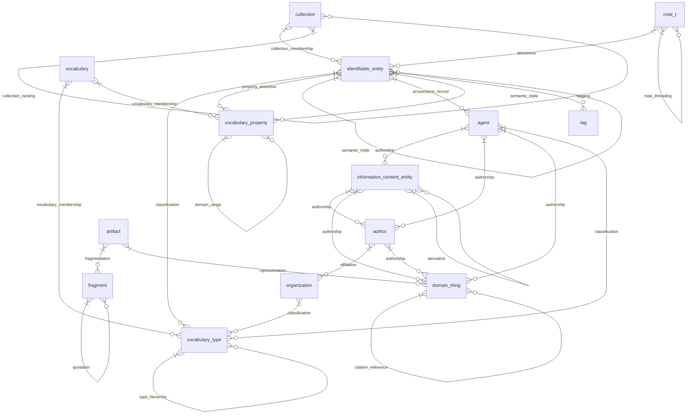

# Core Schema

> **Source:** `alhazen_notebook.tql`

The foundational Alhazen Notebook Model — five ICE subtypes, agents, classification, and provenance.

**Summary:** 16 entities, 20 relations, 36 attributes

## Contents

- [Type Hierarchy](#type-hierarchy)
- [Relationships](#relationships)
- [Attributes](#attributes)
- [Entity Types](#entity-types)
- [Relation Types](#relation-types)
- [Query Examples](#query-examples)

## Type Hierarchy

```mermaid
classDiagram
    direction LR
    class agent {
        +id
        +name
        +iri
        +agent-type
        +model-name
    }
    class artifact
    information_content_entity <|-- artifact
    class author
    agent <|-- author
    class collection {
        +logical-query
        +is-extensional
    }
    identifiable_entity <|-- collection
    class domain_thing
    identifiable_entity <|-- domain_thing
    class fragment {
        +offset
        +length
    }
    information_content_entity <|-- fragment
    class identifiable_entity {
        +id
        +name
        +description
        +iri
        +created-at
    }
    <<abstract>> identifiable_entity
    class information_content_entity {
        +content
        +content-hash
        +format
        +token-count
        +cache-path
    }
    <<abstract>> information_content_entity
    identifiable_entity <|-- information_content_entity
    class information_resource
    identifiable_entity <|-- information_resource
    class note_t {
        +confidence
    }
    information_content_entity <|-- note_t
    class organization {
        +id
        +name
        +iri
    }
    class tag {
        +id
        +name
        +description
    }
    class user_question
    identifiable_entity <|-- user_question
    class vocabulary {
        +id
        +name
        +iri
        +description
    }
    class vocabulary_property {
        +id
        +name
        +schema-org-uri
        +description
    }
    class vocabulary_type {
        +id
        +name
        +schema-org-uri
        +wikidata-qid
        +description
    }
    class aboutness
    class affiliation {
        +valid-from
        +valid-until
    }
    class authorship {
        +created-at
    }
    class citation_reference {
        +provenance
        +created-at
    }
    class classification {
        +confidence
        +provenance
        +created-at
    }
    class collection_membership {
        +created-at
        +provenance
    }
    class collection_nesting
    class derivation {
        +provenance
        +created-at
    }
    class domain_range
    class evidence_chain {
        +confidence
        +evidence-type-attr
    }
    class fragmentation
    class note_threading
    class property_assertion {
        +created-at
        +provenance
        +value-string
    }
    class provenance_record {
        +agent-id
        +agent-type
        +model-name
        +operation-type
        +operation-timestamp
    }
    class quotation
    class representation
    class semantic_triple {
        +confidence
        +provenance
        +created-at
        +source-uri
    }
    class tagging {
        +created-at
        +provenance
    }
    class type_hierarchy
    class vocabulary_membership
```



## Relationships



## Attributes

| Attribute | Value Type | Description |
|-----------|-----------|-------------|
| `abstract-text` | `string` |  |
| `agent-id` | `string` | Agent/provenance tracking |
| `agent-type` | `string` |  |
| `cache-path` | `string` | Cache storage (for large artifacts stored externally) |
| `confidence` | `double` |  |
| `content` | `string` | Content and representation |
| `content-hash` | `string` |  |
| `created-at` | `datetime` | Temporal |
| `description` | `string` |  |
| `evidence-type-attr` | `string` |  |
| `file-size` | `long` |  |
| `format` | `string` |  |
| `id` | `string` | Identity and naming |
| `iri` | `string` |  |
| `is-extensional` | `boolean` |  |
| `length` | `long` |  |
| `license` | `string` |  |
| `logical-query` | `string` | Collection semantics |
| `mime-type` | `string` |  |
| `model-name` | `string` |  |
| `name` | `string` |  |
| `offset` | `long` | Fragment positioning |
| `operation-parameters` | `string` |  |
| `operation-timestamp` | `datetime` |  |
| `operation-type` | `string` |  |
| `provenance` | `string` | Provenance |
| `publication-date` | `datetime` |  |
| `schema-org-uri` | `string` | Classification metadata |
| `source-uri` | `string` |  |
| `token-count` | `long` |  |
| `updated-at` | `datetime` |  |
| `valid-from` | `datetime` |  |
| `valid-until` | `datetime` |  |
| `value-string` | `string` | Additional attributes |
| `vocabulary-source` | `string` |  |
| `wikidata-qid` | `string` |  |

## Entity Types

### `agent`

> AGENT - Creator of notes and other content

- **Kind:** Entity
- **Parent:** entity
- **Defined in:** `core`

**Attributes (owns):**

| Attribute | Key? | Defined In |
|-----------|------|------------|
| `id` | @key | core |
| `name` |  | core |
| `iri` |  | core |
| `agent-type` |  | core |
| `model-name` |  | core |

**Roles (plays):**

| Relation | Role | Defined In |
|----------|------|------------|
| `authorship` | `author` | core |
| `classification` | `classified-entity` | core |
| `provenance-record` | `performing-agent` | core |

### `artifact`

> ARTIFACT - Specific representations of Things

- **Kind:** Entity
- **Parent:** `information-content-entity`
- **Defined in:** `core`

**Attributes (owns):**

| Attribute | Key? | Defined In |
|-----------|------|------------|
| `content` |  | *information-content-entity* (inherited) |
| `content-hash` |  | *information-content-entity* (inherited) |
| `format` |  | *information-content-entity* (inherited) |
| `token-count` |  | *information-content-entity* (inherited) |
| `cache-path` |  | *information-content-entity* (inherited) |
| `mime-type` |  | *information-content-entity* (inherited) |
| `file-size` |  | *information-content-entity* (inherited) |
| `id` | @key | *identifiable-entity* (inherited) |
| `name` |  | *identifiable-entity* (inherited) |
| `description` |  | *identifiable-entity* (inherited) |
| `iri` |  | *identifiable-entity* (inherited) |
| `created-at` |  | *identifiable-entity* (inherited) |
| `updated-at` |  | *identifiable-entity* (inherited) |
| `provenance` |  | *identifiable-entity* (inherited) |
| `source-uri` |  | *identifiable-entity* (inherited) |
| `license` |  | *identifiable-entity* (inherited) |

**Roles (plays):**

| Relation | Role | Defined In |
|----------|------|------------|
| `representation` | `artifact` | core |
| `fragmentation` | `whole` | core |
| `authorship` | `work` | *information-content-entity* (inherited) |
| `derivation` | `derived-from-source` | *information-content-entity* (inherited) |
| `derivation` | `derivative` | *information-content-entity* (inherited) |
| `classification` | `classified-entity` | *identifiable-entity* (inherited) |
| `tagging` | `tagged-entity` | *identifiable-entity* (inherited) |
| `aboutness` | `subject` | *identifiable-entity* (inherited) |
| `collection-membership` | `member` | *identifiable-entity* (inherited) |
| `provenance-record` | `produced-entity` | *identifiable-entity* (inherited) |
| `provenance-record` | `source-entity` | *identifiable-entity* (inherited) |
| `property-assertion` | `subject-entity` | *identifiable-entity* (inherited) |
| `semantic-triple` | `triple-subject` | *identifiable-entity* (inherited) |
| `semantic-triple` | `triple-object` | *identifiable-entity* (inherited) |

### `author`

> AUTHOR - Specifically an author of a Thing (publication author)

- **Kind:** Entity
- **Parent:** `agent`
- **Defined in:** `core`

**Attributes (owns):**

| Attribute | Key? | Defined In |
|-----------|------|------------|
| `id` | @key | *agent* (inherited) |
| `name` |  | *agent* (inherited) |
| `iri` |  | *agent* (inherited) |
| `agent-type` |  | *agent* (inherited) |
| `model-name` |  | *agent* (inherited) |

**Roles (plays):**

| Relation | Role | Defined In |
|----------|------|------------|
| `authorship` | `publication-author` | core |
| `affiliation` | `affiliated-agent` | core |
| `authorship` | `author` | *agent* (inherited) |
| `classification` | `classified-entity` | *agent* (inherited) |
| `provenance-record` | `performing-agent` | *agent* (inherited) |

### `collection`

> COLLECTION - Organized groupings of Things Typed per domain namespace (scilit-corpus, jobhunt-search, apm-case-file, etc.)

- **Kind:** Entity
- **Parent:** `identifiable-entity`
- **Defined in:** `core`

**Attributes (owns):**

| Attribute | Key? | Defined In |
|-----------|------|------------|
| `logical-query` |  | core |
| `is-extensional` |  | core |
| `id` | @key | *identifiable-entity* (inherited) |
| `name` |  | *identifiable-entity* (inherited) |
| `description` |  | *identifiable-entity* (inherited) |
| `iri` |  | *identifiable-entity* (inherited) |
| `created-at` |  | *identifiable-entity* (inherited) |
| `updated-at` |  | *identifiable-entity* (inherited) |
| `provenance` |  | *identifiable-entity* (inherited) |
| `source-uri` |  | *identifiable-entity* (inherited) |
| `license` |  | *identifiable-entity* (inherited) |

**Roles (plays):**

| Relation | Role | Defined In |
|----------|------|------------|
| `collection-membership` | `collection` | core |
| `collection-nesting` | `parent-collection` | core |
| `collection-nesting` | `child-collection` | core |
| `addresses-requirement` | `resource` | core |
| `classification` | `classified-entity` | *identifiable-entity* (inherited) |
| `tagging` | `tagged-entity` | *identifiable-entity* (inherited) |
| `aboutness` | `subject` | *identifiable-entity* (inherited) |
| `collection-membership` | `member` | *identifiable-entity* (inherited) |
| `provenance-record` | `produced-entity` | *identifiable-entity* (inherited) |
| `provenance-record` | `source-entity` | *identifiable-entity* (inherited) |
| `property-assertion` | `subject-entity` | *identifiable-entity* (inherited) |
| `semantic-triple` | `triple-subject` | *identifiable-entity* (inherited) |
| `semantic-triple` | `triple-object` | *identifiable-entity* (inherited) |

### `domain-thing`

> THING - Domain objects (papers, genes, diseases, jobs, etc.) Concrete base type for real-world entities that are NOT information content

- **Kind:** Entity
- **Parent:** `identifiable-entity`
- **Defined in:** `core`

**Attributes (owns):**

| Attribute | Key? | Defined In |
|-----------|------|------------|
| `id` | @key | *identifiable-entity* (inherited) |
| `name` |  | *identifiable-entity* (inherited) |
| `description` |  | *identifiable-entity* (inherited) |
| `iri` |  | *identifiable-entity* (inherited) |
| `created-at` |  | *identifiable-entity* (inherited) |
| `updated-at` |  | *identifiable-entity* (inherited) |
| `provenance` |  | *identifiable-entity* (inherited) |
| `source-uri` |  | *identifiable-entity* (inherited) |
| `license` |  | *identifiable-entity* (inherited) |

**Roles (plays):**

| Relation | Role | Defined In |
|----------|------|------------|
| `representation` | `referent` | core |
| `authorship` | `authored-work` | core |
| `citation-reference` | `citing-item` | core |
| `citation-reference` | `cited-item` | core |
| `classification` | `classified-entity` | *identifiable-entity* (inherited) |
| `tagging` | `tagged-entity` | *identifiable-entity* (inherited) |
| `aboutness` | `subject` | *identifiable-entity* (inherited) |
| `collection-membership` | `member` | *identifiable-entity* (inherited) |
| `provenance-record` | `produced-entity` | *identifiable-entity* (inherited) |
| `provenance-record` | `source-entity` | *identifiable-entity* (inherited) |
| `property-assertion` | `subject-entity` | *identifiable-entity* (inherited) |
| `semantic-triple` | `triple-subject` | *identifiable-entity* (inherited) |
| `semantic-triple` | `triple-object` | *identifiable-entity* (inherited) |

### `fragment`

> FRAGMENT - Parts of artifacts

- **Kind:** Entity
- **Parent:** `information-content-entity`
- **Defined in:** `core`

**Attributes (owns):**

| Attribute | Key? | Defined In |
|-----------|------|------------|
| `offset` |  | core |
| `length` |  | core |
| `content` |  | *information-content-entity* (inherited) |
| `content-hash` |  | *information-content-entity* (inherited) |
| `format` |  | *information-content-entity* (inherited) |
| `token-count` |  | *information-content-entity* (inherited) |
| `cache-path` |  | *information-content-entity* (inherited) |
| `mime-type` |  | *information-content-entity* (inherited) |
| `file-size` |  | *information-content-entity* (inherited) |
| `id` | @key | *identifiable-entity* (inherited) |
| `name` |  | *identifiable-entity* (inherited) |
| `description` |  | *identifiable-entity* (inherited) |
| `iri` |  | *identifiable-entity* (inherited) |
| `created-at` |  | *identifiable-entity* (inherited) |
| `updated-at` |  | *identifiable-entity* (inherited) |
| `provenance` |  | *identifiable-entity* (inherited) |
| `source-uri` |  | *identifiable-entity* (inherited) |
| `license` |  | *identifiable-entity* (inherited) |

**Roles (plays):**

| Relation | Role | Defined In |
|----------|------|------------|
| `fragmentation` | `part` | core |
| `quotation` | `quoted-fragment` | core |
| `quotation` | `quoting-fragment` | core |
| `authorship` | `work` | *information-content-entity* (inherited) |
| `derivation` | `derived-from-source` | *information-content-entity* (inherited) |
| `derivation` | `derivative` | *information-content-entity* (inherited) |
| `classification` | `classified-entity` | *identifiable-entity* (inherited) |
| `tagging` | `tagged-entity` | *identifiable-entity* (inherited) |
| `aboutness` | `subject` | *identifiable-entity* (inherited) |
| `collection-membership` | `member` | *identifiable-entity* (inherited) |
| `provenance-record` | `produced-entity` | *identifiable-entity* (inherited) |
| `provenance-record` | `source-entity` | *identifiable-entity* (inherited) |
| `property-assertion` | `subject-entity` | *identifiable-entity* (inherited) |
| `semantic-triple` | `triple-subject` | *identifiable-entity* (inherited) |
| `semantic-triple` | `triple-object` | *identifiable-entity* (inherited) |

### `identifiable-entity`

> Shared abstract root for all identifiable entities Provides identity, metadata, and cross-cutting concerns (tagging, classification, provenance)

- **Kind:** Entity
- **Parent:** entity
- **Abstract:** Yes
- **Defined in:** `core`

**Attributes (owns):**

| Attribute | Key? | Defined In |
|-----------|------|------------|
| `id` | @key | core |
| `name` |  | core |
| `description` |  | core |
| `iri` |  | core |
| `created-at` |  | core |
| `updated-at` |  | core |
| `provenance` |  | core |
| `source-uri` |  | core |
| `license` |  | core |

**Roles (plays):**

| Relation | Role | Defined In |
|----------|------|------------|
| `classification` | `classified-entity` | core |
| `tagging` | `tagged-entity` | core |
| `aboutness` | `subject` | core |
| `collection-membership` | `member` | core |
| `provenance-record` | `produced-entity` | core |
| `provenance-record` | `source-entity` | core |
| `property-assertion` | `subject-entity` | core |
| `semantic-triple` | `triple-subject` | core |
| `semantic-triple` | `triple-object` | core |

### `information-content-entity`

> INFORMATION-CONTENT-ENTITY - Content-bearing entities (artifacts, fragments, notes) Only ICEs carry actual content, cache paths, formats, etc.

- **Kind:** Entity
- **Parent:** `identifiable-entity`
- **Abstract:** Yes
- **Defined in:** `core`

**Attributes (owns):**

| Attribute | Key? | Defined In |
|-----------|------|------------|
| `content` |  | core |
| `content-hash` |  | core |
| `format` |  | core |
| `token-count` |  | core |
| `cache-path` |  | core |
| `mime-type` |  | core |
| `file-size` |  | core |
| `id` | @key | *identifiable-entity* (inherited) |
| `name` |  | *identifiable-entity* (inherited) |
| `description` |  | *identifiable-entity* (inherited) |
| `iri` |  | *identifiable-entity* (inherited) |
| `created-at` |  | *identifiable-entity* (inherited) |
| `updated-at` |  | *identifiable-entity* (inherited) |
| `provenance` |  | *identifiable-entity* (inherited) |
| `source-uri` |  | *identifiable-entity* (inherited) |
| `license` |  | *identifiable-entity* (inherited) |

**Roles (plays):**

| Relation | Role | Defined In |
|----------|------|------------|
| `authorship` | `work` | core |
| `derivation` | `derived-from-source` | core |
| `derivation` | `derivative` | core |
| `classification` | `classified-entity` | *identifiable-entity* (inherited) |
| `tagging` | `tagged-entity` | *identifiable-entity* (inherited) |
| `aboutness` | `subject` | *identifiable-entity* (inherited) |
| `collection-membership` | `member` | *identifiable-entity* (inherited) |
| `provenance-record` | `produced-entity` | *identifiable-entity* (inherited) |
| `provenance-record` | `source-entity` | *identifiable-entity* (inherited) |
| `property-assertion` | `subject-entity` | *identifiable-entity* (inherited) |
| `semantic-triple` | `triple-subject` | *identifiable-entity* (inherited) |
| `semantic-triple` | `triple-object` | *identifiable-entity* (inherited) |

### `information-resource`

> INFORMATION-RESOURCE - Databases, knowledgebases, APIs

- **Kind:** Entity
- **Parent:** `identifiable-entity`
- **Defined in:** `core`

**Attributes (owns):**

| Attribute | Key? | Defined In |
|-----------|------|------------|
| `id` | @key | *identifiable-entity* (inherited) |
| `name` |  | *identifiable-entity* (inherited) |
| `description` |  | *identifiable-entity* (inherited) |
| `iri` |  | *identifiable-entity* (inherited) |
| `created-at` |  | *identifiable-entity* (inherited) |
| `updated-at` |  | *identifiable-entity* (inherited) |
| `provenance` |  | *identifiable-entity* (inherited) |
| `source-uri` |  | *identifiable-entity* (inherited) |
| `license` |  | *identifiable-entity* (inherited) |

**Roles (plays):**

| Relation | Role | Defined In |
|----------|------|------------|
| `classification` | `classified-entity` | *identifiable-entity* (inherited) |
| `tagging` | `tagged-entity` | *identifiable-entity* (inherited) |
| `aboutness` | `subject` | *identifiable-entity* (inherited) |
| `collection-membership` | `member` | *identifiable-entity* (inherited) |
| `provenance-record` | `produced-entity` | *identifiable-entity* (inherited) |
| `provenance-record` | `source-entity` | *identifiable-entity* (inherited) |
| `property-assertion` | `subject-entity` | *identifiable-entity* (inherited) |
| `semantic-triple` | `triple-subject` | *identifiable-entity* (inherited) |
| `semantic-triple` | `triple-object` | *identifiable-entity* (inherited) |

### `note`

> NOTE - Agent-generated annotations

- **Kind:** Entity
- **Parent:** `information-content-entity`
- **Defined in:** `core`

**Attributes (owns):**

| Attribute | Key? | Defined In |
|-----------|------|------------|
| `confidence` |  | core |
| `content` |  | *information-content-entity* (inherited) |
| `content-hash` |  | *information-content-entity* (inherited) |
| `format` |  | *information-content-entity* (inherited) |
| `token-count` |  | *information-content-entity* (inherited) |
| `cache-path` |  | *information-content-entity* (inherited) |
| `mime-type` |  | *information-content-entity* (inherited) |
| `file-size` |  | *information-content-entity* (inherited) |
| `id` | @key | *identifiable-entity* (inherited) |
| `name` |  | *identifiable-entity* (inherited) |
| `description` |  | *identifiable-entity* (inherited) |
| `iri` |  | *identifiable-entity* (inherited) |
| `created-at` |  | *identifiable-entity* (inherited) |
| `updated-at` |  | *identifiable-entity* (inherited) |
| `provenance` |  | *identifiable-entity* (inherited) |
| `source-uri` |  | *identifiable-entity* (inherited) |
| `license` |  | *identifiable-entity* (inherited) |

**Roles (plays):**

| Relation | Role | Defined In |
|----------|------|------------|
| `aboutness` | `note` | core |
| `note-threading` | `parent-note` | core |
| `note-threading` | `child-note` | core |
| `evidence-chain` | `claim` | core |
| `evidence-chain` | `evidence` | core |
| `authorship` | `work` | *information-content-entity* (inherited) |
| `derivation` | `derived-from-source` | *information-content-entity* (inherited) |
| `derivation` | `derivative` | *information-content-entity* (inherited) |
| `classification` | `classified-entity` | *identifiable-entity* (inherited) |
| `tagging` | `tagged-entity` | *identifiable-entity* (inherited) |
| `aboutness` | `subject` | *identifiable-entity* (inherited) |
| `collection-membership` | `member` | *identifiable-entity* (inherited) |
| `provenance-record` | `produced-entity` | *identifiable-entity* (inherited) |
| `provenance-record` | `source-entity` | *identifiable-entity* (inherited) |
| `property-assertion` | `subject-entity` | *identifiable-entity* (inherited) |
| `semantic-triple` | `triple-subject` | *identifiable-entity* (inherited) |
| `semantic-triple` | `triple-object` | *identifiable-entity* (inherited) |

### `organization`

> ORGANIZATION - Groups of agents/authors

- **Kind:** Entity
- **Parent:** entity
- **Defined in:** `core`

**Attributes (owns):**

| Attribute | Key? | Defined In |
|-----------|------|------------|
| `id` | @key | core |
| `name` |  | core |
| `iri` |  | core |

**Roles (plays):**

| Relation | Role | Defined In |
|----------|------|------------|
| `affiliation` | `organization` | core |
| `classification` | `classified-entity` | core |

### `tag`

> TAG - Lightweight classification without full vocabulary structure

- **Kind:** Entity
- **Parent:** entity
- **Defined in:** `core`

**Attributes (owns):**

| Attribute | Key? | Defined In |
|-----------|------|------------|
| `id` | @key | core |
| `name` |  | core |
| `description` |  | core |

**Roles (plays):**

| Relation | Role | Defined In |
|----------|------|------------|
| `tagging` | `tag` | core |

### `user-question`

> USER-QUESTION - Questions/instructions from users

- **Kind:** Entity
- **Parent:** `identifiable-entity`
- **Defined in:** `core`

**Attributes (owns):**

| Attribute | Key? | Defined In |
|-----------|------|------------|
| `id` | @key | *identifiable-entity* (inherited) |
| `name` |  | *identifiable-entity* (inherited) |
| `description` |  | *identifiable-entity* (inherited) |
| `iri` |  | *identifiable-entity* (inherited) |
| `created-at` |  | *identifiable-entity* (inherited) |
| `updated-at` |  | *identifiable-entity* (inherited) |
| `provenance` |  | *identifiable-entity* (inherited) |
| `source-uri` |  | *identifiable-entity* (inherited) |
| `license` |  | *identifiable-entity* (inherited) |

**Roles (plays):**

| Relation | Role | Defined In |
|----------|------|------------|
| `classification` | `classified-entity` | *identifiable-entity* (inherited) |
| `tagging` | `tagged-entity` | *identifiable-entity* (inherited) |
| `aboutness` | `subject` | *identifiable-entity* (inherited) |
| `collection-membership` | `member` | *identifiable-entity* (inherited) |
| `provenance-record` | `produced-entity` | *identifiable-entity* (inherited) |
| `provenance-record` | `source-entity` | *identifiable-entity* (inherited) |
| `property-assertion` | `subject-entity` | *identifiable-entity* (inherited) |
| `semantic-triple` | `triple-subject` | *identifiable-entity* (inherited) |
| `semantic-triple` | `triple-object` | *identifiable-entity* (inherited) |

### `vocabulary`

> VOCABULARY - A classification system (schema.org, Wikidata, UMLS, etc.)

- **Kind:** Entity
- **Parent:** entity
- **Defined in:** `core`

**Attributes (owns):**

| Attribute | Key? | Defined In |
|-----------|------|------------|
| `id` | @key | core |
| `name` |  | core |
| `iri` |  | core |
| `description` |  | core |

**Roles (plays):**

| Relation | Role | Defined In |
|----------|------|------------|
| `vocabulary-membership` | `vocab` | core |

### `vocabulary-property`

> VOCABULARY-PROPERTY - A property from an external vocabulary

- **Kind:** Entity
- **Parent:** entity
- **Defined in:** `core`

**Attributes (owns):**

| Attribute | Key? | Defined In |
|-----------|------|------------|
| `id` | @key | core |
| `name` |  | core |
| `schema-org-uri` |  | core |
| `description` |  | core |

**Roles (plays):**

| Relation | Role | Defined In |
|----------|------|------------|
| `vocabulary-membership` | `vocab-type` | core |
| `property-assertion` | `property-definition` | core |
| `domain-range` | `property-def` | core |
| `domain-range` | `domain-type` | core |
| `domain-range` | `range-type` | core |
| `semantic-triple` | `triple-predicate` | core |

### `vocabulary-type`

> VOCABULARY-TYPE - A type from an external vocabulary

- **Kind:** Entity
- **Parent:** entity
- **Defined in:** `core`

**Attributes (owns):**

| Attribute | Key? | Defined In |
|-----------|------|------------|
| `id` | @key | core |
| `name` |  | core |
| `schema-org-uri` |  | core |
| `wikidata-qid` |  | core |
| `description` |  | core |

**Roles (plays):**

| Relation | Role | Defined In |
|----------|------|------------|
| `vocabulary-membership` | `vocab-type` | core |
| `type-hierarchy` | `subtype` | core |
| `type-hierarchy` | `supertype` | core |
| `classification` | `type-facet` | core |

## Relation Types

### `aboutness`

> ABOUTNESS - The fundamental "is about" relation (IAO:0000136)

- **Kind:** Relation
- **Parent:** relation
- **Defined in:** `core`

**Roles (relates):**

| Role |
|------|
| `note` |
| `subject` |

### `affiliation`

> AFFILIATION - Agent/Author membership in organizations

- **Kind:** Relation
- **Parent:** relation
- **Defined in:** `core`

**Attributes (owns):**

| Attribute | Key? | Defined In |
|-----------|------|------------|
| `valid-from` |  | core |
| `valid-until` |  | core |

**Roles (relates):**

| Role |
|------|
| `affiliated-agent` |
| `organization` |

### `authorship`

> AUTHORSHIP - Who created what (general)

- **Kind:** Relation
- **Parent:** relation
- **Defined in:** `core`

**Attributes (owns):**

| Attribute | Key? | Defined In |
|-----------|------|------------|
| `created-at` |  | core |

**Roles (relates):**

| Role |
|------|
| `author` |
| `work` |
| `publication-author` |
| `authored-work` |

### `citation-reference`

> CITATION-REFERENCE - References between Things (paper cites paper)

- **Kind:** Relation
- **Parent:** relation
- **Defined in:** `core`

**Attributes (owns):**

| Attribute | Key? | Defined In |
|-----------|------|------------|
| `provenance` |  | core |
| `created-at` |  | core |

**Roles (relates):**

| Role |
|------|
| `citing-item` |
| `cited-item` |

### `classification`

> CLASSIFICATION - Assigning vocabulary types to entities

- **Kind:** Relation
- **Parent:** relation
- **Defined in:** `core`

**Attributes (owns):**

| Attribute | Key? | Defined In |
|-----------|------|------------|
| `confidence` |  | core |
| `provenance` |  | core |
| `created-at` |  | core |

**Roles (relates):**

| Role |
|------|
| `classified-entity` |
| `type-facet` |

### `collection-membership`

> COLLECTION-MEMBERSHIP - Things belonging to collections

- **Kind:** Relation
- **Parent:** relation
- **Defined in:** `core`

**Attributes (owns):**

| Attribute | Key? | Defined In |
|-----------|------|------------|
| `created-at` |  | core |
| `provenance` |  | core |

**Roles (relates):**

| Role |
|------|
| `collection` |
| `member` |

### `collection-nesting`

> COLLECTION-NESTING - Hierarchical collection organization

- **Kind:** Relation
- **Parent:** relation
- **Defined in:** `core`

**Roles (relates):**

| Role |
|------|
| `parent-collection` |
| `child-collection` |

### `derivation`

> DERIVATION - Provenance chain for derived content

- **Kind:** Relation
- **Parent:** relation
- **Defined in:** `core`

**Attributes (owns):**

| Attribute | Key? | Defined In |
|-----------|------|------------|
| `provenance` |  | core |
| `created-at` |  | core |

**Roles (relates):**

| Role |
|------|
| `derivative` |
| `derived-from-source` |

### `domain-range`

> DOMAIN-RANGE - Property constraints from vocabularies

- **Kind:** Relation
- **Parent:** relation
- **Defined in:** `core`

**Roles (relates):**

| Role |
|------|
| `property-def` |
| `domain-type` |
| `range-type` |

### `evidence-chain`

> EVIDENCE-CHAIN - Linking claims to supporting evidence

- **Kind:** Relation
- **Parent:** relation
- **Defined in:** `core`

**Attributes (owns):**

| Attribute | Key? | Defined In |
|-----------|------|------------|
| `confidence` |  | core |
| `evidence-type-attr` |  | core |

**Roles (relates):**

| Role |
|------|
| `claim` |
| `evidence` |

### `fragmentation`

> FRAGMENTATION - Parts of artifacts

- **Kind:** Relation
- **Parent:** relation
- **Defined in:** `core`

**Roles (relates):**

| Role |
|------|
| `whole` |
| `part` |

### `note-threading`

> NOTE-THREADING - Hierarchical note organization (replies, follow-ups)

- **Kind:** Relation
- **Parent:** relation
- **Defined in:** `core`

**Roles (relates):**

| Role |
|------|
| `parent-note` |
| `child-note` |

### `property-assertion`

> PROPERTY-ASSERTION - Dynamic property assignment

- **Kind:** Relation
- **Parent:** relation
- **Defined in:** `core`

**Attributes (owns):**

| Attribute | Key? | Defined In |
|-----------|------|------------|
| `created-at` |  | core |
| `provenance` |  | core |
| `value-string` |  | core |

**Roles (relates):**

| Role |
|------|
| `subject-entity` |
| `property-definition` |

### `provenance-record`

> PROVENANCE-RECORD - Detailed tracking of who/what created entities

- **Kind:** Relation
- **Parent:** relation
- **Defined in:** `core`

**Attributes (owns):**

| Attribute | Key? | Defined In |
|-----------|------|------------|
| `agent-id` |  | core |
| `agent-type` |  | core |
| `model-name` |  | core |
| `operation-type` |  | core |
| `operation-timestamp` |  | core |
| `operation-parameters` |  | core |

**Roles (relates):**

| Role |
|------|
| `produced-entity` |
| `source-entity` |
| `performing-agent` |

### `quotation`

> QUOTATION - When a fragment quotes another

- **Kind:** Relation
- **Parent:** relation
- **Defined in:** `core`

**Roles (relates):**

| Role |
|------|
| `quoting-fragment` |
| `quoted-fragment` |

### `representation`

> REPRESENTATION - Connects artifacts to the things they represent

- **Kind:** Relation
- **Parent:** relation
- **Defined in:** `core`

**Roles (relates):**

| Role |
|------|
| `artifact` |
| `referent` |

### `semantic-triple`

> SEMANTIC-TRIPLE - For RDF-style assertions with provenance

- **Kind:** Relation
- **Parent:** relation
- **Defined in:** `core`

**Attributes (owns):**

| Attribute | Key? | Defined In |
|-----------|------|------------|
| `confidence` |  | core |
| `provenance` |  | core |
| `created-at` |  | core |
| `source-uri` |  | core |

**Roles (relates):**

| Role |
|------|
| `triple-subject` |
| `triple-predicate` |
| `triple-object` |

### `tagging`

> TAGGING - Lightweight classification

- **Kind:** Relation
- **Parent:** relation
- **Defined in:** `core`

**Attributes (owns):**

| Attribute | Key? | Defined In |
|-----------|------|------------|
| `created-at` |  | core |
| `provenance` |  | core |

**Roles (relates):**

| Role |
|------|
| `tagged-entity` |
| `tag` |

### `type-hierarchy`

> TYPE-HIERARCHY - Subtype relationships within vocabularies

- **Kind:** Relation
- **Parent:** relation
- **Defined in:** `core`

**Roles (relates):**

| Role |
|------|
| `subtype` |
| `supertype` |

### `vocabulary-membership`

> VOCABULARY-MEMBERSHIP - Types belonging to vocabularies

- **Kind:** Relation
- **Parent:** relation
- **Defined in:** `core`

**Roles (relates):**

| Role |
|------|
| `vocab` |
| `vocab-type` |

## Query Examples

### Collection Management

Creating, querying, and managing collections of research items.

**Create a collection**
*Used by:* `typedb_notebook.py insert-collection`

```typeql
insert $c isa collection,
    has id "my-collection-id",
    has name "My Collection",
    has description "A curated set of papers",
    has created-at 2025-01-15T10:30:00;
```

**Fetch collection details**
*Used by:* `typedb_notebook.py query-collection`

```typeql
match $c isa collection, has id "my-collection-id";
fetch $c: id, name, description;
```

**List collection members**
*Used by:* `typedb_notebook.py query-collection`

```typeql
match
    $c isa collection, has id "my-collection-id";
    (collection: $c, member: $m) isa collection-membership;
fetch $m: id, name;
```

**Add member to collection**
*Used by:* `typedb_notebook.py insert-paper`

```typeql
match
    $c isa collection, has id "my-collection-id";
    $p isa research-item, has id "paper-id";
insert
    (collection: $c, member: $p) isa collection-membership;
```

### Notes and Aboutness

Creating notes and linking them to entities via the aboutness relation.

**Create a note about an entity**

```typeql
insert $n isa note,
    has id "note-abc123",
    has name "Key finding",
    has content "This paper demonstrates...",
    has confidence 0.9,
    has created-at 2025-01-15T10:30:00;
```

**Link note to subject via aboutness**

```typeql
match
    $n isa note, has id "note-abc123";
    $s isa entity, has id "paper-id";
insert
    (note: $n, subject: $s) isa aboutness;
```

**Fetch notes about an entity**

```typeql
match
    $e isa entity, has id "paper-id";
    (note: $n, subject: $e) isa aboutness;
fetch $n: id, name, content;
```

### Tagging

Lightweight classification using tags.

**Create and apply a tag**
*Used by:* `jobhunt.py tag`

```typeql
insert $t isa tag,
    has id "tag-ml",
    has name "machine-learning";
```

**Tag an entity**

```typeql
match
    $e isa entity, has id "paper-id";
    $t isa tag, has name "machine-learning";
insert
    (tagged-entity: $e, tag: $t) isa tagging;
```

**Search by tag**
*Used by:* `jobhunt.py search-tag`

```typeql
match
    $t isa tag, has name "machine-learning";
    (tagged-entity: $e, tag: $t) isa tagging;
    $e has id $id, has name $name;
fetch $e: id, name;
```
