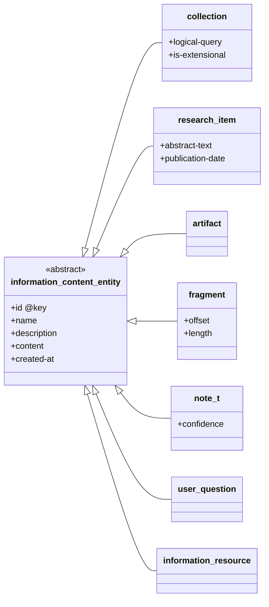
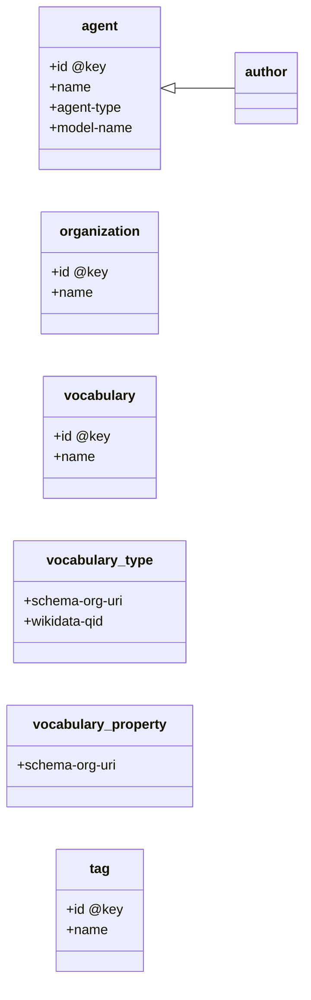

# TypeDB Schema Documentation

> Auto-generated by `generate_schema_docs.py`. Do not edit manually.

## Overview

The Alhazen Notebook Model is a TypeDB knowledge graph schema for agent memory systems.
It follows a five-level hierarchy: **Collection → Thing → Artifact → Fragment → Note**.

**Total types:** 96 entities, 41 relations, 136 attributes

## Core Model

The five primary ICE (Information Content Entity) subtypes form the backbone:

## Namespaces

| Namespace | Description | Entities | Relations | Attributes | Docs |
|-----------|-------------|----------|-----------|------------|------|
| **Core Schema** | The foundational Alhazen Notebook Model — five ICE subtypes,... | 16 | 20 | 36 | [core.md](core.md) |
| **Scientific Literature (scilit)** | Domain-specific subtypes for scientific literature analysis:... | 25 | 4 | 25 | [scilit.md](scilit.md) |
| **Job Hunting (jobhunt)** | Job hunting and career management: positions, companies, ski... | 20 | 4 | 28 | [jobhunt.md](jobhunt.md) |
| **Algorithm for Precision Medicine (apm)** | Rare disease investigation following Matt Might's APM: diagn... | 35 | 13 | 47 | [apm.md](apm.md) |

## Agent & Classification Subsystem

