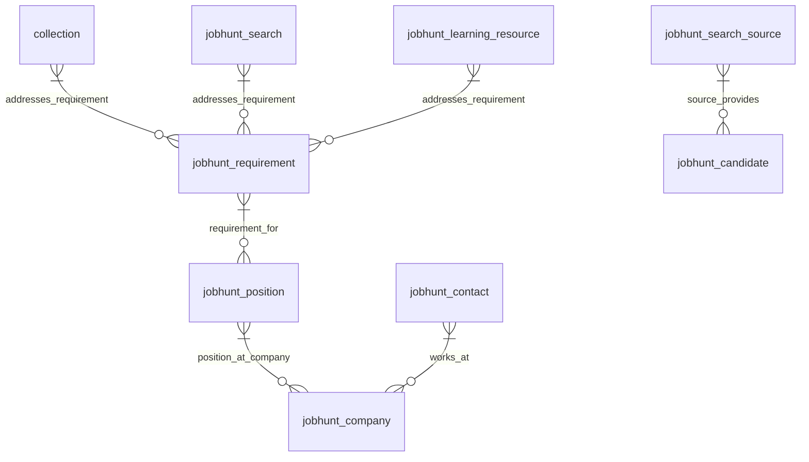

# Job Hunting (jobhunt)

> **Source:** `namespaces/jobhunt.tql`

Job hunting and career management: positions, companies, skill gaps, learning resources, and application tracking.

**Summary:** 22 entities, 5 relations, 37 attributes

## Contents

- [Type Hierarchy](#type-hierarchy)
- [Relationships](#relationships)
- [Attributes](#attributes)
- [Entity Types](#entity-types)
- [Relation Types](#relation-types)
- [Query Examples](#query-examples)

## Type Hierarchy

```mermaid
classDiagram
    direction LR
    class jobhunt_application_note {
        +application-status
        +applied-date
        +response-date
    }
    note_t <|-- jobhunt_application_note
    class jobhunt_candidate {
        +job-url
        +external-job-id
        +location
        +discovered-at
        +relevance-score
    }
    domain_thing <|-- jobhunt_candidate
    class jobhunt_company {
        +company-url
        +linkedin-url
        +location
    }
    domain_thing <|-- jobhunt_company
    class jobhunt_company_page
    artifact <|-- jobhunt_company_page
    class jobhunt_contact {
        +contact-role
        +contact-email
        +linkedin-url
    }
    agent <|-- jobhunt_contact
    class jobhunt_cover_letter
    artifact <|-- jobhunt_cover_letter
    class jobhunt_fit_analysis_note {
        +fit-score
        +fit-summary
    }
    note_t <|-- jobhunt_fit_analysis_note
    class jobhunt_interaction_note {
        +interaction-type
        +interaction-date
    }
    note_t <|-- jobhunt_interaction_note
    class jobhunt_interview_note {
        +interview-date
    }
    note_t <|-- jobhunt_interview_note
    class jobhunt_job_description
    artifact <|-- jobhunt_job_description
    class jobhunt_learning_resource {
        +resource-type
        +resource-url
        +estimated-hours
        +completion-status
    }
    domain_thing <|-- jobhunt_learning_resource
    class jobhunt_position {
        +job-url
        +short-name
        +salary-range
        +location
        +remote-policy
    }
    domain_thing <|-- jobhunt_position
    class jobhunt_qualification
    fragment <|-- jobhunt_qualification
    class jobhunt_requirement {
        +skill-name
        +skill-level
        +your-level
    }
    fragment <|-- jobhunt_requirement
    class jobhunt_research_note
    note_t <|-- jobhunt_research_note
    class jobhunt_responsibility
    fragment <|-- jobhunt_responsibility
    class jobhunt_resume
    artifact <|-- jobhunt_resume
    class jobhunt_search
    collection <|-- jobhunt_search
    class jobhunt_search_source {
        +board-token
        +board-platform
        +company-url
        +search-query
        +search-location
    }
    domain_thing <|-- jobhunt_search_source
    class jobhunt_skill_gap_note
    note_t <|-- jobhunt_skill_gap_note
    class jobhunt_strategy_note
    note_t <|-- jobhunt_strategy_note
    class your_skill {
        +skill-name
        +skill-level
        +last-updated
    }
    domain_thing <|-- your_skill
    class addresses_requirement {
        +confidence
    }
    class position_at_company
    class requirement_for
    class source_provides
    class works_at {
        +valid-from
        +valid-until
    }
    class domain_thing
    <<core>> domain_thing
    class artifact
    <<core>> artifact
    class note_t
    <<core>> note_t
    class agent
    <<core>> agent
    class collection
    <<core>> collection
    class fragment
    <<core>> fragment
```



## Relationships



## Attributes

| Attribute | Value Type | Description |
|-----------|-----------|-------------|
| `application-status` | `string` | Application tracking |
| `applied-date` | `datetime` |  |
| `board-platform` | `string` |  |
| `board-token` | `string` | Forager attributes (automated job discovery) |
| `candidate-status` | `string` |  |
| `company-url` | `string` |  |
| `completion-status` | `string` |  |
| `contact-email` | `string` |  |
| `contact-role` | `string` | Contact attributes |
| `deadline` | `datetime` |  |
| `discovered-at` | `datetime` |  |
| `estimated-hours` | `long` |  |
| `external-job-id` | `string` |  |
| `fit-score` | `double` | Fit analysis |
| `fit-summary` | `string` |  |
| `interaction-date` | `datetime` |  |
| `interaction-type` | `string` | Interaction tracking |
| `interview-date` | `datetime` |  |
| `job-url` | `string` | URL attributes |
| `last-updated` | `datetime` | Your skill profile attributes |
| `linkedin-url` | `string` |  |
| `location` | `string` |  |
| `priority-level` | `string` | Priority |
| `relevance-score` | `double` |  |
| `remote-policy` | `string` |  |
| `resource-type` | `string` | Learning resource attributes |
| `resource-url` | `string` |  |
| `response-date` | `datetime` |  |
| `salary-range` | `string` |  |
| `search-location` | `string` |  |
| `search-query` | `string` |  |
| `short-name` | `string` | Position attributes |
| `skill-level` | `string` |  |
| `skill-name` | `string` | Skill/requirement attributes |
| `team-size` | `string` |  |
| `triage-reason` | `string` |  |
| `your-level` | `string` |  |

## Entity Types

### `jobhunt-application-note`

> JOBHUNT-APPLICATION-NOTE - Status tracking, dates

- **Kind:** Entity
- **Parent:** `note`
- **Defined in:** `jobhunt`

**Attributes (owns):**

| Attribute | Key? | Defined In |
|-----------|------|------------|
| `application-status` |  | jobhunt |
| `applied-date` |  | jobhunt |
| `response-date` |  | jobhunt |
| `confidence` |  | *note* (inherited) |
| `content` |  | *information-content-entity* (inherited) |
| `content-hash` |  | *information-content-entity* (inherited) |
| `format` |  | *information-content-entity* (inherited) |
| `token-count` |  | *information-content-entity* (inherited) |
| `cache-path` |  | *information-content-entity* (inherited) |
| `mime-type` |  | *information-content-entity* (inherited) |
| `file-size` |  | *information-content-entity* (inherited) |
| `id` | @key | *identifiable-entity* (inherited) |
| `name` |  | *identifiable-entity* (inherited) |
| `description` |  | *identifiable-entity* (inherited) |
| `iri` |  | *identifiable-entity* (inherited) |
| `created-at` |  | *identifiable-entity* (inherited) |
| `updated-at` |  | *identifiable-entity* (inherited) |
| `provenance` |  | *identifiable-entity* (inherited) |
| `source-uri` |  | *identifiable-entity* (inherited) |
| `license` |  | *identifiable-entity* (inherited) |

**Roles (plays):**

| Relation | Role | Defined In |
|----------|------|------------|
| `aboutness` | `note` | *note* (inherited) |
| `note-threading` | `parent-note` | *note* (inherited) |
| `note-threading` | `child-note` | *note* (inherited) |
| `evidence-chain` | `claim` | *note* (inherited) |
| `evidence-chain` | `evidence` | *note* (inherited) |
| `authorship` | `work` | *information-content-entity* (inherited) |
| `derivation` | `derived-from-source` | *information-content-entity* (inherited) |
| `derivation` | `derivative` | *information-content-entity* (inherited) |
| `classification` | `classified-entity` | *identifiable-entity* (inherited) |
| `tagging` | `tagged-entity` | *identifiable-entity* (inherited) |
| `aboutness` | `subject` | *identifiable-entity* (inherited) |
| `collection-membership` | `member` | *identifiable-entity* (inherited) |
| `provenance-record` | `produced-entity` | *identifiable-entity* (inherited) |
| `provenance-record` | `source-entity` | *identifiable-entity* (inherited) |
| `property-assertion` | `subject-entity` | *identifiable-entity* (inherited) |
| `semantic-triple` | `triple-subject` | *identifiable-entity* (inherited) |
| `semantic-triple` | `triple-object` | *identifiable-entity* (inherited) |

### `jobhunt-candidate`

> JOBHUNT-CANDIDATE - A discovered job posting (forager, lightweight)

- **Kind:** Entity
- **Parent:** `domain-thing`
- **Defined in:** `jobhunt`

**Attributes (owns):**

| Attribute | Key? | Defined In |
|-----------|------|------------|
| `job-url` |  | jobhunt |
| `external-job-id` |  | jobhunt |
| `location` |  | jobhunt |
| `discovered-at` |  | jobhunt |
| `relevance-score` |  | jobhunt |
| `candidate-status` |  | jobhunt |
| `triage-reason` |  | jobhunt |
| `id` | @key | *identifiable-entity* (inherited) |
| `name` |  | *identifiable-entity* (inherited) |
| `description` |  | *identifiable-entity* (inherited) |
| `iri` |  | *identifiable-entity* (inherited) |
| `created-at` |  | *identifiable-entity* (inherited) |
| `updated-at` |  | *identifiable-entity* (inherited) |
| `provenance` |  | *identifiable-entity* (inherited) |
| `source-uri` |  | *identifiable-entity* (inherited) |
| `license` |  | *identifiable-entity* (inherited) |

**Roles (plays):**

| Relation | Role | Defined In |
|----------|------|------------|
| `source-provides` | `candidate` | jobhunt |
| `representation` | `referent` | *domain-thing* (inherited) |
| `authorship` | `authored-work` | *domain-thing* (inherited) |
| `citation-reference` | `citing-item` | *domain-thing* (inherited) |
| `citation-reference` | `cited-item` | *domain-thing* (inherited) |
| `classification` | `classified-entity` | *identifiable-entity* (inherited) |
| `tagging` | `tagged-entity` | *identifiable-entity* (inherited) |
| `aboutness` | `subject` | *identifiable-entity* (inherited) |
| `collection-membership` | `member` | *identifiable-entity* (inherited) |
| `provenance-record` | `produced-entity` | *identifiable-entity* (inherited) |
| `provenance-record` | `source-entity` | *identifiable-entity* (inherited) |
| `property-assertion` | `subject-entity` | *identifiable-entity* (inherited) |
| `semantic-triple` | `triple-subject` | *identifiable-entity* (inherited) |
| `semantic-triple` | `triple-object` | *identifiable-entity* (inherited) |

### `jobhunt-company`

> JOBHUNT-COMPANY - An organization/employer

- **Kind:** Entity
- **Parent:** `domain-thing`
- **Defined in:** `jobhunt`

**Attributes (owns):**

| Attribute | Key? | Defined In |
|-----------|------|------------|
| `company-url` |  | jobhunt |
| `linkedin-url` |  | jobhunt |
| `location` |  | jobhunt |
| `id` | @key | *identifiable-entity* (inherited) |
| `name` |  | *identifiable-entity* (inherited) |
| `description` |  | *identifiable-entity* (inherited) |
| `iri` |  | *identifiable-entity* (inherited) |
| `created-at` |  | *identifiable-entity* (inherited) |
| `updated-at` |  | *identifiable-entity* (inherited) |
| `provenance` |  | *identifiable-entity* (inherited) |
| `source-uri` |  | *identifiable-entity* (inherited) |
| `license` |  | *identifiable-entity* (inherited) |

**Roles (plays):**

| Relation | Role | Defined In |
|----------|------|------------|
| `position-at-company` | `employer` | jobhunt |
| `works-at` | `employer` | jobhunt |
| `representation` | `referent` | *domain-thing* (inherited) |
| `authorship` | `authored-work` | *domain-thing* (inherited) |
| `citation-reference` | `citing-item` | *domain-thing* (inherited) |
| `citation-reference` | `cited-item` | *domain-thing* (inherited) |
| `classification` | `classified-entity` | *identifiable-entity* (inherited) |
| `tagging` | `tagged-entity` | *identifiable-entity* (inherited) |
| `aboutness` | `subject` | *identifiable-entity* (inherited) |
| `collection-membership` | `member` | *identifiable-entity* (inherited) |
| `provenance-record` | `produced-entity` | *identifiable-entity* (inherited) |
| `provenance-record` | `source-entity` | *identifiable-entity* (inherited) |
| `property-assertion` | `subject-entity` | *identifiable-entity* (inherited) |
| `semantic-triple` | `triple-subject` | *identifiable-entity* (inherited) |
| `semantic-triple` | `triple-object` | *identifiable-entity* (inherited) |

### `jobhunt-company-page`

> JOBHUNT-COMPANY-PAGE - About/careers page content

- **Kind:** Entity
- **Parent:** `artifact`
- **Defined in:** `jobhunt`

**Attributes (owns):**

| Attribute | Key? | Defined In |
|-----------|------|------------|
| `content` |  | *information-content-entity* (inherited) |
| `content-hash` |  | *information-content-entity* (inherited) |
| `format` |  | *information-content-entity* (inherited) |
| `token-count` |  | *information-content-entity* (inherited) |
| `cache-path` |  | *information-content-entity* (inherited) |
| `mime-type` |  | *information-content-entity* (inherited) |
| `file-size` |  | *information-content-entity* (inherited) |
| `id` | @key | *identifiable-entity* (inherited) |
| `name` |  | *identifiable-entity* (inherited) |
| `description` |  | *identifiable-entity* (inherited) |
| `iri` |  | *identifiable-entity* (inherited) |
| `created-at` |  | *identifiable-entity* (inherited) |
| `updated-at` |  | *identifiable-entity* (inherited) |
| `provenance` |  | *identifiable-entity* (inherited) |
| `source-uri` |  | *identifiable-entity* (inherited) |
| `license` |  | *identifiable-entity* (inherited) |

**Roles (plays):**

| Relation | Role | Defined In |
|----------|------|------------|
| `representation` | `artifact` | *artifact* (inherited) |
| `fragmentation` | `whole` | *artifact* (inherited) |
| `authorship` | `work` | *information-content-entity* (inherited) |
| `derivation` | `derived-from-source` | *information-content-entity* (inherited) |
| `derivation` | `derivative` | *information-content-entity* (inherited) |
| `classification` | `classified-entity` | *identifiable-entity* (inherited) |
| `tagging` | `tagged-entity` | *identifiable-entity* (inherited) |
| `aboutness` | `subject` | *identifiable-entity* (inherited) |
| `collection-membership` | `member` | *identifiable-entity* (inherited) |
| `provenance-record` | `produced-entity` | *identifiable-entity* (inherited) |
| `provenance-record` | `source-entity` | *identifiable-entity* (inherited) |
| `property-assertion` | `subject-entity` | *identifiable-entity* (inherited) |
| `semantic-triple` | `triple-subject` | *identifiable-entity* (inherited) |
| `semantic-triple` | `triple-object` | *identifiable-entity* (inherited) |

### `jobhunt-contact`

> JOBHUNT-CONTACT - A person at a company

- **Kind:** Entity
- **Parent:** `agent`
- **Defined in:** `jobhunt`

**Attributes (owns):**

| Attribute | Key? | Defined In |
|-----------|------|------------|
| `contact-role` |  | jobhunt |
| `contact-email` |  | jobhunt |
| `linkedin-url` |  | jobhunt |
| `id` | @key | *agent* (inherited) |
| `name` |  | *agent* (inherited) |
| `iri` |  | *agent* (inherited) |
| `agent-type` |  | *agent* (inherited) |
| `model-name` |  | *agent* (inherited) |

**Roles (plays):**

| Relation | Role | Defined In |
|----------|------|------------|
| `works-at` | `employee` | jobhunt |
| `authorship` | `author` | *agent* (inherited) |
| `classification` | `classified-entity` | *agent* (inherited) |
| `provenance-record` | `performing-agent` | *agent* (inherited) |

### `jobhunt-cover-letter`

> JOBHUNT-COVER-LETTER - Tailored cover letter

- **Kind:** Entity
- **Parent:** `artifact`
- **Defined in:** `jobhunt`

**Attributes (owns):**

| Attribute | Key? | Defined In |
|-----------|------|------------|
| `content` |  | *information-content-entity* (inherited) |
| `content-hash` |  | *information-content-entity* (inherited) |
| `format` |  | *information-content-entity* (inherited) |
| `token-count` |  | *information-content-entity* (inherited) |
| `cache-path` |  | *information-content-entity* (inherited) |
| `mime-type` |  | *information-content-entity* (inherited) |
| `file-size` |  | *information-content-entity* (inherited) |
| `id` | @key | *identifiable-entity* (inherited) |
| `name` |  | *identifiable-entity* (inherited) |
| `description` |  | *identifiable-entity* (inherited) |
| `iri` |  | *identifiable-entity* (inherited) |
| `created-at` |  | *identifiable-entity* (inherited) |
| `updated-at` |  | *identifiable-entity* (inherited) |
| `provenance` |  | *identifiable-entity* (inherited) |
| `source-uri` |  | *identifiable-entity* (inherited) |
| `license` |  | *identifiable-entity* (inherited) |

**Roles (plays):**

| Relation | Role | Defined In |
|----------|------|------------|
| `representation` | `artifact` | *artifact* (inherited) |
| `fragmentation` | `whole` | *artifact* (inherited) |
| `authorship` | `work` | *information-content-entity* (inherited) |
| `derivation` | `derived-from-source` | *information-content-entity* (inherited) |
| `derivation` | `derivative` | *information-content-entity* (inherited) |
| `classification` | `classified-entity` | *identifiable-entity* (inherited) |
| `tagging` | `tagged-entity` | *identifiable-entity* (inherited) |
| `aboutness` | `subject` | *identifiable-entity* (inherited) |
| `collection-membership` | `member` | *identifiable-entity* (inherited) |
| `provenance-record` | `produced-entity` | *identifiable-entity* (inherited) |
| `provenance-record` | `source-entity` | *identifiable-entity* (inherited) |
| `property-assertion` | `subject-entity` | *identifiable-entity* (inherited) |
| `semantic-triple` | `triple-subject` | *identifiable-entity* (inherited) |
| `semantic-triple` | `triple-object` | *identifiable-entity* (inherited) |

### `jobhunt-fit-analysis-note`

> JOBHUNT-FIT-ANALYSIS-NOTE - How well you match a position

- **Kind:** Entity
- **Parent:** `note`
- **Defined in:** `jobhunt`

**Attributes (owns):**

| Attribute | Key? | Defined In |
|-----------|------|------------|
| `fit-score` |  | jobhunt |
| `fit-summary` |  | jobhunt |
| `confidence` |  | *note* (inherited) |
| `content` |  | *information-content-entity* (inherited) |
| `content-hash` |  | *information-content-entity* (inherited) |
| `format` |  | *information-content-entity* (inherited) |
| `token-count` |  | *information-content-entity* (inherited) |
| `cache-path` |  | *information-content-entity* (inherited) |
| `mime-type` |  | *information-content-entity* (inherited) |
| `file-size` |  | *information-content-entity* (inherited) |
| `id` | @key | *identifiable-entity* (inherited) |
| `name` |  | *identifiable-entity* (inherited) |
| `description` |  | *identifiable-entity* (inherited) |
| `iri` |  | *identifiable-entity* (inherited) |
| `created-at` |  | *identifiable-entity* (inherited) |
| `updated-at` |  | *identifiable-entity* (inherited) |
| `provenance` |  | *identifiable-entity* (inherited) |
| `source-uri` |  | *identifiable-entity* (inherited) |
| `license` |  | *identifiable-entity* (inherited) |

**Roles (plays):**

| Relation | Role | Defined In |
|----------|------|------------|
| `aboutness` | `note` | *note* (inherited) |
| `note-threading` | `parent-note` | *note* (inherited) |
| `note-threading` | `child-note` | *note* (inherited) |
| `evidence-chain` | `claim` | *note* (inherited) |
| `evidence-chain` | `evidence` | *note* (inherited) |
| `authorship` | `work` | *information-content-entity* (inherited) |
| `derivation` | `derived-from-source` | *information-content-entity* (inherited) |
| `derivation` | `derivative` | *information-content-entity* (inherited) |
| `classification` | `classified-entity` | *identifiable-entity* (inherited) |
| `tagging` | `tagged-entity` | *identifiable-entity* (inherited) |
| `aboutness` | `subject` | *identifiable-entity* (inherited) |
| `collection-membership` | `member` | *identifiable-entity* (inherited) |
| `provenance-record` | `produced-entity` | *identifiable-entity* (inherited) |
| `provenance-record` | `source-entity` | *identifiable-entity* (inherited) |
| `property-assertion` | `subject-entity` | *identifiable-entity* (inherited) |
| `semantic-triple` | `triple-subject` | *identifiable-entity* (inherited) |
| `semantic-triple` | `triple-object` | *identifiable-entity* (inherited) |

### `jobhunt-interaction-note`

> JOBHUNT-INTERACTION-NOTE - Record of contact/conversation

- **Kind:** Entity
- **Parent:** `note`
- **Defined in:** `jobhunt`

**Attributes (owns):**

| Attribute | Key? | Defined In |
|-----------|------|------------|
| `interaction-type` |  | jobhunt |
| `interaction-date` |  | jobhunt |
| `confidence` |  | *note* (inherited) |
| `content` |  | *information-content-entity* (inherited) |
| `content-hash` |  | *information-content-entity* (inherited) |
| `format` |  | *information-content-entity* (inherited) |
| `token-count` |  | *information-content-entity* (inherited) |
| `cache-path` |  | *information-content-entity* (inherited) |
| `mime-type` |  | *information-content-entity* (inherited) |
| `file-size` |  | *information-content-entity* (inherited) |
| `id` | @key | *identifiable-entity* (inherited) |
| `name` |  | *identifiable-entity* (inherited) |
| `description` |  | *identifiable-entity* (inherited) |
| `iri` |  | *identifiable-entity* (inherited) |
| `created-at` |  | *identifiable-entity* (inherited) |
| `updated-at` |  | *identifiable-entity* (inherited) |
| `provenance` |  | *identifiable-entity* (inherited) |
| `source-uri` |  | *identifiable-entity* (inherited) |
| `license` |  | *identifiable-entity* (inherited) |

**Roles (plays):**

| Relation | Role | Defined In |
|----------|------|------------|
| `aboutness` | `note` | *note* (inherited) |
| `note-threading` | `parent-note` | *note* (inherited) |
| `note-threading` | `child-note` | *note* (inherited) |
| `evidence-chain` | `claim` | *note* (inherited) |
| `evidence-chain` | `evidence` | *note* (inherited) |
| `authorship` | `work` | *information-content-entity* (inherited) |
| `derivation` | `derived-from-source` | *information-content-entity* (inherited) |
| `derivation` | `derivative` | *information-content-entity* (inherited) |
| `classification` | `classified-entity` | *identifiable-entity* (inherited) |
| `tagging` | `tagged-entity` | *identifiable-entity* (inherited) |
| `aboutness` | `subject` | *identifiable-entity* (inherited) |
| `collection-membership` | `member` | *identifiable-entity* (inherited) |
| `provenance-record` | `produced-entity` | *identifiable-entity* (inherited) |
| `provenance-record` | `source-entity` | *identifiable-entity* (inherited) |
| `property-assertion` | `subject-entity` | *identifiable-entity* (inherited) |
| `semantic-triple` | `triple-subject` | *identifiable-entity* (inherited) |
| `semantic-triple` | `triple-object` | *identifiable-entity* (inherited) |

### `jobhunt-interview-note`

> JOBHUNT-INTERVIEW-NOTE - Interview prep, feedback

- **Kind:** Entity
- **Parent:** `note`
- **Defined in:** `jobhunt`

**Attributes (owns):**

| Attribute | Key? | Defined In |
|-----------|------|------------|
| `interview-date` |  | jobhunt |
| `confidence` |  | *note* (inherited) |
| `content` |  | *information-content-entity* (inherited) |
| `content-hash` |  | *information-content-entity* (inherited) |
| `format` |  | *information-content-entity* (inherited) |
| `token-count` |  | *information-content-entity* (inherited) |
| `cache-path` |  | *information-content-entity* (inherited) |
| `mime-type` |  | *information-content-entity* (inherited) |
| `file-size` |  | *information-content-entity* (inherited) |
| `id` | @key | *identifiable-entity* (inherited) |
| `name` |  | *identifiable-entity* (inherited) |
| `description` |  | *identifiable-entity* (inherited) |
| `iri` |  | *identifiable-entity* (inherited) |
| `created-at` |  | *identifiable-entity* (inherited) |
| `updated-at` |  | *identifiable-entity* (inherited) |
| `provenance` |  | *identifiable-entity* (inherited) |
| `source-uri` |  | *identifiable-entity* (inherited) |
| `license` |  | *identifiable-entity* (inherited) |

**Roles (plays):**

| Relation | Role | Defined In |
|----------|------|------------|
| `aboutness` | `note` | *note* (inherited) |
| `note-threading` | `parent-note` | *note* (inherited) |
| `note-threading` | `child-note` | *note* (inherited) |
| `evidence-chain` | `claim` | *note* (inherited) |
| `evidence-chain` | `evidence` | *note* (inherited) |
| `authorship` | `work` | *information-content-entity* (inherited) |
| `derivation` | `derived-from-source` | *information-content-entity* (inherited) |
| `derivation` | `derivative` | *information-content-entity* (inherited) |
| `classification` | `classified-entity` | *identifiable-entity* (inherited) |
| `tagging` | `tagged-entity` | *identifiable-entity* (inherited) |
| `aboutness` | `subject` | *identifiable-entity* (inherited) |
| `collection-membership` | `member` | *identifiable-entity* (inherited) |
| `provenance-record` | `produced-entity` | *identifiable-entity* (inherited) |
| `provenance-record` | `source-entity` | *identifiable-entity* (inherited) |
| `property-assertion` | `subject-entity` | *identifiable-entity* (inherited) |
| `semantic-triple` | `triple-subject` | *identifiable-entity* (inherited) |
| `semantic-triple` | `triple-object` | *identifiable-entity* (inherited) |

### `jobhunt-job-description`

> JOBHUNT-JOB-DESCRIPTION - Full text of job posting

- **Kind:** Entity
- **Parent:** `artifact`
- **Defined in:** `jobhunt`

**Attributes (owns):**

| Attribute | Key? | Defined In |
|-----------|------|------------|
| `content` |  | *information-content-entity* (inherited) |
| `content-hash` |  | *information-content-entity* (inherited) |
| `format` |  | *information-content-entity* (inherited) |
| `token-count` |  | *information-content-entity* (inherited) |
| `cache-path` |  | *information-content-entity* (inherited) |
| `mime-type` |  | *information-content-entity* (inherited) |
| `file-size` |  | *information-content-entity* (inherited) |
| `id` | @key | *identifiable-entity* (inherited) |
| `name` |  | *identifiable-entity* (inherited) |
| `description` |  | *identifiable-entity* (inherited) |
| `iri` |  | *identifiable-entity* (inherited) |
| `created-at` |  | *identifiable-entity* (inherited) |
| `updated-at` |  | *identifiable-entity* (inherited) |
| `provenance` |  | *identifiable-entity* (inherited) |
| `source-uri` |  | *identifiable-entity* (inherited) |
| `license` |  | *identifiable-entity* (inherited) |

**Roles (plays):**

| Relation | Role | Defined In |
|----------|------|------------|
| `representation` | `artifact` | *artifact* (inherited) |
| `fragmentation` | `whole` | *artifact* (inherited) |
| `authorship` | `work` | *information-content-entity* (inherited) |
| `derivation` | `derived-from-source` | *information-content-entity* (inherited) |
| `derivation` | `derivative` | *information-content-entity* (inherited) |
| `classification` | `classified-entity` | *identifiable-entity* (inherited) |
| `tagging` | `tagged-entity` | *identifiable-entity* (inherited) |
| `aboutness` | `subject` | *identifiable-entity* (inherited) |
| `collection-membership` | `member` | *identifiable-entity* (inherited) |
| `provenance-record` | `produced-entity` | *identifiable-entity* (inherited) |
| `provenance-record` | `source-entity` | *identifiable-entity* (inherited) |
| `property-assertion` | `subject-entity` | *identifiable-entity* (inherited) |
| `semantic-triple` | `triple-subject` | *identifiable-entity* (inherited) |
| `semantic-triple` | `triple-object` | *identifiable-entity* (inherited) |

### `jobhunt-learning-resource`

> JOBHUNT-LEARNING-RESOURCE - Course, tutorial, book, etc.

- **Kind:** Entity
- **Parent:** `domain-thing`
- **Defined in:** `jobhunt`

**Attributes (owns):**

| Attribute | Key? | Defined In |
|-----------|------|------------|
| `resource-type` |  | jobhunt |
| `resource-url` |  | jobhunt |
| `estimated-hours` |  | jobhunt |
| `completion-status` |  | jobhunt |
| `id` | @key | *identifiable-entity* (inherited) |
| `name` |  | *identifiable-entity* (inherited) |
| `description` |  | *identifiable-entity* (inherited) |
| `iri` |  | *identifiable-entity* (inherited) |
| `created-at` |  | *identifiable-entity* (inherited) |
| `updated-at` |  | *identifiable-entity* (inherited) |
| `provenance` |  | *identifiable-entity* (inherited) |
| `source-uri` |  | *identifiable-entity* (inherited) |
| `license` |  | *identifiable-entity* (inherited) |

**Roles (plays):**

| Relation | Role | Defined In |
|----------|------|------------|
| `addresses-requirement` | `resource` | jobhunt |
| `representation` | `referent` | *domain-thing* (inherited) |
| `authorship` | `authored-work` | *domain-thing* (inherited) |
| `citation-reference` | `citing-item` | *domain-thing* (inherited) |
| `citation-reference` | `cited-item` | *domain-thing* (inherited) |
| `classification` | `classified-entity` | *identifiable-entity* (inherited) |
| `tagging` | `tagged-entity` | *identifiable-entity* (inherited) |
| `aboutness` | `subject` | *identifiable-entity* (inherited) |
| `collection-membership` | `member` | *identifiable-entity* (inherited) |
| `provenance-record` | `produced-entity` | *identifiable-entity* (inherited) |
| `provenance-record` | `source-entity` | *identifiable-entity* (inherited) |
| `property-assertion` | `subject-entity` | *identifiable-entity* (inherited) |
| `semantic-triple` | `triple-subject` | *identifiable-entity* (inherited) |
| `semantic-triple` | `triple-object` | *identifiable-entity* (inherited) |

### `jobhunt-position`

> JOBHUNT-POSITION - A specific role/job posting

- **Kind:** Entity
- **Parent:** `domain-thing`
- **Defined in:** `jobhunt`

**Attributes (owns):**

| Attribute | Key? | Defined In |
|-----------|------|------------|
| `job-url` |  | jobhunt |
| `short-name` |  | jobhunt |
| `salary-range` |  | jobhunt |
| `location` |  | jobhunt |
| `remote-policy` |  | jobhunt |
| `team-size` |  | jobhunt |
| `deadline` |  | jobhunt |
| `priority-level` |  | jobhunt |
| `id` | @key | *identifiable-entity* (inherited) |
| `name` |  | *identifiable-entity* (inherited) |
| `description` |  | *identifiable-entity* (inherited) |
| `iri` |  | *identifiable-entity* (inherited) |
| `created-at` |  | *identifiable-entity* (inherited) |
| `updated-at` |  | *identifiable-entity* (inherited) |
| `provenance` |  | *identifiable-entity* (inherited) |
| `source-uri` |  | *identifiable-entity* (inherited) |
| `license` |  | *identifiable-entity* (inherited) |

**Roles (plays):**

| Relation | Role | Defined In |
|----------|------|------------|
| `position-at-company` | `position` | jobhunt |
| `requirement-for` | `position` | jobhunt |
| `representation` | `referent` | *domain-thing* (inherited) |
| `authorship` | `authored-work` | *domain-thing* (inherited) |
| `citation-reference` | `citing-item` | *domain-thing* (inherited) |
| `citation-reference` | `cited-item` | *domain-thing* (inherited) |
| `classification` | `classified-entity` | *identifiable-entity* (inherited) |
| `tagging` | `tagged-entity` | *identifiable-entity* (inherited) |
| `aboutness` | `subject` | *identifiable-entity* (inherited) |
| `collection-membership` | `member` | *identifiable-entity* (inherited) |
| `provenance-record` | `produced-entity` | *identifiable-entity* (inherited) |
| `provenance-record` | `source-entity` | *identifiable-entity* (inherited) |
| `property-assertion` | `subject-entity` | *identifiable-entity* (inherited) |
| `semantic-triple` | `triple-subject` | *identifiable-entity* (inherited) |
| `semantic-triple` | `triple-object` | *identifiable-entity* (inherited) |

### `jobhunt-qualification`

> JOBHUNT-QUALIFICATION - Required/preferred qualification

- **Kind:** Entity
- **Parent:** `fragment`
- **Defined in:** `jobhunt`

**Attributes (owns):**

| Attribute | Key? | Defined In |
|-----------|------|------------|
| `offset` |  | *fragment* (inherited) |
| `length` |  | *fragment* (inherited) |
| `content` |  | *information-content-entity* (inherited) |
| `content-hash` |  | *information-content-entity* (inherited) |
| `format` |  | *information-content-entity* (inherited) |
| `token-count` |  | *information-content-entity* (inherited) |
| `cache-path` |  | *information-content-entity* (inherited) |
| `mime-type` |  | *information-content-entity* (inherited) |
| `file-size` |  | *information-content-entity* (inherited) |
| `id` | @key | *identifiable-entity* (inherited) |
| `name` |  | *identifiable-entity* (inherited) |
| `description` |  | *identifiable-entity* (inherited) |
| `iri` |  | *identifiable-entity* (inherited) |
| `created-at` |  | *identifiable-entity* (inherited) |
| `updated-at` |  | *identifiable-entity* (inherited) |
| `provenance` |  | *identifiable-entity* (inherited) |
| `source-uri` |  | *identifiable-entity* (inherited) |
| `license` |  | *identifiable-entity* (inherited) |

**Roles (plays):**

| Relation | Role | Defined In |
|----------|------|------------|
| `fragmentation` | `part` | *fragment* (inherited) |
| `quotation` | `quoted-fragment` | *fragment* (inherited) |
| `quotation` | `quoting-fragment` | *fragment* (inherited) |
| `authorship` | `work` | *information-content-entity* (inherited) |
| `derivation` | `derived-from-source` | *information-content-entity* (inherited) |
| `derivation` | `derivative` | *information-content-entity* (inherited) |
| `classification` | `classified-entity` | *identifiable-entity* (inherited) |
| `tagging` | `tagged-entity` | *identifiable-entity* (inherited) |
| `aboutness` | `subject` | *identifiable-entity* (inherited) |
| `collection-membership` | `member` | *identifiable-entity* (inherited) |
| `provenance-record` | `produced-entity` | *identifiable-entity* (inherited) |
| `provenance-record` | `source-entity` | *identifiable-entity* (inherited) |
| `property-assertion` | `subject-entity` | *identifiable-entity* (inherited) |
| `semantic-triple` | `triple-subject` | *identifiable-entity* (inherited) |
| `semantic-triple` | `triple-object` | *identifiable-entity* (inherited) |

### `jobhunt-requirement`

> JOBHUNT-REQUIREMENT - A single requirement extracted from JD

- **Kind:** Entity
- **Parent:** `fragment`
- **Defined in:** `jobhunt`

**Attributes (owns):**

| Attribute | Key? | Defined In |
|-----------|------|------------|
| `skill-name` |  | jobhunt |
| `skill-level` |  | jobhunt |
| `your-level` |  | jobhunt |
| `offset` |  | *fragment* (inherited) |
| `length` |  | *fragment* (inherited) |
| `content` |  | *information-content-entity* (inherited) |
| `content-hash` |  | *information-content-entity* (inherited) |
| `format` |  | *information-content-entity* (inherited) |
| `token-count` |  | *information-content-entity* (inherited) |
| `cache-path` |  | *information-content-entity* (inherited) |
| `mime-type` |  | *information-content-entity* (inherited) |
| `file-size` |  | *information-content-entity* (inherited) |
| `id` | @key | *identifiable-entity* (inherited) |
| `name` |  | *identifiable-entity* (inherited) |
| `description` |  | *identifiable-entity* (inherited) |
| `iri` |  | *identifiable-entity* (inherited) |
| `created-at` |  | *identifiable-entity* (inherited) |
| `updated-at` |  | *identifiable-entity* (inherited) |
| `provenance` |  | *identifiable-entity* (inherited) |
| `source-uri` |  | *identifiable-entity* (inherited) |
| `license` |  | *identifiable-entity* (inherited) |

**Roles (plays):**

| Relation | Role | Defined In |
|----------|------|------------|
| `requirement-for` | `requirement` | jobhunt |
| `addresses-requirement` | `requirement` | jobhunt |
| `fragmentation` | `part` | *fragment* (inherited) |
| `quotation` | `quoted-fragment` | *fragment* (inherited) |
| `quotation` | `quoting-fragment` | *fragment* (inherited) |
| `authorship` | `work` | *information-content-entity* (inherited) |
| `derivation` | `derived-from-source` | *information-content-entity* (inherited) |
| `derivation` | `derivative` | *information-content-entity* (inherited) |
| `classification` | `classified-entity` | *identifiable-entity* (inherited) |
| `tagging` | `tagged-entity` | *identifiable-entity* (inherited) |
| `aboutness` | `subject` | *identifiable-entity* (inherited) |
| `collection-membership` | `member` | *identifiable-entity* (inherited) |
| `provenance-record` | `produced-entity` | *identifiable-entity* (inherited) |
| `provenance-record` | `source-entity` | *identifiable-entity* (inherited) |
| `property-assertion` | `subject-entity` | *identifiable-entity* (inherited) |
| `semantic-triple` | `triple-subject` | *identifiable-entity* (inherited) |
| `semantic-triple` | `triple-object` | *identifiable-entity* (inherited) |

### `jobhunt-research-note`

> JOBHUNT-RESEARCH-NOTE - Company research, culture, news

- **Kind:** Entity
- **Parent:** `note`
- **Defined in:** `jobhunt`

**Attributes (owns):**

| Attribute | Key? | Defined In |
|-----------|------|------------|
| `confidence` |  | *note* (inherited) |
| `content` |  | *information-content-entity* (inherited) |
| `content-hash` |  | *information-content-entity* (inherited) |
| `format` |  | *information-content-entity* (inherited) |
| `token-count` |  | *information-content-entity* (inherited) |
| `cache-path` |  | *information-content-entity* (inherited) |
| `mime-type` |  | *information-content-entity* (inherited) |
| `file-size` |  | *information-content-entity* (inherited) |
| `id` | @key | *identifiable-entity* (inherited) |
| `name` |  | *identifiable-entity* (inherited) |
| `description` |  | *identifiable-entity* (inherited) |
| `iri` |  | *identifiable-entity* (inherited) |
| `created-at` |  | *identifiable-entity* (inherited) |
| `updated-at` |  | *identifiable-entity* (inherited) |
| `provenance` |  | *identifiable-entity* (inherited) |
| `source-uri` |  | *identifiable-entity* (inherited) |
| `license` |  | *identifiable-entity* (inherited) |

**Roles (plays):**

| Relation | Role | Defined In |
|----------|------|------------|
| `aboutness` | `note` | *note* (inherited) |
| `note-threading` | `parent-note` | *note* (inherited) |
| `note-threading` | `child-note` | *note* (inherited) |
| `evidence-chain` | `claim` | *note* (inherited) |
| `evidence-chain` | `evidence` | *note* (inherited) |
| `authorship` | `work` | *information-content-entity* (inherited) |
| `derivation` | `derived-from-source` | *information-content-entity* (inherited) |
| `derivation` | `derivative` | *information-content-entity* (inherited) |
| `classification` | `classified-entity` | *identifiable-entity* (inherited) |
| `tagging` | `tagged-entity` | *identifiable-entity* (inherited) |
| `aboutness` | `subject` | *identifiable-entity* (inherited) |
| `collection-membership` | `member` | *identifiable-entity* (inherited) |
| `provenance-record` | `produced-entity` | *identifiable-entity* (inherited) |
| `provenance-record` | `source-entity` | *identifiable-entity* (inherited) |
| `property-assertion` | `subject-entity` | *identifiable-entity* (inherited) |
| `semantic-triple` | `triple-subject` | *identifiable-entity* (inherited) |
| `semantic-triple` | `triple-object` | *identifiable-entity* (inherited) |

### `jobhunt-responsibility`

> JOBHUNT-RESPONSIBILITY - A responsibility from the JD

- **Kind:** Entity
- **Parent:** `fragment`
- **Defined in:** `jobhunt`

**Attributes (owns):**

| Attribute | Key? | Defined In |
|-----------|------|------------|
| `offset` |  | *fragment* (inherited) |
| `length` |  | *fragment* (inherited) |
| `content` |  | *information-content-entity* (inherited) |
| `content-hash` |  | *information-content-entity* (inherited) |
| `format` |  | *information-content-entity* (inherited) |
| `token-count` |  | *information-content-entity* (inherited) |
| `cache-path` |  | *information-content-entity* (inherited) |
| `mime-type` |  | *information-content-entity* (inherited) |
| `file-size` |  | *information-content-entity* (inherited) |
| `id` | @key | *identifiable-entity* (inherited) |
| `name` |  | *identifiable-entity* (inherited) |
| `description` |  | *identifiable-entity* (inherited) |
| `iri` |  | *identifiable-entity* (inherited) |
| `created-at` |  | *identifiable-entity* (inherited) |
| `updated-at` |  | *identifiable-entity* (inherited) |
| `provenance` |  | *identifiable-entity* (inherited) |
| `source-uri` |  | *identifiable-entity* (inherited) |
| `license` |  | *identifiable-entity* (inherited) |

**Roles (plays):**

| Relation | Role | Defined In |
|----------|------|------------|
| `fragmentation` | `part` | *fragment* (inherited) |
| `quotation` | `quoted-fragment` | *fragment* (inherited) |
| `quotation` | `quoting-fragment` | *fragment* (inherited) |
| `authorship` | `work` | *information-content-entity* (inherited) |
| `derivation` | `derived-from-source` | *information-content-entity* (inherited) |
| `derivation` | `derivative` | *information-content-entity* (inherited) |
| `classification` | `classified-entity` | *identifiable-entity* (inherited) |
| `tagging` | `tagged-entity` | *identifiable-entity* (inherited) |
| `aboutness` | `subject` | *identifiable-entity* (inherited) |
| `collection-membership` | `member` | *identifiable-entity* (inherited) |
| `provenance-record` | `produced-entity` | *identifiable-entity* (inherited) |
| `provenance-record` | `source-entity` | *identifiable-entity* (inherited) |
| `property-assertion` | `subject-entity` | *identifiable-entity* (inherited) |
| `semantic-triple` | `triple-subject` | *identifiable-entity* (inherited) |
| `semantic-triple` | `triple-object` | *identifiable-entity* (inherited) |

### `jobhunt-resume`

> JOBHUNT-RESUME - A version of your resume

- **Kind:** Entity
- **Parent:** `artifact`
- **Defined in:** `jobhunt`

**Attributes (owns):**

| Attribute | Key? | Defined In |
|-----------|------|------------|
| `content` |  | *information-content-entity* (inherited) |
| `content-hash` |  | *information-content-entity* (inherited) |
| `format` |  | *information-content-entity* (inherited) |
| `token-count` |  | *information-content-entity* (inherited) |
| `cache-path` |  | *information-content-entity* (inherited) |
| `mime-type` |  | *information-content-entity* (inherited) |
| `file-size` |  | *information-content-entity* (inherited) |
| `id` | @key | *identifiable-entity* (inherited) |
| `name` |  | *identifiable-entity* (inherited) |
| `description` |  | *identifiable-entity* (inherited) |
| `iri` |  | *identifiable-entity* (inherited) |
| `created-at` |  | *identifiable-entity* (inherited) |
| `updated-at` |  | *identifiable-entity* (inherited) |
| `provenance` |  | *identifiable-entity* (inherited) |
| `source-uri` |  | *identifiable-entity* (inherited) |
| `license` |  | *identifiable-entity* (inherited) |

**Roles (plays):**

| Relation | Role | Defined In |
|----------|------|------------|
| `representation` | `artifact` | *artifact* (inherited) |
| `fragmentation` | `whole` | *artifact* (inherited) |
| `authorship` | `work` | *information-content-entity* (inherited) |
| `derivation` | `derived-from-source` | *information-content-entity* (inherited) |
| `derivation` | `derivative` | *information-content-entity* (inherited) |
| `classification` | `classified-entity` | *identifiable-entity* (inherited) |
| `tagging` | `tagged-entity` | *identifiable-entity* (inherited) |
| `aboutness` | `subject` | *identifiable-entity* (inherited) |
| `collection-membership` | `member` | *identifiable-entity* (inherited) |
| `provenance-record` | `produced-entity` | *identifiable-entity* (inherited) |
| `provenance-record` | `source-entity` | *identifiable-entity* (inherited) |
| `property-assertion` | `subject-entity` | *identifiable-entity* (inherited) |
| `semantic-triple` | `triple-subject` | *identifiable-entity* (inherited) |
| `semantic-triple` | `triple-object` | *identifiable-entity* (inherited) |

### `jobhunt-search`

> JOBHUNT-SEARCH - A job search campaign (set of positions being tracked together)

- **Kind:** Entity
- **Parent:** `collection`
- **Defined in:** `jobhunt`

**Attributes (owns):**

| Attribute | Key? | Defined In |
|-----------|------|------------|
| `logical-query` |  | *collection* (inherited) |
| `is-extensional` |  | *collection* (inherited) |
| `id` | @key | *identifiable-entity* (inherited) |
| `name` |  | *identifiable-entity* (inherited) |
| `description` |  | *identifiable-entity* (inherited) |
| `iri` |  | *identifiable-entity* (inherited) |
| `created-at` |  | *identifiable-entity* (inherited) |
| `updated-at` |  | *identifiable-entity* (inherited) |
| `provenance` |  | *identifiable-entity* (inherited) |
| `source-uri` |  | *identifiable-entity* (inherited) |
| `license` |  | *identifiable-entity* (inherited) |

**Roles (plays):**

| Relation | Role | Defined In |
|----------|------|------------|
| `collection-membership` | `collection` | *collection* (inherited) |
| `collection-nesting` | `parent-collection` | *collection* (inherited) |
| `collection-nesting` | `child-collection` | *collection* (inherited) |
| `addresses-requirement` | `resource` | *collection* (inherited) |
| `classification` | `classified-entity` | *identifiable-entity* (inherited) |
| `tagging` | `tagged-entity` | *identifiable-entity* (inherited) |
| `aboutness` | `subject` | *identifiable-entity* (inherited) |
| `collection-membership` | `member` | *identifiable-entity* (inherited) |
| `provenance-record` | `produced-entity` | *identifiable-entity* (inherited) |
| `provenance-record` | `source-entity` | *identifiable-entity* (inherited) |
| `property-assertion` | `subject-entity` | *identifiable-entity* (inherited) |
| `semantic-triple` | `triple-subject` | *identifiable-entity* (inherited) |
| `semantic-triple` | `triple-object` | *identifiable-entity* (inherited) |

### `jobhunt-search-source`

> JOBHUNT-SEARCH-SOURCE - A company job board to search (forager)

- **Kind:** Entity
- **Parent:** `domain-thing`
- **Defined in:** `jobhunt`

**Attributes (owns):**

| Attribute | Key? | Defined In |
|-----------|------|------------|
| `board-token` |  | jobhunt |
| `board-platform` |  | jobhunt |
| `company-url` |  | jobhunt |
| `search-query` |  | jobhunt |
| `search-location` |  | jobhunt |
| `id` | @key | *identifiable-entity* (inherited) |
| `name` |  | *identifiable-entity* (inherited) |
| `description` |  | *identifiable-entity* (inherited) |
| `iri` |  | *identifiable-entity* (inherited) |
| `created-at` |  | *identifiable-entity* (inherited) |
| `updated-at` |  | *identifiable-entity* (inherited) |
| `provenance` |  | *identifiable-entity* (inherited) |
| `source-uri` |  | *identifiable-entity* (inherited) |
| `license` |  | *identifiable-entity* (inherited) |

**Roles (plays):**

| Relation | Role | Defined In |
|----------|------|------------|
| `source-provides` | `source` | jobhunt |
| `representation` | `referent` | *domain-thing* (inherited) |
| `authorship` | `authored-work` | *domain-thing* (inherited) |
| `citation-reference` | `citing-item` | *domain-thing* (inherited) |
| `citation-reference` | `cited-item` | *domain-thing* (inherited) |
| `classification` | `classified-entity` | *identifiable-entity* (inherited) |
| `tagging` | `tagged-entity` | *identifiable-entity* (inherited) |
| `aboutness` | `subject` | *identifiable-entity* (inherited) |
| `collection-membership` | `member` | *identifiable-entity* (inherited) |
| `provenance-record` | `produced-entity` | *identifiable-entity* (inherited) |
| `provenance-record` | `source-entity` | *identifiable-entity* (inherited) |
| `property-assertion` | `subject-entity` | *identifiable-entity* (inherited) |
| `semantic-triple` | `triple-subject` | *identifiable-entity* (inherited) |
| `semantic-triple` | `triple-object` | *identifiable-entity* (inherited) |

### `jobhunt-skill-gap-note`

> JOBHUNT-SKILL-GAP-NOTE - What you need to learn

- **Kind:** Entity
- **Parent:** `note`
- **Defined in:** `jobhunt`

**Attributes (owns):**

| Attribute | Key? | Defined In |
|-----------|------|------------|
| `confidence` |  | *note* (inherited) |
| `content` |  | *information-content-entity* (inherited) |
| `content-hash` |  | *information-content-entity* (inherited) |
| `format` |  | *information-content-entity* (inherited) |
| `token-count` |  | *information-content-entity* (inherited) |
| `cache-path` |  | *information-content-entity* (inherited) |
| `mime-type` |  | *information-content-entity* (inherited) |
| `file-size` |  | *information-content-entity* (inherited) |
| `id` | @key | *identifiable-entity* (inherited) |
| `name` |  | *identifiable-entity* (inherited) |
| `description` |  | *identifiable-entity* (inherited) |
| `iri` |  | *identifiable-entity* (inherited) |
| `created-at` |  | *identifiable-entity* (inherited) |
| `updated-at` |  | *identifiable-entity* (inherited) |
| `provenance` |  | *identifiable-entity* (inherited) |
| `source-uri` |  | *identifiable-entity* (inherited) |
| `license` |  | *identifiable-entity* (inherited) |

**Roles (plays):**

| Relation | Role | Defined In |
|----------|------|------------|
| `aboutness` | `note` | *note* (inherited) |
| `note-threading` | `parent-note` | *note* (inherited) |
| `note-threading` | `child-note` | *note* (inherited) |
| `evidence-chain` | `claim` | *note* (inherited) |
| `evidence-chain` | `evidence` | *note* (inherited) |
| `authorship` | `work` | *information-content-entity* (inherited) |
| `derivation` | `derived-from-source` | *information-content-entity* (inherited) |
| `derivation` | `derivative` | *information-content-entity* (inherited) |
| `classification` | `classified-entity` | *identifiable-entity* (inherited) |
| `tagging` | `tagged-entity` | *identifiable-entity* (inherited) |
| `aboutness` | `subject` | *identifiable-entity* (inherited) |
| `collection-membership` | `member` | *identifiable-entity* (inherited) |
| `provenance-record` | `produced-entity` | *identifiable-entity* (inherited) |
| `provenance-record` | `source-entity` | *identifiable-entity* (inherited) |
| `property-assertion` | `subject-entity` | *identifiable-entity* (inherited) |
| `semantic-triple` | `triple-subject` | *identifiable-entity* (inherited) |
| `semantic-triple` | `triple-object` | *identifiable-entity* (inherited) |

### `jobhunt-strategy-note`

> JOBHUNT-STRATEGY-NOTE - Your approach, talking points

- **Kind:** Entity
- **Parent:** `note`
- **Defined in:** `jobhunt`

**Attributes (owns):**

| Attribute | Key? | Defined In |
|-----------|------|------------|
| `confidence` |  | *note* (inherited) |
| `content` |  | *information-content-entity* (inherited) |
| `content-hash` |  | *information-content-entity* (inherited) |
| `format` |  | *information-content-entity* (inherited) |
| `token-count` |  | *information-content-entity* (inherited) |
| `cache-path` |  | *information-content-entity* (inherited) |
| `mime-type` |  | *information-content-entity* (inherited) |
| `file-size` |  | *information-content-entity* (inherited) |
| `id` | @key | *identifiable-entity* (inherited) |
| `name` |  | *identifiable-entity* (inherited) |
| `description` |  | *identifiable-entity* (inherited) |
| `iri` |  | *identifiable-entity* (inherited) |
| `created-at` |  | *identifiable-entity* (inherited) |
| `updated-at` |  | *identifiable-entity* (inherited) |
| `provenance` |  | *identifiable-entity* (inherited) |
| `source-uri` |  | *identifiable-entity* (inherited) |
| `license` |  | *identifiable-entity* (inherited) |

**Roles (plays):**

| Relation | Role | Defined In |
|----------|------|------------|
| `aboutness` | `note` | *note* (inherited) |
| `note-threading` | `parent-note` | *note* (inherited) |
| `note-threading` | `child-note` | *note* (inherited) |
| `evidence-chain` | `claim` | *note* (inherited) |
| `evidence-chain` | `evidence` | *note* (inherited) |
| `authorship` | `work` | *information-content-entity* (inherited) |
| `derivation` | `derived-from-source` | *information-content-entity* (inherited) |
| `derivation` | `derivative` | *information-content-entity* (inherited) |
| `classification` | `classified-entity` | *identifiable-entity* (inherited) |
| `tagging` | `tagged-entity` | *identifiable-entity* (inherited) |
| `aboutness` | `subject` | *identifiable-entity* (inherited) |
| `collection-membership` | `member` | *identifiable-entity* (inherited) |
| `provenance-record` | `produced-entity` | *identifiable-entity* (inherited) |
| `provenance-record` | `source-entity` | *identifiable-entity* (inherited) |
| `property-assertion` | `subject-entity` | *identifiable-entity* (inherited) |
| `semantic-triple` | `triple-subject` | *identifiable-entity* (inherited) |
| `semantic-triple` | `triple-object` | *identifiable-entity* (inherited) |

### `your-skill`

> YOUR-SKILL - Your personal skill/capability for gap analysis

- **Kind:** Entity
- **Parent:** `domain-thing`
- **Defined in:** `jobhunt`

**Attributes (owns):**

| Attribute | Key? | Defined In |
|-----------|------|------------|
| `skill-name` |  | jobhunt |
| `skill-level` |  | jobhunt |
| `last-updated` |  | jobhunt |
| `id` | @key | *identifiable-entity* (inherited) |
| `name` |  | *identifiable-entity* (inherited) |
| `description` |  | *identifiable-entity* (inherited) |
| `iri` |  | *identifiable-entity* (inherited) |
| `created-at` |  | *identifiable-entity* (inherited) |
| `updated-at` |  | *identifiable-entity* (inherited) |
| `provenance` |  | *identifiable-entity* (inherited) |
| `source-uri` |  | *identifiable-entity* (inherited) |
| `license` |  | *identifiable-entity* (inherited) |

**Roles (plays):**

| Relation | Role | Defined In |
|----------|------|------------|
| `representation` | `referent` | *domain-thing* (inherited) |
| `authorship` | `authored-work` | *domain-thing* (inherited) |
| `citation-reference` | `citing-item` | *domain-thing* (inherited) |
| `citation-reference` | `cited-item` | *domain-thing* (inherited) |
| `classification` | `classified-entity` | *identifiable-entity* (inherited) |
| `tagging` | `tagged-entity` | *identifiable-entity* (inherited) |
| `aboutness` | `subject` | *identifiable-entity* (inherited) |
| `collection-membership` | `member` | *identifiable-entity* (inherited) |
| `provenance-record` | `produced-entity` | *identifiable-entity* (inherited) |
| `provenance-record` | `source-entity` | *identifiable-entity* (inherited) |
| `property-assertion` | `subject-entity` | *identifiable-entity* (inherited) |
| `semantic-triple` | `triple-subject` | *identifiable-entity* (inherited) |
| `semantic-triple` | `triple-object` | *identifiable-entity* (inherited) |

## Relation Types

### `addresses-requirement`

> ADDRESSES-REQUIREMENT - Learning resources that address skill gaps

- **Kind:** Relation
- **Parent:** relation
- **Defined in:** `jobhunt`

**Attributes (owns):**

| Attribute | Key? | Defined In |
|-----------|------|------------|
| `confidence` |  | jobhunt |

**Roles (relates):**

| Role |
|------|
| `resource` |
| `requirement` |

### `position-at-company`

> POSITION-AT-COMPANY - Links position to employer

- **Kind:** Relation
- **Parent:** relation
- **Defined in:** `jobhunt`

**Roles (relates):**

| Role |
|------|
| `position` |
| `employer` |

### `requirement-for`

> REQUIREMENT-FOR - Links requirements to positions

- **Kind:** Relation
- **Parent:** relation
- **Defined in:** `jobhunt`

**Roles (relates):**

| Role |
|------|
| `requirement` |
| `position` |

### `source-provides`

> SOURCE-PROVIDES - Links forager candidates to their search source

- **Kind:** Relation
- **Parent:** relation
- **Defined in:** `jobhunt`

**Roles (relates):**

| Role |
|------|
| `source` |
| `candidate` |

### `works-at`

> WORKS-AT - Contacts working at companies

- **Kind:** Relation
- **Parent:** relation
- **Defined in:** `jobhunt`

**Attributes (owns):**

| Attribute | Key? | Defined In |
|-----------|------|------------|
| `valid-from` |  | jobhunt |
| `valid-until` |  | jobhunt |

**Roles (relates):**

| Role |
|------|
| `employee` |
| `employer` |

## Query Examples

### Position & Company Management

Creating and linking job positions and companies.

**Insert a company**
*Used by:* `jobhunt.py add-company`

```typeql
insert $c isa jobhunt-company,
    has id "company-anthropic",
    has name "Anthropic",
    has company-url "https://anthropic.com",
    has location "San Francisco, CA",
    has description "AI safety company",
    has created-at 2025-01-15T10:30:00;
```

**Insert a position and link to company**
*Used by:* `jobhunt.py add-position`

```typeql
match
    $c isa jobhunt-company, has id "company-anthropic";
insert
    $p isa jobhunt-position,
        has id "pos-ml-eng",
        has name "ML Engineer",
        has job-url "https://anthropic.com/jobs/ml-eng",
        has location "San Francisco",
        has remote-policy "hybrid",
        has priority-level "high",
        has created-at 2025-01-15T10:30:00;
    (position: $p, employer: $c) isa position-at-company;
```

**Show position with company**
*Used by:* `jobhunt.py show-position`

```typeql
match
    $p isa jobhunt-position, has id "pos-ml-eng";
    (position: $p, employer: $c) isa position-at-company;
fetch
    $p: id, name, job-url, location, remote-policy,
        salary-range, team-size, priority-level;
    $c: id, name;
```

### Application Tracking

Tracking application status through the pipeline.

**Set application status**
*Used by:* `jobhunt.py update-status`

```typeql
match
    $p isa jobhunt-position, has id "pos-ml-eng";
insert
    $n isa jobhunt-application-note,
        has id "appnote-001",
        has name "Application Status",
        has content "Applied on 2025-01-15",
        has application-status "applied",
        has applied-date 2025-01-15T00:00:00,
        has created-at 2025-01-15T10:30:00;
    (note: $n, subject: $p) isa aboutness;
```

**List pipeline (positions with status)**
*Used by:* `jobhunt.py list-pipeline`

```typeql
match
    $p isa jobhunt-position;
    (note: $n, subject: $p) isa aboutness;
    $n isa jobhunt-application-note,
        has application-status $status;
fetch
    $p: id, name, short-name, job-url, location,
        remote-policy, salary-range, priority-level;
    $n: application-status;
```

**Delete old status before update**
*Used by:* `jobhunt.py update-status`

```typeql
match
    $n isa jobhunt-application-note, has id "appnote-001";
    (note: $n, subject: $s) isa aboutness;
    $a isa aboutness;
delete
    $a isa aboutness;
    $n isa note;
```

### Skill Gaps & Learning

Analyzing skill gaps across positions and tracking learning resources.

**Add requirement to position**
*Used by:* `jobhunt.py add-requirement`

```typeql
match
    $p isa jobhunt-position, has id "pos-ml-eng";
insert
    $r isa jobhunt-requirement,
        has id "req-pytorch",
        has name "PyTorch expertise",
        has skill-name "PyTorch",
        has skill-level "required",
        has your-level "strong",
        has created-at 2025-01-15T10:30:00;
    (position: $p, requirement: $r) isa requirement-for;
```

**Show skill gaps (excluding rejected/withdrawn)**
*Used by:* `jobhunt.py show-gaps`

```typeql
match
    $r isa jobhunt-requirement,
        has skill-name $skill;
    (requirement: $r, position: $p) isa requirement-for;
    (note: $n, subject: $p) isa aboutness;
    $n isa jobhunt-application-note,
        has application-status $status;
    not { $status = "rejected"; };
    not { $status = "withdrawn"; };
fetch
    $r: skill-name, skill-level, your-level;
    $p: id, name;
```

**Link collection to skill requirement**
*Used by:* `jobhunt.py link-collection`

```typeql
match
    $c isa collection, has id "rag-papers";
    $req isa jobhunt-requirement, has id "req-rag";
insert
    (resource: $c, requirement: $req)
        isa addresses-requirement;
```

**Get learning resources with requirements**
*Used by:* `jobhunt.py learning-plan`

```typeql
match
    $r isa jobhunt-learning-resource;
    (resource: $r, requirement: $req)
        isa addresses-requirement;
    $req has skill-name $skill;
fetch
    $r: id, name, resource-type, resource-url,
        estimated-hours, completion-status;
    $req: skill-name;
```
