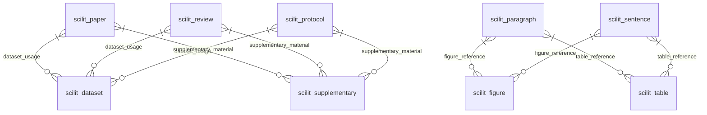

# Scientific Literature (scilit)

> **Source:** `namespaces/scilit.tql`

Domain-specific subtypes for scientific literature analysis: papers, datasets, preprints, and structured extraction.

**Summary:** 25 entities, 4 relations, 25 attributes

## Contents

- [Type Hierarchy](#type-hierarchy)
- [Relationships](#relationships)
- [Attributes](#attributes)
- [Entity Types](#entity-types)
- [Relation Types](#relation-types)
- [Query Examples](#query-examples)

## Type Hierarchy

```mermaid
classDiagram
    direction LR
    class scilit_book {
        +abstract-text
        +publication-date
        +isbn
        +doi
    }
    domain_thing <|-- scilit_book
    class scilit_citation_record
    artifact <|-- scilit_citation_record
    class scilit_classification_note {
        +note-type
    }
    note_t <|-- scilit_classification_note
    class scilit_corpus
    collection <|-- scilit_corpus
    class scilit_critique_note {
        +note-type
    }
    note_t <|-- scilit_critique_note
    class scilit_dataset {
        +abstract-text
        +doi
        +dataset-url
        +dataset-format
        +dataset-size
    }
    domain_thing <|-- scilit_dataset
    class scilit_equation
    fragment <|-- scilit_equation
    class scilit_extraction_note {
        +note-type
        +extraction-method
        +extraction-model
    }
    note_t <|-- scilit_extraction_note
    class scilit_figure {
        +figure-number
        +caption
    }
    fragment <|-- scilit_figure
    class scilit_jats_fulltext
    artifact <|-- scilit_jats_fulltext
    class scilit_methodology_note {
        +note-type
    }
    note_t <|-- scilit_methodology_note
    class scilit_paper {
        +abstract-text
        +publication-date
        +doi
        +pmid
        +pmcid
    }
    domain_thing <|-- scilit_paper
    class scilit_paragraph
    fragment <|-- scilit_paragraph
    class scilit_pdf_fulltext
    artifact <|-- scilit_pdf_fulltext
    class scilit_preprint {
        +abstract-text
        +publication-date
        +doi
        +arxiv-id
    }
    domain_thing <|-- scilit_preprint
    class scilit_protocol
    scilit_paper <|-- scilit_protocol
    class scilit_reference
    fragment <|-- scilit_reference
    class scilit_review
    scilit_paper <|-- scilit_review
    class scilit_section {
        +section-type
        +section-number
        +heading-level
    }
    fragment <|-- scilit_section
    class scilit_sentence
    fragment <|-- scilit_sentence
    class scilit_structured_data
    artifact <|-- scilit_structured_data
    class scilit_summary_note {
        +note-type
    }
    note_t <|-- scilit_summary_note
    class scilit_supplementary
    artifact <|-- scilit_supplementary
    class scilit_synthesis_note {
        +note-type
    }
    note_t <|-- scilit_synthesis_note
    class scilit_table {
        +table-number
        +caption
    }
    fragment <|-- scilit_table
    class dataset_usage {
        +usage-type
        +provenance
    }
    class figure_reference {
        +provenance
    }
    class supplementary_material
    class table_reference {
        +provenance
    }
    class fragment
    <<core>> fragment
    class domain_thing
    <<core>> domain_thing
    class artifact
    <<core>> artifact
    class collection
    <<core>> collection
    class note_t
    <<core>> note_t
```



## Relationships



## Attributes

| Attribute | Value Type | Description |
|-----------|-----------|-------------|
| `arxiv-id` | `string` |  |
| `caption` | `string` |  |
| `dataset-format` | `string` |  |
| `dataset-size` | `string` |  |
| `dataset-url` | `string` | Dataset specific |
| `doi` | `string` | Publication identifiers |
| `extraction-method` | `string` |  |
| `extraction-model` | `string` |  |
| `figure-number` | `string` | Figure/table specific |
| `heading-level` | `long` |  |
| `isbn` | `string` |  |
| `issn` | `string` |  |
| `journal-issue` | `string` |  |
| `journal-name` | `string` | Publication metadata |
| `journal-volume` | `string` |  |
| `keyword` | `string` |  |
| `note-type` | `string` | Note type classification |
| `page-range` | `string` |  |
| `pmcid` | `string` |  |
| `pmid` | `string` |  |
| `publication-year` | `long` |  |
| `section-number` | `string` |  |
| `section-type` | `string` | Section types |
| `table-number` | `string` |  |
| `usage-type` | `string` | Relation attributes |

## Entity Types

### `scilit-book`

> SCILIT-BOOK - A book or book chapter

- **Kind:** Entity
- **Parent:** `domain-thing`
- **Defined in:** `scilit`

**Attributes (owns):**

| Attribute | Key? | Defined In |
|-----------|------|------------|
| `abstract-text` |  | scilit |
| `publication-date` |  | scilit |
| `isbn` |  | scilit |
| `doi` |  | scilit |
| `id` | @key | *identifiable-entity* (inherited) |
| `name` |  | *identifiable-entity* (inherited) |
| `description` |  | *identifiable-entity* (inherited) |
| `iri` |  | *identifiable-entity* (inherited) |
| `created-at` |  | *identifiable-entity* (inherited) |
| `updated-at` |  | *identifiable-entity* (inherited) |
| `provenance` |  | *identifiable-entity* (inherited) |
| `source-uri` |  | *identifiable-entity* (inherited) |
| `license` |  | *identifiable-entity* (inherited) |

**Roles (plays):**

| Relation | Role | Defined In |
|----------|------|------------|
| `representation` | `referent` | *domain-thing* (inherited) |
| `authorship` | `authored-work` | *domain-thing* (inherited) |
| `citation-reference` | `citing-item` | *domain-thing* (inherited) |
| `citation-reference` | `cited-item` | *domain-thing* (inherited) |
| `classification` | `classified-entity` | *identifiable-entity* (inherited) |
| `tagging` | `tagged-entity` | *identifiable-entity* (inherited) |
| `aboutness` | `subject` | *identifiable-entity* (inherited) |
| `collection-membership` | `member` | *identifiable-entity* (inherited) |
| `provenance-record` | `produced-entity` | *identifiable-entity* (inherited) |
| `provenance-record` | `source-entity` | *identifiable-entity* (inherited) |
| `property-assertion` | `subject-entity` | *identifiable-entity* (inherited) |
| `semantic-triple` | `triple-subject` | *identifiable-entity* (inherited) |
| `semantic-triple` | `triple-object` | *identifiable-entity* (inherited) |

### `scilit-citation-record`

> SCILIT-CITATION-RECORD - Citation/metadata record (from PubMed, Crossref, etc.)

- **Kind:** Entity
- **Parent:** `artifact`
- **Defined in:** `scilit`

**Attributes (owns):**

| Attribute | Key? | Defined In |
|-----------|------|------------|
| `content` |  | *information-content-entity* (inherited) |
| `content-hash` |  | *information-content-entity* (inherited) |
| `format` |  | *information-content-entity* (inherited) |
| `token-count` |  | *information-content-entity* (inherited) |
| `cache-path` |  | *information-content-entity* (inherited) |
| `mime-type` |  | *information-content-entity* (inherited) |
| `file-size` |  | *information-content-entity* (inherited) |
| `id` | @key | *identifiable-entity* (inherited) |
| `name` |  | *identifiable-entity* (inherited) |
| `description` |  | *identifiable-entity* (inherited) |
| `iri` |  | *identifiable-entity* (inherited) |
| `created-at` |  | *identifiable-entity* (inherited) |
| `updated-at` |  | *identifiable-entity* (inherited) |
| `provenance` |  | *identifiable-entity* (inherited) |
| `source-uri` |  | *identifiable-entity* (inherited) |
| `license` |  | *identifiable-entity* (inherited) |

**Roles (plays):**

| Relation | Role | Defined In |
|----------|------|------------|
| `representation` | `artifact` | *artifact* (inherited) |
| `fragmentation` | `whole` | *artifact* (inherited) |
| `authorship` | `work` | *information-content-entity* (inherited) |
| `derivation` | `derived-from-source` | *information-content-entity* (inherited) |
| `derivation` | `derivative` | *information-content-entity* (inherited) |
| `classification` | `classified-entity` | *identifiable-entity* (inherited) |
| `tagging` | `tagged-entity` | *identifiable-entity* (inherited) |
| `aboutness` | `subject` | *identifiable-entity* (inherited) |
| `collection-membership` | `member` | *identifiable-entity* (inherited) |
| `provenance-record` | `produced-entity` | *identifiable-entity* (inherited) |
| `provenance-record` | `source-entity` | *identifiable-entity* (inherited) |
| `property-assertion` | `subject-entity` | *identifiable-entity* (inherited) |
| `semantic-triple` | `triple-subject` | *identifiable-entity* (inherited) |
| `semantic-triple` | `triple-object` | *identifiable-entity* (inherited) |

### `scilit-classification-note`

> SCILIT-CLASSIFICATION-NOTE - Classification/categorization of a paper

- **Kind:** Entity
- **Parent:** `note`
- **Defined in:** `scilit`

**Attributes (owns):**

| Attribute | Key? | Defined In |
|-----------|------|------------|
| `note-type` |  | scilit |
| `confidence` |  | *note* (inherited) |
| `content` |  | *information-content-entity* (inherited) |
| `content-hash` |  | *information-content-entity* (inherited) |
| `format` |  | *information-content-entity* (inherited) |
| `token-count` |  | *information-content-entity* (inherited) |
| `cache-path` |  | *information-content-entity* (inherited) |
| `mime-type` |  | *information-content-entity* (inherited) |
| `file-size` |  | *information-content-entity* (inherited) |
| `id` | @key | *identifiable-entity* (inherited) |
| `name` |  | *identifiable-entity* (inherited) |
| `description` |  | *identifiable-entity* (inherited) |
| `iri` |  | *identifiable-entity* (inherited) |
| `created-at` |  | *identifiable-entity* (inherited) |
| `updated-at` |  | *identifiable-entity* (inherited) |
| `provenance` |  | *identifiable-entity* (inherited) |
| `source-uri` |  | *identifiable-entity* (inherited) |
| `license` |  | *identifiable-entity* (inherited) |

**Roles (plays):**

| Relation | Role | Defined In |
|----------|------|------------|
| `aboutness` | `note` | *note* (inherited) |
| `note-threading` | `parent-note` | *note* (inherited) |
| `note-threading` | `child-note` | *note* (inherited) |
| `evidence-chain` | `claim` | *note* (inherited) |
| `evidence-chain` | `evidence` | *note* (inherited) |
| `authorship` | `work` | *information-content-entity* (inherited) |
| `derivation` | `derived-from-source` | *information-content-entity* (inherited) |
| `derivation` | `derivative` | *information-content-entity* (inherited) |
| `classification` | `classified-entity` | *identifiable-entity* (inherited) |
| `tagging` | `tagged-entity` | *identifiable-entity* (inherited) |
| `aboutness` | `subject` | *identifiable-entity* (inherited) |
| `collection-membership` | `member` | *identifiable-entity* (inherited) |
| `provenance-record` | `produced-entity` | *identifiable-entity* (inherited) |
| `provenance-record` | `source-entity` | *identifiable-entity* (inherited) |
| `property-assertion` | `subject-entity` | *identifiable-entity* (inherited) |
| `semantic-triple` | `triple-subject` | *identifiable-entity* (inherited) |
| `semantic-triple` | `triple-object` | *identifiable-entity* (inherited) |

### `scilit-corpus`

> SCILIT-CORPUS - A literature corpus (set of papers on a topic)

- **Kind:** Entity
- **Parent:** `collection`
- **Defined in:** `scilit`

**Attributes (owns):**

| Attribute | Key? | Defined In |
|-----------|------|------------|
| `logical-query` |  | *collection* (inherited) |
| `is-extensional` |  | *collection* (inherited) |
| `id` | @key | *identifiable-entity* (inherited) |
| `name` |  | *identifiable-entity* (inherited) |
| `description` |  | *identifiable-entity* (inherited) |
| `iri` |  | *identifiable-entity* (inherited) |
| `created-at` |  | *identifiable-entity* (inherited) |
| `updated-at` |  | *identifiable-entity* (inherited) |
| `provenance` |  | *identifiable-entity* (inherited) |
| `source-uri` |  | *identifiable-entity* (inherited) |
| `license` |  | *identifiable-entity* (inherited) |

**Roles (plays):**

| Relation | Role | Defined In |
|----------|------|------------|
| `collection-membership` | `collection` | *collection* (inherited) |
| `collection-nesting` | `parent-collection` | *collection* (inherited) |
| `collection-nesting` | `child-collection` | *collection* (inherited) |
| `addresses-requirement` | `resource` | *collection* (inherited) |
| `classification` | `classified-entity` | *identifiable-entity* (inherited) |
| `tagging` | `tagged-entity` | *identifiable-entity* (inherited) |
| `aboutness` | `subject` | *identifiable-entity* (inherited) |
| `collection-membership` | `member` | *identifiable-entity* (inherited) |
| `provenance-record` | `produced-entity` | *identifiable-entity* (inherited) |
| `provenance-record` | `source-entity` | *identifiable-entity* (inherited) |
| `property-assertion` | `subject-entity` | *identifiable-entity* (inherited) |
| `semantic-triple` | `triple-subject` | *identifiable-entity* (inherited) |
| `semantic-triple` | `triple-object` | *identifiable-entity* (inherited) |

### `scilit-critique-note`

> SCILIT-CRITIQUE-NOTE - Critical analysis or review

- **Kind:** Entity
- **Parent:** `note`
- **Defined in:** `scilit`

**Attributes (owns):**

| Attribute | Key? | Defined In |
|-----------|------|------------|
| `note-type` |  | scilit |
| `confidence` |  | *note* (inherited) |
| `content` |  | *information-content-entity* (inherited) |
| `content-hash` |  | *information-content-entity* (inherited) |
| `format` |  | *information-content-entity* (inherited) |
| `token-count` |  | *information-content-entity* (inherited) |
| `cache-path` |  | *information-content-entity* (inherited) |
| `mime-type` |  | *information-content-entity* (inherited) |
| `file-size` |  | *information-content-entity* (inherited) |
| `id` | @key | *identifiable-entity* (inherited) |
| `name` |  | *identifiable-entity* (inherited) |
| `description` |  | *identifiable-entity* (inherited) |
| `iri` |  | *identifiable-entity* (inherited) |
| `created-at` |  | *identifiable-entity* (inherited) |
| `updated-at` |  | *identifiable-entity* (inherited) |
| `provenance` |  | *identifiable-entity* (inherited) |
| `source-uri` |  | *identifiable-entity* (inherited) |
| `license` |  | *identifiable-entity* (inherited) |

**Roles (plays):**

| Relation | Role | Defined In |
|----------|------|------------|
| `aboutness` | `note` | *note* (inherited) |
| `note-threading` | `parent-note` | *note* (inherited) |
| `note-threading` | `child-note` | *note* (inherited) |
| `evidence-chain` | `claim` | *note* (inherited) |
| `evidence-chain` | `evidence` | *note* (inherited) |
| `authorship` | `work` | *information-content-entity* (inherited) |
| `derivation` | `derived-from-source` | *information-content-entity* (inherited) |
| `derivation` | `derivative` | *information-content-entity* (inherited) |
| `classification` | `classified-entity` | *identifiable-entity* (inherited) |
| `tagging` | `tagged-entity` | *identifiable-entity* (inherited) |
| `aboutness` | `subject` | *identifiable-entity* (inherited) |
| `collection-membership` | `member` | *identifiable-entity* (inherited) |
| `provenance-record` | `produced-entity` | *identifiable-entity* (inherited) |
| `provenance-record` | `source-entity` | *identifiable-entity* (inherited) |
| `property-assertion` | `subject-entity` | *identifiable-entity* (inherited) |
| `semantic-triple` | `triple-subject` | *identifiable-entity* (inherited) |
| `semantic-triple` | `triple-object` | *identifiable-entity* (inherited) |

### `scilit-dataset`

> SCILIT-DATASET - A scientific dataset

- **Kind:** Entity
- **Parent:** `domain-thing`
- **Defined in:** `scilit`

**Attributes (owns):**

| Attribute | Key? | Defined In |
|-----------|------|------------|
| `abstract-text` |  | scilit |
| `doi` |  | scilit |
| `dataset-url` |  | scilit |
| `dataset-format` |  | scilit |
| `dataset-size` |  | scilit |
| `id` | @key | *identifiable-entity* (inherited) |
| `name` |  | *identifiable-entity* (inherited) |
| `description` |  | *identifiable-entity* (inherited) |
| `iri` |  | *identifiable-entity* (inherited) |
| `created-at` |  | *identifiable-entity* (inherited) |
| `updated-at` |  | *identifiable-entity* (inherited) |
| `provenance` |  | *identifiable-entity* (inherited) |
| `source-uri` |  | *identifiable-entity* (inherited) |
| `license` |  | *identifiable-entity* (inherited) |

**Roles (plays):**

| Relation | Role | Defined In |
|----------|------|------------|
| `dataset-usage` | `dataset-entity` | scilit |
| `representation` | `referent` | *domain-thing* (inherited) |
| `authorship` | `authored-work` | *domain-thing* (inherited) |
| `citation-reference` | `citing-item` | *domain-thing* (inherited) |
| `citation-reference` | `cited-item` | *domain-thing* (inherited) |
| `classification` | `classified-entity` | *identifiable-entity* (inherited) |
| `tagging` | `tagged-entity` | *identifiable-entity* (inherited) |
| `aboutness` | `subject` | *identifiable-entity* (inherited) |
| `collection-membership` | `member` | *identifiable-entity* (inherited) |
| `provenance-record` | `produced-entity` | *identifiable-entity* (inherited) |
| `provenance-record` | `source-entity` | *identifiable-entity* (inherited) |
| `property-assertion` | `subject-entity` | *identifiable-entity* (inherited) |
| `semantic-triple` | `triple-subject` | *identifiable-entity* (inherited) |
| `semantic-triple` | `triple-object` | *identifiable-entity* (inherited) |

### `scilit-equation`

> SCILIT-EQUATION - An equation from a paper

- **Kind:** Entity
- **Parent:** `fragment`
- **Defined in:** `scilit`

**Attributes (owns):**

| Attribute | Key? | Defined In |
|-----------|------|------------|
| `offset` |  | *fragment* (inherited) |
| `length` |  | *fragment* (inherited) |
| `content` |  | *information-content-entity* (inherited) |
| `content-hash` |  | *information-content-entity* (inherited) |
| `format` |  | *information-content-entity* (inherited) |
| `token-count` |  | *information-content-entity* (inherited) |
| `cache-path` |  | *information-content-entity* (inherited) |
| `mime-type` |  | *information-content-entity* (inherited) |
| `file-size` |  | *information-content-entity* (inherited) |
| `id` | @key | *identifiable-entity* (inherited) |
| `name` |  | *identifiable-entity* (inherited) |
| `description` |  | *identifiable-entity* (inherited) |
| `iri` |  | *identifiable-entity* (inherited) |
| `created-at` |  | *identifiable-entity* (inherited) |
| `updated-at` |  | *identifiable-entity* (inherited) |
| `provenance` |  | *identifiable-entity* (inherited) |
| `source-uri` |  | *identifiable-entity* (inherited) |
| `license` |  | *identifiable-entity* (inherited) |

**Roles (plays):**

| Relation | Role | Defined In |
|----------|------|------------|
| `fragmentation` | `part` | *fragment* (inherited) |
| `quotation` | `quoted-fragment` | *fragment* (inherited) |
| `quotation` | `quoting-fragment` | *fragment* (inherited) |
| `authorship` | `work` | *information-content-entity* (inherited) |
| `derivation` | `derived-from-source` | *information-content-entity* (inherited) |
| `derivation` | `derivative` | *information-content-entity* (inherited) |
| `classification` | `classified-entity` | *identifiable-entity* (inherited) |
| `tagging` | `tagged-entity` | *identifiable-entity* (inherited) |
| `aboutness` | `subject` | *identifiable-entity* (inherited) |
| `collection-membership` | `member` | *identifiable-entity* (inherited) |
| `provenance-record` | `produced-entity` | *identifiable-entity* (inherited) |
| `provenance-record` | `source-entity` | *identifiable-entity* (inherited) |
| `property-assertion` | `subject-entity` | *identifiable-entity* (inherited) |
| `semantic-triple` | `triple-subject` | *identifiable-entity* (inherited) |
| `semantic-triple` | `triple-object` | *identifiable-entity* (inherited) |

### `scilit-extraction-note`

> SCILIT-EXTRACTION-NOTE - Extracted information from a paper

- **Kind:** Entity
- **Parent:** `note`
- **Defined in:** `scilit`

**Attributes (owns):**

| Attribute | Key? | Defined In |
|-----------|------|------------|
| `note-type` |  | scilit |
| `extraction-method` |  | scilit |
| `extraction-model` |  | scilit |
| `confidence` |  | *note* (inherited) |
| `content` |  | *information-content-entity* (inherited) |
| `content-hash` |  | *information-content-entity* (inherited) |
| `format` |  | *information-content-entity* (inherited) |
| `token-count` |  | *information-content-entity* (inherited) |
| `cache-path` |  | *information-content-entity* (inherited) |
| `mime-type` |  | *information-content-entity* (inherited) |
| `file-size` |  | *information-content-entity* (inherited) |
| `id` | @key | *identifiable-entity* (inherited) |
| `name` |  | *identifiable-entity* (inherited) |
| `description` |  | *identifiable-entity* (inherited) |
| `iri` |  | *identifiable-entity* (inherited) |
| `created-at` |  | *identifiable-entity* (inherited) |
| `updated-at` |  | *identifiable-entity* (inherited) |
| `provenance` |  | *identifiable-entity* (inherited) |
| `source-uri` |  | *identifiable-entity* (inherited) |
| `license` |  | *identifiable-entity* (inherited) |

**Roles (plays):**

| Relation | Role | Defined In |
|----------|------|------------|
| `aboutness` | `note` | *note* (inherited) |
| `note-threading` | `parent-note` | *note* (inherited) |
| `note-threading` | `child-note` | *note* (inherited) |
| `evidence-chain` | `claim` | *note* (inherited) |
| `evidence-chain` | `evidence` | *note* (inherited) |
| `authorship` | `work` | *information-content-entity* (inherited) |
| `derivation` | `derived-from-source` | *information-content-entity* (inherited) |
| `derivation` | `derivative` | *information-content-entity* (inherited) |
| `classification` | `classified-entity` | *identifiable-entity* (inherited) |
| `tagging` | `tagged-entity` | *identifiable-entity* (inherited) |
| `aboutness` | `subject` | *identifiable-entity* (inherited) |
| `collection-membership` | `member` | *identifiable-entity* (inherited) |
| `provenance-record` | `produced-entity` | *identifiable-entity* (inherited) |
| `provenance-record` | `source-entity` | *identifiable-entity* (inherited) |
| `property-assertion` | `subject-entity` | *identifiable-entity* (inherited) |
| `semantic-triple` | `triple-subject` | *identifiable-entity* (inherited) |
| `semantic-triple` | `triple-object` | *identifiable-entity* (inherited) |

### `scilit-figure`

> SCILIT-FIGURE - A figure from a paper

- **Kind:** Entity
- **Parent:** `fragment`
- **Defined in:** `scilit`

**Attributes (owns):**

| Attribute | Key? | Defined In |
|-----------|------|------------|
| `figure-number` |  | scilit |
| `caption` |  | scilit |
| `offset` |  | *fragment* (inherited) |
| `length` |  | *fragment* (inherited) |
| `content` |  | *information-content-entity* (inherited) |
| `content-hash` |  | *information-content-entity* (inherited) |
| `format` |  | *information-content-entity* (inherited) |
| `token-count` |  | *information-content-entity* (inherited) |
| `cache-path` |  | *information-content-entity* (inherited) |
| `mime-type` |  | *information-content-entity* (inherited) |
| `file-size` |  | *information-content-entity* (inherited) |
| `id` | @key | *identifiable-entity* (inherited) |
| `name` |  | *identifiable-entity* (inherited) |
| `description` |  | *identifiable-entity* (inherited) |
| `iri` |  | *identifiable-entity* (inherited) |
| `created-at` |  | *identifiable-entity* (inherited) |
| `updated-at` |  | *identifiable-entity* (inherited) |
| `provenance` |  | *identifiable-entity* (inherited) |
| `source-uri` |  | *identifiable-entity* (inherited) |
| `license` |  | *identifiable-entity* (inherited) |

**Roles (plays):**

| Relation | Role | Defined In |
|----------|------|------------|
| `figure-reference` | `referenced-figure` | scilit |
| `fragmentation` | `part` | *fragment* (inherited) |
| `quotation` | `quoted-fragment` | *fragment* (inherited) |
| `quotation` | `quoting-fragment` | *fragment* (inherited) |
| `authorship` | `work` | *information-content-entity* (inherited) |
| `derivation` | `derived-from-source` | *information-content-entity* (inherited) |
| `derivation` | `derivative` | *information-content-entity* (inherited) |
| `classification` | `classified-entity` | *identifiable-entity* (inherited) |
| `tagging` | `tagged-entity` | *identifiable-entity* (inherited) |
| `aboutness` | `subject` | *identifiable-entity* (inherited) |
| `collection-membership` | `member` | *identifiable-entity* (inherited) |
| `provenance-record` | `produced-entity` | *identifiable-entity* (inherited) |
| `provenance-record` | `source-entity` | *identifiable-entity* (inherited) |
| `property-assertion` | `subject-entity` | *identifiable-entity* (inherited) |
| `semantic-triple` | `triple-subject` | *identifiable-entity* (inherited) |
| `semantic-triple` | `triple-object` | *identifiable-entity* (inherited) |

### `scilit-jats-fulltext`

> SCILIT-JATS-FULLTEXT - JATS XML full-text representation

- **Kind:** Entity
- **Parent:** `artifact`
- **Defined in:** `scilit`

**Attributes (owns):**

| Attribute | Key? | Defined In |
|-----------|------|------------|
| `content` |  | *information-content-entity* (inherited) |
| `content-hash` |  | *information-content-entity* (inherited) |
| `format` |  | *information-content-entity* (inherited) |
| `token-count` |  | *information-content-entity* (inherited) |
| `cache-path` |  | *information-content-entity* (inherited) |
| `mime-type` |  | *information-content-entity* (inherited) |
| `file-size` |  | *information-content-entity* (inherited) |
| `id` | @key | *identifiable-entity* (inherited) |
| `name` |  | *identifiable-entity* (inherited) |
| `description` |  | *identifiable-entity* (inherited) |
| `iri` |  | *identifiable-entity* (inherited) |
| `created-at` |  | *identifiable-entity* (inherited) |
| `updated-at` |  | *identifiable-entity* (inherited) |
| `provenance` |  | *identifiable-entity* (inherited) |
| `source-uri` |  | *identifiable-entity* (inherited) |
| `license` |  | *identifiable-entity* (inherited) |

**Roles (plays):**

| Relation | Role | Defined In |
|----------|------|------------|
| `representation` | `artifact` | *artifact* (inherited) |
| `fragmentation` | `whole` | *artifact* (inherited) |
| `authorship` | `work` | *information-content-entity* (inherited) |
| `derivation` | `derived-from-source` | *information-content-entity* (inherited) |
| `derivation` | `derivative` | *information-content-entity* (inherited) |
| `classification` | `classified-entity` | *identifiable-entity* (inherited) |
| `tagging` | `tagged-entity` | *identifiable-entity* (inherited) |
| `aboutness` | `subject` | *identifiable-entity* (inherited) |
| `collection-membership` | `member` | *identifiable-entity* (inherited) |
| `provenance-record` | `produced-entity` | *identifiable-entity* (inherited) |
| `provenance-record` | `source-entity` | *identifiable-entity* (inherited) |
| `property-assertion` | `subject-entity` | *identifiable-entity* (inherited) |
| `semantic-triple` | `triple-subject` | *identifiable-entity* (inherited) |
| `semantic-triple` | `triple-object` | *identifiable-entity* (inherited) |

### `scilit-methodology-note`

> SCILIT-METHODOLOGY-NOTE - Notes about methods/protocols

- **Kind:** Entity
- **Parent:** `note`
- **Defined in:** `scilit`

**Attributes (owns):**

| Attribute | Key? | Defined In |
|-----------|------|------------|
| `note-type` |  | scilit |
| `confidence` |  | *note* (inherited) |
| `content` |  | *information-content-entity* (inherited) |
| `content-hash` |  | *information-content-entity* (inherited) |
| `format` |  | *information-content-entity* (inherited) |
| `token-count` |  | *information-content-entity* (inherited) |
| `cache-path` |  | *information-content-entity* (inherited) |
| `mime-type` |  | *information-content-entity* (inherited) |
| `file-size` |  | *information-content-entity* (inherited) |
| `id` | @key | *identifiable-entity* (inherited) |
| `name` |  | *identifiable-entity* (inherited) |
| `description` |  | *identifiable-entity* (inherited) |
| `iri` |  | *identifiable-entity* (inherited) |
| `created-at` |  | *identifiable-entity* (inherited) |
| `updated-at` |  | *identifiable-entity* (inherited) |
| `provenance` |  | *identifiable-entity* (inherited) |
| `source-uri` |  | *identifiable-entity* (inherited) |
| `license` |  | *identifiable-entity* (inherited) |

**Roles (plays):**

| Relation | Role | Defined In |
|----------|------|------------|
| `aboutness` | `note` | *note* (inherited) |
| `note-threading` | `parent-note` | *note* (inherited) |
| `note-threading` | `child-note` | *note* (inherited) |
| `evidence-chain` | `claim` | *note* (inherited) |
| `evidence-chain` | `evidence` | *note* (inherited) |
| `authorship` | `work` | *information-content-entity* (inherited) |
| `derivation` | `derived-from-source` | *information-content-entity* (inherited) |
| `derivation` | `derivative` | *information-content-entity* (inherited) |
| `classification` | `classified-entity` | *identifiable-entity* (inherited) |
| `tagging` | `tagged-entity` | *identifiable-entity* (inherited) |
| `aboutness` | `subject` | *identifiable-entity* (inherited) |
| `collection-membership` | `member` | *identifiable-entity* (inherited) |
| `provenance-record` | `produced-entity` | *identifiable-entity* (inherited) |
| `provenance-record` | `source-entity` | *identifiable-entity* (inherited) |
| `property-assertion` | `subject-entity` | *identifiable-entity* (inherited) |
| `semantic-triple` | `triple-subject` | *identifiable-entity* (inherited) |
| `semantic-triple` | `triple-object` | *identifiable-entity* (inherited) |

### `scilit-paper`

> SCILIT-PAPER - A scientific publication

- **Kind:** Entity
- **Parent:** `domain-thing`
- **Defined in:** `scilit`

**Attributes (owns):**

| Attribute | Key? | Defined In |
|-----------|------|------------|
| `abstract-text` |  | scilit |
| `publication-date` |  | scilit |
| `doi` |  | scilit |
| `pmid` |  | scilit |
| `pmcid` |  | scilit |
| `arxiv-id` |  | scilit |
| `journal-name` |  | scilit |
| `journal-volume` |  | scilit |
| `journal-issue` |  | scilit |
| `page-range` |  | scilit |
| `publication-year` |  | scilit |
| `keyword` |  | scilit |
| `id` | @key | *identifiable-entity* (inherited) |
| `name` |  | *identifiable-entity* (inherited) |
| `description` |  | *identifiable-entity* (inherited) |
| `iri` |  | *identifiable-entity* (inherited) |
| `created-at` |  | *identifiable-entity* (inherited) |
| `updated-at` |  | *identifiable-entity* (inherited) |
| `provenance` |  | *identifiable-entity* (inherited) |
| `source-uri` |  | *identifiable-entity* (inherited) |
| `license` |  | *identifiable-entity* (inherited) |

**Roles (plays):**

| Relation | Role | Defined In |
|----------|------|------------|
| `supplementary-material` | `paper` | scilit |
| `dataset-usage` | `paper-entity` | scilit |
| `representation` | `referent` | *domain-thing* (inherited) |
| `authorship` | `authored-work` | *domain-thing* (inherited) |
| `citation-reference` | `citing-item` | *domain-thing* (inherited) |
| `citation-reference` | `cited-item` | *domain-thing* (inherited) |
| `classification` | `classified-entity` | *identifiable-entity* (inherited) |
| `tagging` | `tagged-entity` | *identifiable-entity* (inherited) |
| `aboutness` | `subject` | *identifiable-entity* (inherited) |
| `collection-membership` | `member` | *identifiable-entity* (inherited) |
| `provenance-record` | `produced-entity` | *identifiable-entity* (inherited) |
| `provenance-record` | `source-entity` | *identifiable-entity* (inherited) |
| `property-assertion` | `subject-entity` | *identifiable-entity* (inherited) |
| `semantic-triple` | `triple-subject` | *identifiable-entity* (inherited) |
| `semantic-triple` | `triple-object` | *identifiable-entity* (inherited) |

### `scilit-paragraph`

> SCILIT-PARAGRAPH - A paragraph from a paper

- **Kind:** Entity
- **Parent:** `fragment`
- **Defined in:** `scilit`

**Attributes (owns):**

| Attribute | Key? | Defined In |
|-----------|------|------------|
| `offset` |  | *fragment* (inherited) |
| `length` |  | *fragment* (inherited) |
| `content` |  | *information-content-entity* (inherited) |
| `content-hash` |  | *information-content-entity* (inherited) |
| `format` |  | *information-content-entity* (inherited) |
| `token-count` |  | *information-content-entity* (inherited) |
| `cache-path` |  | *information-content-entity* (inherited) |
| `mime-type` |  | *information-content-entity* (inherited) |
| `file-size` |  | *information-content-entity* (inherited) |
| `id` | @key | *identifiable-entity* (inherited) |
| `name` |  | *identifiable-entity* (inherited) |
| `description` |  | *identifiable-entity* (inherited) |
| `iri` |  | *identifiable-entity* (inherited) |
| `created-at` |  | *identifiable-entity* (inherited) |
| `updated-at` |  | *identifiable-entity* (inherited) |
| `provenance` |  | *identifiable-entity* (inherited) |
| `source-uri` |  | *identifiable-entity* (inherited) |
| `license` |  | *identifiable-entity* (inherited) |

**Roles (plays):**

| Relation | Role | Defined In |
|----------|------|------------|
| `figure-reference` | `referencing-text` | scilit |
| `table-reference` | `referencing-text` | scilit |
| `fragmentation` | `part` | *fragment* (inherited) |
| `quotation` | `quoted-fragment` | *fragment* (inherited) |
| `quotation` | `quoting-fragment` | *fragment* (inherited) |
| `authorship` | `work` | *information-content-entity* (inherited) |
| `derivation` | `derived-from-source` | *information-content-entity* (inherited) |
| `derivation` | `derivative` | *information-content-entity* (inherited) |
| `classification` | `classified-entity` | *identifiable-entity* (inherited) |
| `tagging` | `tagged-entity` | *identifiable-entity* (inherited) |
| `aboutness` | `subject` | *identifiable-entity* (inherited) |
| `collection-membership` | `member` | *identifiable-entity* (inherited) |
| `provenance-record` | `produced-entity` | *identifiable-entity* (inherited) |
| `provenance-record` | `source-entity` | *identifiable-entity* (inherited) |
| `property-assertion` | `subject-entity` | *identifiable-entity* (inherited) |
| `semantic-triple` | `triple-subject` | *identifiable-entity* (inherited) |
| `semantic-triple` | `triple-object` | *identifiable-entity* (inherited) |

### `scilit-pdf-fulltext`

> SCILIT-PDF-FULLTEXT - PDF full-text representation

- **Kind:** Entity
- **Parent:** `artifact`
- **Defined in:** `scilit`

**Attributes (owns):**

| Attribute | Key? | Defined In |
|-----------|------|------------|
| `content` |  | *information-content-entity* (inherited) |
| `content-hash` |  | *information-content-entity* (inherited) |
| `format` |  | *information-content-entity* (inherited) |
| `token-count` |  | *information-content-entity* (inherited) |
| `cache-path` |  | *information-content-entity* (inherited) |
| `mime-type` |  | *information-content-entity* (inherited) |
| `file-size` |  | *information-content-entity* (inherited) |
| `id` | @key | *identifiable-entity* (inherited) |
| `name` |  | *identifiable-entity* (inherited) |
| `description` |  | *identifiable-entity* (inherited) |
| `iri` |  | *identifiable-entity* (inherited) |
| `created-at` |  | *identifiable-entity* (inherited) |
| `updated-at` |  | *identifiable-entity* (inherited) |
| `provenance` |  | *identifiable-entity* (inherited) |
| `source-uri` |  | *identifiable-entity* (inherited) |
| `license` |  | *identifiable-entity* (inherited) |

**Roles (plays):**

| Relation | Role | Defined In |
|----------|------|------------|
| `representation` | `artifact` | *artifact* (inherited) |
| `fragmentation` | `whole` | *artifact* (inherited) |
| `authorship` | `work` | *information-content-entity* (inherited) |
| `derivation` | `derived-from-source` | *information-content-entity* (inherited) |
| `derivation` | `derivative` | *information-content-entity* (inherited) |
| `classification` | `classified-entity` | *identifiable-entity* (inherited) |
| `tagging` | `tagged-entity` | *identifiable-entity* (inherited) |
| `aboutness` | `subject` | *identifiable-entity* (inherited) |
| `collection-membership` | `member` | *identifiable-entity* (inherited) |
| `provenance-record` | `produced-entity` | *identifiable-entity* (inherited) |
| `provenance-record` | `source-entity` | *identifiable-entity* (inherited) |
| `property-assertion` | `subject-entity` | *identifiable-entity* (inherited) |
| `semantic-triple` | `triple-subject` | *identifiable-entity* (inherited) |
| `semantic-triple` | `triple-object` | *identifiable-entity* (inherited) |

### `scilit-preprint`

> SCILIT-PREPRINT - A preprint publication

- **Kind:** Entity
- **Parent:** `domain-thing`
- **Defined in:** `scilit`

**Attributes (owns):**

| Attribute | Key? | Defined In |
|-----------|------|------------|
| `abstract-text` |  | scilit |
| `publication-date` |  | scilit |
| `doi` |  | scilit |
| `arxiv-id` |  | scilit |
| `id` | @key | *identifiable-entity* (inherited) |
| `name` |  | *identifiable-entity* (inherited) |
| `description` |  | *identifiable-entity* (inherited) |
| `iri` |  | *identifiable-entity* (inherited) |
| `created-at` |  | *identifiable-entity* (inherited) |
| `updated-at` |  | *identifiable-entity* (inherited) |
| `provenance` |  | *identifiable-entity* (inherited) |
| `source-uri` |  | *identifiable-entity* (inherited) |
| `license` |  | *identifiable-entity* (inherited) |

**Roles (plays):**

| Relation | Role | Defined In |
|----------|------|------------|
| `representation` | `referent` | *domain-thing* (inherited) |
| `authorship` | `authored-work` | *domain-thing* (inherited) |
| `citation-reference` | `citing-item` | *domain-thing* (inherited) |
| `citation-reference` | `cited-item` | *domain-thing* (inherited) |
| `classification` | `classified-entity` | *identifiable-entity* (inherited) |
| `tagging` | `tagged-entity` | *identifiable-entity* (inherited) |
| `aboutness` | `subject` | *identifiable-entity* (inherited) |
| `collection-membership` | `member` | *identifiable-entity* (inherited) |
| `provenance-record` | `produced-entity` | *identifiable-entity* (inherited) |
| `provenance-record` | `source-entity` | *identifiable-entity* (inherited) |
| `property-assertion` | `subject-entity` | *identifiable-entity* (inherited) |
| `semantic-triple` | `triple-subject` | *identifiable-entity* (inherited) |
| `semantic-triple` | `triple-object` | *identifiable-entity* (inherited) |

### `scilit-protocol`

> SCILIT-PROTOCOL - A published protocol or methods paper

- **Kind:** Entity
- **Parent:** `scilit-paper`
- **Defined in:** `scilit`

**Attributes (owns):**

| Attribute | Key? | Defined In |
|-----------|------|------------|
| `abstract-text` |  | *scilit-paper* (inherited) |
| `publication-date` |  | *scilit-paper* (inherited) |
| `doi` |  | *scilit-paper* (inherited) |
| `pmid` |  | *scilit-paper* (inherited) |
| `pmcid` |  | *scilit-paper* (inherited) |
| `arxiv-id` |  | *scilit-paper* (inherited) |
| `journal-name` |  | *scilit-paper* (inherited) |
| `journal-volume` |  | *scilit-paper* (inherited) |
| `journal-issue` |  | *scilit-paper* (inherited) |
| `page-range` |  | *scilit-paper* (inherited) |
| `publication-year` |  | *scilit-paper* (inherited) |
| `keyword` |  | *scilit-paper* (inherited) |
| `id` | @key | *identifiable-entity* (inherited) |
| `name` |  | *identifiable-entity* (inherited) |
| `description` |  | *identifiable-entity* (inherited) |
| `iri` |  | *identifiable-entity* (inherited) |
| `created-at` |  | *identifiable-entity* (inherited) |
| `updated-at` |  | *identifiable-entity* (inherited) |
| `provenance` |  | *identifiable-entity* (inherited) |
| `source-uri` |  | *identifiable-entity* (inherited) |
| `license` |  | *identifiable-entity* (inherited) |

**Roles (plays):**

| Relation | Role | Defined In |
|----------|------|------------|
| `supplementary-material` | `paper` | *scilit-paper* (inherited) |
| `dataset-usage` | `paper-entity` | *scilit-paper* (inherited) |
| `representation` | `referent` | *domain-thing* (inherited) |
| `authorship` | `authored-work` | *domain-thing* (inherited) |
| `citation-reference` | `citing-item` | *domain-thing* (inherited) |
| `citation-reference` | `cited-item` | *domain-thing* (inherited) |
| `classification` | `classified-entity` | *identifiable-entity* (inherited) |
| `tagging` | `tagged-entity` | *identifiable-entity* (inherited) |
| `aboutness` | `subject` | *identifiable-entity* (inherited) |
| `collection-membership` | `member` | *identifiable-entity* (inherited) |
| `provenance-record` | `produced-entity` | *identifiable-entity* (inherited) |
| `provenance-record` | `source-entity` | *identifiable-entity* (inherited) |
| `property-assertion` | `subject-entity` | *identifiable-entity* (inherited) |
| `semantic-triple` | `triple-subject` | *identifiable-entity* (inherited) |
| `semantic-triple` | `triple-object` | *identifiable-entity* (inherited) |

### `scilit-reference`

> SCILIT-REFERENCE - A reference entry from a paper's bibliography

- **Kind:** Entity
- **Parent:** `fragment`
- **Defined in:** `scilit`

**Attributes (owns):**

| Attribute | Key? | Defined In |
|-----------|------|------------|
| `offset` |  | *fragment* (inherited) |
| `length` |  | *fragment* (inherited) |
| `content` |  | *information-content-entity* (inherited) |
| `content-hash` |  | *information-content-entity* (inherited) |
| `format` |  | *information-content-entity* (inherited) |
| `token-count` |  | *information-content-entity* (inherited) |
| `cache-path` |  | *information-content-entity* (inherited) |
| `mime-type` |  | *information-content-entity* (inherited) |
| `file-size` |  | *information-content-entity* (inherited) |
| `id` | @key | *identifiable-entity* (inherited) |
| `name` |  | *identifiable-entity* (inherited) |
| `description` |  | *identifiable-entity* (inherited) |
| `iri` |  | *identifiable-entity* (inherited) |
| `created-at` |  | *identifiable-entity* (inherited) |
| `updated-at` |  | *identifiable-entity* (inherited) |
| `provenance` |  | *identifiable-entity* (inherited) |
| `source-uri` |  | *identifiable-entity* (inherited) |
| `license` |  | *identifiable-entity* (inherited) |

**Roles (plays):**

| Relation | Role | Defined In |
|----------|------|------------|
| `fragmentation` | `part` | *fragment* (inherited) |
| `quotation` | `quoted-fragment` | *fragment* (inherited) |
| `quotation` | `quoting-fragment` | *fragment* (inherited) |
| `authorship` | `work` | *information-content-entity* (inherited) |
| `derivation` | `derived-from-source` | *information-content-entity* (inherited) |
| `derivation` | `derivative` | *information-content-entity* (inherited) |
| `classification` | `classified-entity` | *identifiable-entity* (inherited) |
| `tagging` | `tagged-entity` | *identifiable-entity* (inherited) |
| `aboutness` | `subject` | *identifiable-entity* (inherited) |
| `collection-membership` | `member` | *identifiable-entity* (inherited) |
| `provenance-record` | `produced-entity` | *identifiable-entity* (inherited) |
| `provenance-record` | `source-entity` | *identifiable-entity* (inherited) |
| `property-assertion` | `subject-entity` | *identifiable-entity* (inherited) |
| `semantic-triple` | `triple-subject` | *identifiable-entity* (inherited) |
| `semantic-triple` | `triple-object` | *identifiable-entity* (inherited) |

### `scilit-review`

> SCILIT-REVIEW - A review article

- **Kind:** Entity
- **Parent:** `scilit-paper`
- **Defined in:** `scilit`

**Attributes (owns):**

| Attribute | Key? | Defined In |
|-----------|------|------------|
| `abstract-text` |  | *scilit-paper* (inherited) |
| `publication-date` |  | *scilit-paper* (inherited) |
| `doi` |  | *scilit-paper* (inherited) |
| `pmid` |  | *scilit-paper* (inherited) |
| `pmcid` |  | *scilit-paper* (inherited) |
| `arxiv-id` |  | *scilit-paper* (inherited) |
| `journal-name` |  | *scilit-paper* (inherited) |
| `journal-volume` |  | *scilit-paper* (inherited) |
| `journal-issue` |  | *scilit-paper* (inherited) |
| `page-range` |  | *scilit-paper* (inherited) |
| `publication-year` |  | *scilit-paper* (inherited) |
| `keyword` |  | *scilit-paper* (inherited) |
| `id` | @key | *identifiable-entity* (inherited) |
| `name` |  | *identifiable-entity* (inherited) |
| `description` |  | *identifiable-entity* (inherited) |
| `iri` |  | *identifiable-entity* (inherited) |
| `created-at` |  | *identifiable-entity* (inherited) |
| `updated-at` |  | *identifiable-entity* (inherited) |
| `provenance` |  | *identifiable-entity* (inherited) |
| `source-uri` |  | *identifiable-entity* (inherited) |
| `license` |  | *identifiable-entity* (inherited) |

**Roles (plays):**

| Relation | Role | Defined In |
|----------|------|------------|
| `supplementary-material` | `paper` | *scilit-paper* (inherited) |
| `dataset-usage` | `paper-entity` | *scilit-paper* (inherited) |
| `representation` | `referent` | *domain-thing* (inherited) |
| `authorship` | `authored-work` | *domain-thing* (inherited) |
| `citation-reference` | `citing-item` | *domain-thing* (inherited) |
| `citation-reference` | `cited-item` | *domain-thing* (inherited) |
| `classification` | `classified-entity` | *identifiable-entity* (inherited) |
| `tagging` | `tagged-entity` | *identifiable-entity* (inherited) |
| `aboutness` | `subject` | *identifiable-entity* (inherited) |
| `collection-membership` | `member` | *identifiable-entity* (inherited) |
| `provenance-record` | `produced-entity` | *identifiable-entity* (inherited) |
| `provenance-record` | `source-entity` | *identifiable-entity* (inherited) |
| `property-assertion` | `subject-entity` | *identifiable-entity* (inherited) |
| `semantic-triple` | `triple-subject` | *identifiable-entity* (inherited) |
| `semantic-triple` | `triple-object` | *identifiable-entity* (inherited) |

### `scilit-section`

> SCILIT-SECTION - A section of a paper

- **Kind:** Entity
- **Parent:** `fragment`
- **Defined in:** `scilit`

**Attributes (owns):**

| Attribute | Key? | Defined In |
|-----------|------|------------|
| `section-type` |  | scilit |
| `section-number` |  | scilit |
| `heading-level` |  | scilit |
| `offset` |  | *fragment* (inherited) |
| `length` |  | *fragment* (inherited) |
| `content` |  | *information-content-entity* (inherited) |
| `content-hash` |  | *information-content-entity* (inherited) |
| `format` |  | *information-content-entity* (inherited) |
| `token-count` |  | *information-content-entity* (inherited) |
| `cache-path` |  | *information-content-entity* (inherited) |
| `mime-type` |  | *information-content-entity* (inherited) |
| `file-size` |  | *information-content-entity* (inherited) |
| `id` | @key | *identifiable-entity* (inherited) |
| `name` |  | *identifiable-entity* (inherited) |
| `description` |  | *identifiable-entity* (inherited) |
| `iri` |  | *identifiable-entity* (inherited) |
| `created-at` |  | *identifiable-entity* (inherited) |
| `updated-at` |  | *identifiable-entity* (inherited) |
| `provenance` |  | *identifiable-entity* (inherited) |
| `source-uri` |  | *identifiable-entity* (inherited) |
| `license` |  | *identifiable-entity* (inherited) |

**Roles (plays):**

| Relation | Role | Defined In |
|----------|------|------------|
| `fragmentation` | `part` | *fragment* (inherited) |
| `quotation` | `quoted-fragment` | *fragment* (inherited) |
| `quotation` | `quoting-fragment` | *fragment* (inherited) |
| `authorship` | `work` | *information-content-entity* (inherited) |
| `derivation` | `derived-from-source` | *information-content-entity* (inherited) |
| `derivation` | `derivative` | *information-content-entity* (inherited) |
| `classification` | `classified-entity` | *identifiable-entity* (inherited) |
| `tagging` | `tagged-entity` | *identifiable-entity* (inherited) |
| `aboutness` | `subject` | *identifiable-entity* (inherited) |
| `collection-membership` | `member` | *identifiable-entity* (inherited) |
| `provenance-record` | `produced-entity` | *identifiable-entity* (inherited) |
| `provenance-record` | `source-entity` | *identifiable-entity* (inherited) |
| `property-assertion` | `subject-entity` | *identifiable-entity* (inherited) |
| `semantic-triple` | `triple-subject` | *identifiable-entity* (inherited) |
| `semantic-triple` | `triple-object` | *identifiable-entity* (inherited) |

### `scilit-sentence`

> SCILIT-SENTENCE - A sentence from a paper

- **Kind:** Entity
- **Parent:** `fragment`
- **Defined in:** `scilit`

**Attributes (owns):**

| Attribute | Key? | Defined In |
|-----------|------|------------|
| `offset` |  | *fragment* (inherited) |
| `length` |  | *fragment* (inherited) |
| `content` |  | *information-content-entity* (inherited) |
| `content-hash` |  | *information-content-entity* (inherited) |
| `format` |  | *information-content-entity* (inherited) |
| `token-count` |  | *information-content-entity* (inherited) |
| `cache-path` |  | *information-content-entity* (inherited) |
| `mime-type` |  | *information-content-entity* (inherited) |
| `file-size` |  | *information-content-entity* (inherited) |
| `id` | @key | *identifiable-entity* (inherited) |
| `name` |  | *identifiable-entity* (inherited) |
| `description` |  | *identifiable-entity* (inherited) |
| `iri` |  | *identifiable-entity* (inherited) |
| `created-at` |  | *identifiable-entity* (inherited) |
| `updated-at` |  | *identifiable-entity* (inherited) |
| `provenance` |  | *identifiable-entity* (inherited) |
| `source-uri` |  | *identifiable-entity* (inherited) |
| `license` |  | *identifiable-entity* (inherited) |

**Roles (plays):**

| Relation | Role | Defined In |
|----------|------|------------|
| `figure-reference` | `referencing-text` | scilit |
| `table-reference` | `referencing-text` | scilit |
| `fragmentation` | `part` | *fragment* (inherited) |
| `quotation` | `quoted-fragment` | *fragment* (inherited) |
| `quotation` | `quoting-fragment` | *fragment* (inherited) |
| `authorship` | `work` | *information-content-entity* (inherited) |
| `derivation` | `derived-from-source` | *information-content-entity* (inherited) |
| `derivation` | `derivative` | *information-content-entity* (inherited) |
| `classification` | `classified-entity` | *identifiable-entity* (inherited) |
| `tagging` | `tagged-entity` | *identifiable-entity* (inherited) |
| `aboutness` | `subject` | *identifiable-entity* (inherited) |
| `collection-membership` | `member` | *identifiable-entity* (inherited) |
| `provenance-record` | `produced-entity` | *identifiable-entity* (inherited) |
| `provenance-record` | `source-entity` | *identifiable-entity* (inherited) |
| `property-assertion` | `subject-entity` | *identifiable-entity* (inherited) |
| `semantic-triple` | `triple-subject` | *identifiable-entity* (inherited) |
| `semantic-triple` | `triple-object` | *identifiable-entity* (inherited) |

### `scilit-structured-data`

> SCILIT-STRUCTURED-DATA - Structured data extracted from a paper

- **Kind:** Entity
- **Parent:** `artifact`
- **Defined in:** `scilit`

**Attributes (owns):**

| Attribute | Key? | Defined In |
|-----------|------|------------|
| `content` |  | *information-content-entity* (inherited) |
| `content-hash` |  | *information-content-entity* (inherited) |
| `format` |  | *information-content-entity* (inherited) |
| `token-count` |  | *information-content-entity* (inherited) |
| `cache-path` |  | *information-content-entity* (inherited) |
| `mime-type` |  | *information-content-entity* (inherited) |
| `file-size` |  | *information-content-entity* (inherited) |
| `id` | @key | *identifiable-entity* (inherited) |
| `name` |  | *identifiable-entity* (inherited) |
| `description` |  | *identifiable-entity* (inherited) |
| `iri` |  | *identifiable-entity* (inherited) |
| `created-at` |  | *identifiable-entity* (inherited) |
| `updated-at` |  | *identifiable-entity* (inherited) |
| `provenance` |  | *identifiable-entity* (inherited) |
| `source-uri` |  | *identifiable-entity* (inherited) |
| `license` |  | *identifiable-entity* (inherited) |

**Roles (plays):**

| Relation | Role | Defined In |
|----------|------|------------|
| `representation` | `artifact` | *artifact* (inherited) |
| `fragmentation` | `whole` | *artifact* (inherited) |
| `authorship` | `work` | *information-content-entity* (inherited) |
| `derivation` | `derived-from-source` | *information-content-entity* (inherited) |
| `derivation` | `derivative` | *information-content-entity* (inherited) |
| `classification` | `classified-entity` | *identifiable-entity* (inherited) |
| `tagging` | `tagged-entity` | *identifiable-entity* (inherited) |
| `aboutness` | `subject` | *identifiable-entity* (inherited) |
| `collection-membership` | `member` | *identifiable-entity* (inherited) |
| `provenance-record` | `produced-entity` | *identifiable-entity* (inherited) |
| `provenance-record` | `source-entity` | *identifiable-entity* (inherited) |
| `property-assertion` | `subject-entity` | *identifiable-entity* (inherited) |
| `semantic-triple` | `triple-subject` | *identifiable-entity* (inherited) |
| `semantic-triple` | `triple-object` | *identifiable-entity* (inherited) |

### `scilit-summary-note`

> SCILIT-SUMMARY-NOTE - Summary of a paper or section

- **Kind:** Entity
- **Parent:** `note`
- **Defined in:** `scilit`

**Attributes (owns):**

| Attribute | Key? | Defined In |
|-----------|------|------------|
| `note-type` |  | scilit |
| `confidence` |  | *note* (inherited) |
| `content` |  | *information-content-entity* (inherited) |
| `content-hash` |  | *information-content-entity* (inherited) |
| `format` |  | *information-content-entity* (inherited) |
| `token-count` |  | *information-content-entity* (inherited) |
| `cache-path` |  | *information-content-entity* (inherited) |
| `mime-type` |  | *information-content-entity* (inherited) |
| `file-size` |  | *information-content-entity* (inherited) |
| `id` | @key | *identifiable-entity* (inherited) |
| `name` |  | *identifiable-entity* (inherited) |
| `description` |  | *identifiable-entity* (inherited) |
| `iri` |  | *identifiable-entity* (inherited) |
| `created-at` |  | *identifiable-entity* (inherited) |
| `updated-at` |  | *identifiable-entity* (inherited) |
| `provenance` |  | *identifiable-entity* (inherited) |
| `source-uri` |  | *identifiable-entity* (inherited) |
| `license` |  | *identifiable-entity* (inherited) |

**Roles (plays):**

| Relation | Role | Defined In |
|----------|------|------------|
| `aboutness` | `note` | *note* (inherited) |
| `note-threading` | `parent-note` | *note* (inherited) |
| `note-threading` | `child-note` | *note* (inherited) |
| `evidence-chain` | `claim` | *note* (inherited) |
| `evidence-chain` | `evidence` | *note* (inherited) |
| `authorship` | `work` | *information-content-entity* (inherited) |
| `derivation` | `derived-from-source` | *information-content-entity* (inherited) |
| `derivation` | `derivative` | *information-content-entity* (inherited) |
| `classification` | `classified-entity` | *identifiable-entity* (inherited) |
| `tagging` | `tagged-entity` | *identifiable-entity* (inherited) |
| `aboutness` | `subject` | *identifiable-entity* (inherited) |
| `collection-membership` | `member` | *identifiable-entity* (inherited) |
| `provenance-record` | `produced-entity` | *identifiable-entity* (inherited) |
| `provenance-record` | `source-entity` | *identifiable-entity* (inherited) |
| `property-assertion` | `subject-entity` | *identifiable-entity* (inherited) |
| `semantic-triple` | `triple-subject` | *identifiable-entity* (inherited) |
| `semantic-triple` | `triple-object` | *identifiable-entity* (inherited) |

### `scilit-supplementary`

> SCILIT-SUPPLEMENTARY - Supplementary material artifact

- **Kind:** Entity
- **Parent:** `artifact`
- **Defined in:** `scilit`

**Attributes (owns):**

| Attribute | Key? | Defined In |
|-----------|------|------------|
| `content` |  | *information-content-entity* (inherited) |
| `content-hash` |  | *information-content-entity* (inherited) |
| `format` |  | *information-content-entity* (inherited) |
| `token-count` |  | *information-content-entity* (inherited) |
| `cache-path` |  | *information-content-entity* (inherited) |
| `mime-type` |  | *information-content-entity* (inherited) |
| `file-size` |  | *information-content-entity* (inherited) |
| `id` | @key | *identifiable-entity* (inherited) |
| `name` |  | *identifiable-entity* (inherited) |
| `description` |  | *identifiable-entity* (inherited) |
| `iri` |  | *identifiable-entity* (inherited) |
| `created-at` |  | *identifiable-entity* (inherited) |
| `updated-at` |  | *identifiable-entity* (inherited) |
| `provenance` |  | *identifiable-entity* (inherited) |
| `source-uri` |  | *identifiable-entity* (inherited) |
| `license` |  | *identifiable-entity* (inherited) |

**Roles (plays):**

| Relation | Role | Defined In |
|----------|------|------------|
| `supplementary-material` | `supplement` | scilit |
| `representation` | `artifact` | *artifact* (inherited) |
| `fragmentation` | `whole` | *artifact* (inherited) |
| `authorship` | `work` | *information-content-entity* (inherited) |
| `derivation` | `derived-from-source` | *information-content-entity* (inherited) |
| `derivation` | `derivative` | *information-content-entity* (inherited) |
| `classification` | `classified-entity` | *identifiable-entity* (inherited) |
| `tagging` | `tagged-entity` | *identifiable-entity* (inherited) |
| `aboutness` | `subject` | *identifiable-entity* (inherited) |
| `collection-membership` | `member` | *identifiable-entity* (inherited) |
| `provenance-record` | `produced-entity` | *identifiable-entity* (inherited) |
| `provenance-record` | `source-entity` | *identifiable-entity* (inherited) |
| `property-assertion` | `subject-entity` | *identifiable-entity* (inherited) |
| `semantic-triple` | `triple-subject` | *identifiable-entity* (inherited) |
| `semantic-triple` | `triple-object` | *identifiable-entity* (inherited) |

### `scilit-synthesis-note`

> SCILIT-SYNTHESIS-NOTE - Synthesis across multiple papers

- **Kind:** Entity
- **Parent:** `note`
- **Defined in:** `scilit`

**Attributes (owns):**

| Attribute | Key? | Defined In |
|-----------|------|------------|
| `note-type` |  | scilit |
| `confidence` |  | *note* (inherited) |
| `content` |  | *information-content-entity* (inherited) |
| `content-hash` |  | *information-content-entity* (inherited) |
| `format` |  | *information-content-entity* (inherited) |
| `token-count` |  | *information-content-entity* (inherited) |
| `cache-path` |  | *information-content-entity* (inherited) |
| `mime-type` |  | *information-content-entity* (inherited) |
| `file-size` |  | *information-content-entity* (inherited) |
| `id` | @key | *identifiable-entity* (inherited) |
| `name` |  | *identifiable-entity* (inherited) |
| `description` |  | *identifiable-entity* (inherited) |
| `iri` |  | *identifiable-entity* (inherited) |
| `created-at` |  | *identifiable-entity* (inherited) |
| `updated-at` |  | *identifiable-entity* (inherited) |
| `provenance` |  | *identifiable-entity* (inherited) |
| `source-uri` |  | *identifiable-entity* (inherited) |
| `license` |  | *identifiable-entity* (inherited) |

**Roles (plays):**

| Relation | Role | Defined In |
|----------|------|------------|
| `aboutness` | `note` | *note* (inherited) |
| `note-threading` | `parent-note` | *note* (inherited) |
| `note-threading` | `child-note` | *note* (inherited) |
| `evidence-chain` | `claim` | *note* (inherited) |
| `evidence-chain` | `evidence` | *note* (inherited) |
| `authorship` | `work` | *information-content-entity* (inherited) |
| `derivation` | `derived-from-source` | *information-content-entity* (inherited) |
| `derivation` | `derivative` | *information-content-entity* (inherited) |
| `classification` | `classified-entity` | *identifiable-entity* (inherited) |
| `tagging` | `tagged-entity` | *identifiable-entity* (inherited) |
| `aboutness` | `subject` | *identifiable-entity* (inherited) |
| `collection-membership` | `member` | *identifiable-entity* (inherited) |
| `provenance-record` | `produced-entity` | *identifiable-entity* (inherited) |
| `provenance-record` | `source-entity` | *identifiable-entity* (inherited) |
| `property-assertion` | `subject-entity` | *identifiable-entity* (inherited) |
| `semantic-triple` | `triple-subject` | *identifiable-entity* (inherited) |
| `semantic-triple` | `triple-object` | *identifiable-entity* (inherited) |

### `scilit-table`

> SCILIT-TABLE - A table from a paper

- **Kind:** Entity
- **Parent:** `fragment`
- **Defined in:** `scilit`

**Attributes (owns):**

| Attribute | Key? | Defined In |
|-----------|------|------------|
| `table-number` |  | scilit |
| `caption` |  | scilit |
| `offset` |  | *fragment* (inherited) |
| `length` |  | *fragment* (inherited) |
| `content` |  | *information-content-entity* (inherited) |
| `content-hash` |  | *information-content-entity* (inherited) |
| `format` |  | *information-content-entity* (inherited) |
| `token-count` |  | *information-content-entity* (inherited) |
| `cache-path` |  | *information-content-entity* (inherited) |
| `mime-type` |  | *information-content-entity* (inherited) |
| `file-size` |  | *information-content-entity* (inherited) |
| `id` | @key | *identifiable-entity* (inherited) |
| `name` |  | *identifiable-entity* (inherited) |
| `description` |  | *identifiable-entity* (inherited) |
| `iri` |  | *identifiable-entity* (inherited) |
| `created-at` |  | *identifiable-entity* (inherited) |
| `updated-at` |  | *identifiable-entity* (inherited) |
| `provenance` |  | *identifiable-entity* (inherited) |
| `source-uri` |  | *identifiable-entity* (inherited) |
| `license` |  | *identifiable-entity* (inherited) |

**Roles (plays):**

| Relation | Role | Defined In |
|----------|------|------------|
| `table-reference` | `referenced-table` | scilit |
| `fragmentation` | `part` | *fragment* (inherited) |
| `quotation` | `quoted-fragment` | *fragment* (inherited) |
| `quotation` | `quoting-fragment` | *fragment* (inherited) |
| `authorship` | `work` | *information-content-entity* (inherited) |
| `derivation` | `derived-from-source` | *information-content-entity* (inherited) |
| `derivation` | `derivative` | *information-content-entity* (inherited) |
| `classification` | `classified-entity` | *identifiable-entity* (inherited) |
| `tagging` | `tagged-entity` | *identifiable-entity* (inherited) |
| `aboutness` | `subject` | *identifiable-entity* (inherited) |
| `collection-membership` | `member` | *identifiable-entity* (inherited) |
| `provenance-record` | `produced-entity` | *identifiable-entity* (inherited) |
| `provenance-record` | `source-entity` | *identifiable-entity* (inherited) |
| `property-assertion` | `subject-entity` | *identifiable-entity* (inherited) |
| `semantic-triple` | `triple-subject` | *identifiable-entity* (inherited) |
| `semantic-triple` | `triple-object` | *identifiable-entity* (inherited) |

## Relation Types

### `dataset-usage`

> DATASET-USAGE - Links papers to datasets they use or produce

- **Kind:** Relation
- **Parent:** relation
- **Defined in:** `scilit`

**Attributes (owns):**

| Attribute | Key? | Defined In |
|-----------|------|------------|
| `usage-type` |  | scilit |
| `provenance` |  | scilit |

**Roles (relates):**

| Role |
|------|
| `paper-entity` |
| `dataset-entity` |

### `figure-reference`

> FIGURE-REFERENCE - When text references a figure

- **Kind:** Relation
- **Parent:** relation
- **Defined in:** `scilit`

**Attributes (owns):**

| Attribute | Key? | Defined In |
|-----------|------|------------|
| `provenance` |  | scilit |

**Roles (relates):**

| Role |
|------|
| `referencing-text` |
| `referenced-figure` |

### `supplementary-material`

> SUPPLEMENTARY-MATERIAL - Links papers to their supplementary files

- **Kind:** Relation
- **Parent:** relation
- **Defined in:** `scilit`

**Roles (relates):**

| Role |
|------|
| `paper` |
| `supplement` |

### `table-reference`

> TABLE-REFERENCE - When text references a table

- **Kind:** Relation
- **Parent:** relation
- **Defined in:** `scilit`

**Attributes (owns):**

| Attribute | Key? | Defined In |
|-----------|------|------------|
| `provenance` |  | scilit |

**Roles (relates):**

| Role |
|------|
| `referencing-text` |
| `referenced-table` |

## Query Examples

### Paper Search & Retrieval

Working with scientific papers, collections, and metadata.

**Insert a paper with identifiers**
*Used by:* `epmc_search.py (insert_paper_to_typedb)`

```typeql
insert $p isa scilit-paper,
    has id "paper-abc123",
    has name "A Novel Approach to CRISPR",
    has doi "10.1234/example",
    has pmid "12345678",
    has abstract-text "We present a novel...",
    has publication-year 2024,
    has created-at 2025-01-15T10:30:00;
```

**List papers in a collection**
*Used by:* `epmc_search.py list-papers`

```typeql
match
    $c isa collection, has id "crispr-papers";
    (collection: $c, member: $p) isa collection-membership;
    $p isa scilit-paper;
fetch $p: id, name, doi, publication-year;
```

**Find papers by keyword**

```typeql
match
    $p isa scilit-paper,
        has keyword $kw;
    $kw contains "CRISPR";
fetch $p: id, name, doi;
```

**List collections with their queries**
*Used by:* `epmc_search.py list-collections`

```typeql
match
    $c isa collection, has logical-query $q;
fetch $c: id, name, description, logical-query;
```

### Artifacts & Fragments

Working with paper representations and extracted sections.

**Link artifact to paper (representation)**

```typeql
match
    $p isa scilit-paper, has id "paper-abc123";
insert
    $a isa scilit-citation-record,
        has id "cite-rec-001",
        has name "Citation record for paper",
        has content "...",
        has created-at 2025-01-15T10:30:00;
    (artifact: $a, referent: $p) isa representation;
```

**Create a section fragment**

```typeql
match
    $a isa scilit-jats-fulltext, has id "fulltext-001";
insert
    $f isa scilit-section,
        has id "section-methods",
        has name "Methods",
        has section-type "methods",
        has heading-level 1,
        has created-at 2025-01-15T10:30:00;
    (whole: $a, part: $f) isa fragmentation;
```
